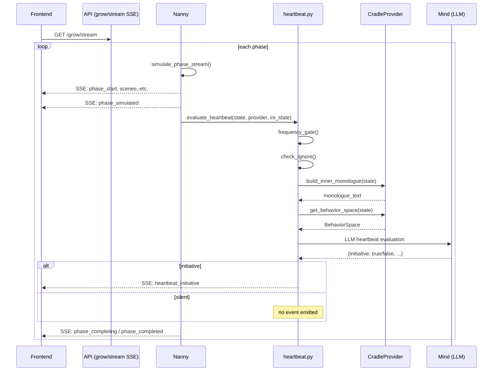
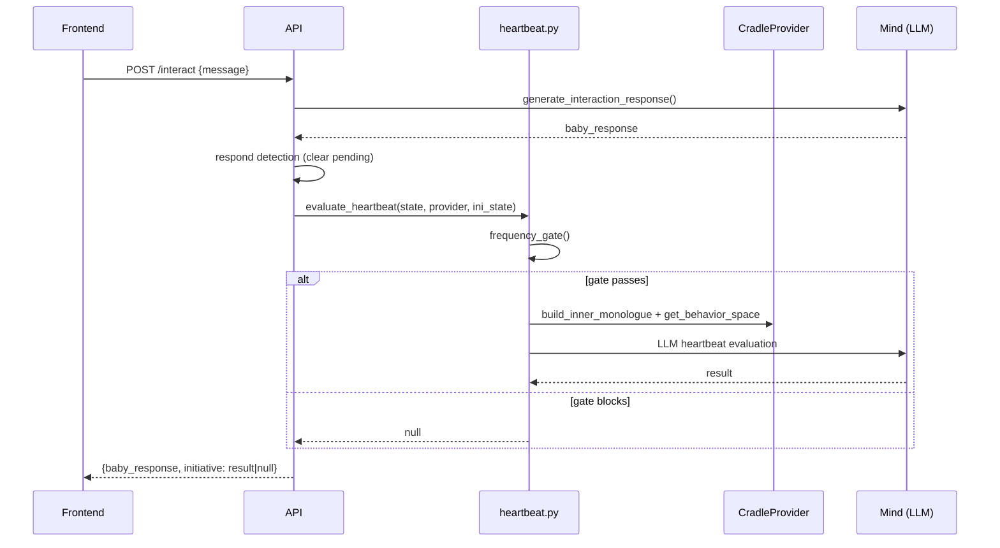
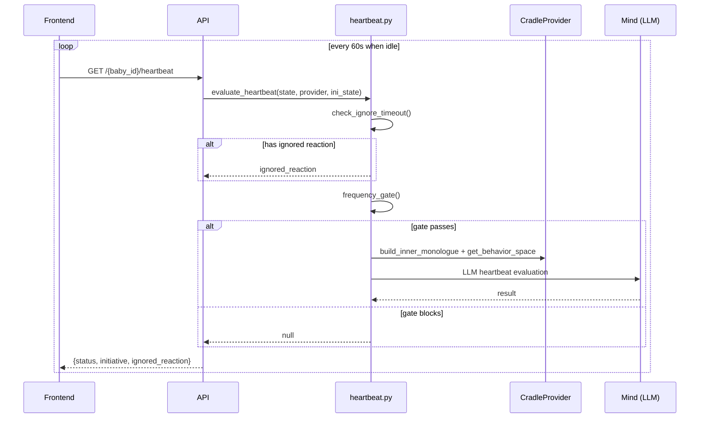

# Design: Initiative System - Heartbeat Mode (Cross-Module)

## Architecture Overview

```
                  +---------------------------+
                  |    Frontend (Cradle.jsx)   |
                  |                           |
                  |  SSE: grow/stream         |  heartbeat_initiative events
                  |  POST: /interact          |  initiative field in response
                  |  GET:  /heartbeat (poll)  |  idle heartbeat check
                  +------------+--------------+
                               |
                  +------------+--------------+
                  |     api/cradle.py          |
                  |                           |
                  |  grow/stream: inject HB   |  after each phase_simulated
                  |  interact:    append HB   |  after interaction response
                  |  GET /heartbeat: new EP   |  lightweight poll
                  +------------+--------------+
                               |
              +----------------+----------------+
              |                                 |
   +----------+---------+        +--------------+--------+
   | heartbeat.py        |        |  cradle/mind.py      |
   | (TOP-LEVEL, new)    |        |  (extend)            |
   |                     |        |                      |
   | MonologueProvider   |        | generate_heartbeat   |
   |   (Protocol)        |        |   _evaluation()      |
   | InitiativeState     |        | generate_ignored_    |
   |   (generic)         |        |   reaction()         |
   | BehaviorSpace       |        |                      |
   |   (generic)         |        | _HEARTBEAT_FALLBACKS |
   | evaluate_heartbeat  |        | _IGNORED_FALLBACKS   |
   | frequency_gate      |        |                      |
   | check_ignore        |        +--------------+-------+
   +----------+----------+                       |
              |                                  |
              |     +----------------------------+
              |     |
   +----------+-----+---------------------------+
   | cradle/heartbeat_provider.py (new)          |
   |                                             |
   | CradleMonologueProvider                     |
   |   implements MonologueProvider              |
   |   build_inner_monologue(BabyState) -> str   |
   |                                             |
   | CRADLE_BEHAVIOR_SPACE                       |
   |   BehaviorSpace for cradle phases           |
   +---------------------------------------------+
              |
   +----------+----------------------------------+
   |                cradle/state.py               |
   |  (extend: initiative field using             |
   |   InitiativeState from heartbeat.py)         |
   +----------------------------------------------+
```

### Future Extension Point (world module)

```
   +---------------------------------------------+
   | world/heartbeat_provider.py (future)         |
   |                                              |
   | WorldMonologueProvider                       |
   |   implements MonologueProvider               |
   |   build_inner_monologue(WorldState) -> str   |
   |                                              |
   | WORLD_BEHAVIOR_SPACE                         |
   |   BehaviorSpace for world phases             |
   +----------------------------------------------+
```

## 1. Data Model: InitiativeState (Generic, in heartbeat.py)

```python
@dataclass
class InitiativeState:
    """
    Heartbeat initiative state tracking.
    Generic -- not coupled to any specific lifecycle module.
    Stored inside each module's state file (e.g., BabyState.initiative).
    """
    last_initiative_ts: float = 0.0
    last_interact_ts: float = 0.0
    pending_initiative_id: str = ""
    pending_initiative_ts: float = 0.0
    pending_initiative_type: str = ""       # "urgent" / "exploratory"
    pending_behavior_type: str = ""         # "verbal" / "physical" / "avoidance"
    consecutive_ignores: int = 0
    total_initiatives: int = 0
    total_responded: int = 0
    total_ignored: int = 0

    def to_dict(self) -> dict: ...
    @classmethod
    def from_dict(cls, d: dict) -> InitiativeState: ...
```

### 1.1 BabyState Extension (cradle/state.py)

```python
from heartbeat import InitiativeState

@dataclass
class BabyState:
    # ... existing fields unchanged ...
    initiative: InitiativeState = field(default_factory=InitiativeState)
```

`from_dict` uses `.get("initiative", {})` -- zero-migration for existing data.

## 2. MonologueProvider Protocol (heartbeat.py)

```python
from typing import Protocol, Any

class MonologueProvider(Protocol):
    """
    Each lifecycle module implements this to provide context
    for the heartbeat LLM evaluation.
    """
    def build_inner_monologue(self, state: Any) -> str:
        """Construct the child's internal state summary."""
        ...

    def get_behavior_space(self, state: Any) -> BehaviorSpace:
        """Return available behaviors for current developmental stage."""
        ...

    def get_expression_mode(self, state: Any) -> str:
        """Return current expression mode identifier."""
        ...

    def get_expression_constraints(self, state: Any) -> dict:
        """Return expression mode description and format rules."""
        ...

    def get_attachment_style(self, state: Any) -> str:
        """Return current attachment style."""
        ...

    def get_caregivers(self, state: Any) -> dict:
        """Return caregiver profiles for responsiveness updates."""
        ...

    def get_stress_state(self, state: Any) -> Any:
        """Return stress state for escalation logic."""
        ...

    def save_state(self, state: Any) -> None:
        """Persist state after heartbeat modifies it."""
        ...
```

## 3. BehaviorSpace (heartbeat.py)

```python
@dataclass
class BehaviorSpace:
    """
    Defines what behaviors are available at a given developmental stage.
    Each lifecycle module constructs this based on current capabilities.
    """
    verbal: list[str]       # available verbal behaviors
    physical: list[str]     # available physical behaviors
    avoidance: list[str]    # available avoidance behaviors

    def to_prompt_section(self) -> str:
        """Format behavior space for LLM prompt."""
        lines = ["## Available Behaviors"]
        if self.verbal:
            lines.append(f"Verbal: {', '.join(self.verbal)}")
        if self.physical:
            lines.append(f"Physical: {', '.join(self.physical)}")
        if self.avoidance:
            lines.append(f"Avoidance: {', '.join(self.avoidance)}")
        return "\n".join(lines)
```

### 3.1 Cradle Behavior Space (cradle/heartbeat_provider.py)

Behavior space expands with each phase:

```python
CRADLE_BEHAVIORS_BY_PHASE = {
    # Phase 0-1: neonatal, sensory_awakening
    (0, 1): BehaviorSpace(
        verbal=["cry", "whimper", "coo"],
        physical=["startle", "squirm", "root"],
        avoidance=["turn_head_away"],
    ),
    # Phase 2-3: body_discovery, object_permanence
    (2, 3): BehaviorSpace(
        verbal=["cry", "babble", "vocalize"],
        physical=["reach", "grasp", "push_away", "cling"],
        avoidance=["turn_away", "cover_eyes", "hide_face"],
    ),
    # Phase 4-5: locomotion, first_word
    (4, 5): BehaviorSpace(
        verbal=["cry", "babble", "single_word", "call_name"],
        physical=["crawl_toward", "point", "pull_hand", "push_away", "hide_behind_parent"],
        avoidance=["crawl_away", "hide_behind_caregiver", "refuse_eye_contact"],
    ),
    # Phase 6-7: language_explosion, why_phase
    (6, 7): BehaviorSpace(
        verbal=["call", "demand", "ask_why", "complain", "refuse_to_answer"],
        physical=["run_to", "tug_clothes", "show_object", "push_away", "stomp"],
        avoidance=["run_away", "hide", "cover_ears", "dodge_question", "say_no"],
    ),
    # Phase 8-9: social_budding, rule_understanding
    (8, 9): BehaviorSpace(
        verbal=["ask", "tell_story", "negotiate", "first_lie", "deliberate_silence"],
        physical=["show_achievement", "seek_friend", "hug", "push_away", "slam_door"],
        avoidance=["hide_secret", "avoid_topic", "refuse_interaction", "pretend_busy"],
    ),
    # Phase 10-11: abstract_beginning, independence
    (10, 11): BehaviorSpace(
        verbal=["argue", "question_rule", "express_opinion", "deliberate_silence", "sarcasm"],
        physical=["independent_action", "show_off", "demonstrative_exit"],
        avoidance=["lock_door", "refuse_hug", "keep_diary", "avoid_conversation", "seek_solitude"],
    ),
}
```

## 4. CradleMonologueProvider (cradle/heartbeat_provider.py)

```python
class CradleMonologueProvider:
    """
    Implements MonologueProvider for cradle lifecycle (0-7 years).
    """
    def build_inner_monologue(self, state: BabyState) -> str:
        """
        Sections:
        1. Physiological signals (stress, sleep, feeding, teething)
        2. Recent experiences (last 3 memories)
        3. Emotional state + preferences + fears
        4. Time since last interaction
        5. Expression mode constraints
        6. Unlocked capabilities
        7. Time since last initiative (for self-regulation)
        8. Active avoidance state (if any)
        """
```

Concrete output example:

```
## Physiological Signals
- Stress level: 0.6 (elevated)
- Sleep: regression active, waking 4 times/night, quality 0.4
- Feeding: introducing_solids
- Teething: 4 teeth (may be uncomfortable)

## Recent Experiences
- Day 200: stranger_visit -> *Turned away, buried face in nanny's shoulder* (negative, 0.7)
- Day 200: feeding_difficulty -> *Pushed spoon away, whimpered* (negative, 0.4)
- Day 198: gentle_touch -> *Relaxed, cooed softly* (positive, 0.3)

## Emotional State
- Attachment: forming
- Fears: [loud_sounds, strangers]
- Preferences: [music, soft_textures]
- Comfort sources: [rocking, humming]
- Emotional vocabulary: [none yet]
- Empathy level: none
- Imaginary friend: (none)

## Interaction History
- Time since last parent interaction: 8 minutes
- Time since last initiative: 15 minutes
- Recent interactions: 2 in the last hour
- Consecutive ignores: 1 (parent didn't respond to last initiative)

## Expression Constraints
- Mode: gesture_and_point
- Can do: action descriptions + gestures + babbling + intentional vocalizations
- Cannot do: words, sentences

## Capabilities
- object_permanence, stranger_anxiety, sitting, babbling_syllables
- (Regressed: none)
```

## 5. Heartbeat Core Engine (heartbeat.py)

### 5.1 evaluate_heartbeat()

```python
def evaluate_heartbeat(
    state: Any,
    provider: MonologueProvider,
    initiative_state: InitiativeState,
) -> dict | None:
    """
    Orchestrate: ignore check -> frequency gate -> inner monologue -> LLM call.

    Args:
        state: opaque state object (BabyState, WorldState, etc.)
        provider: lifecycle-specific context provider
        initiative_state: generic initiative tracking state

    Returns:
        dict with initiative details, or None (silent heartbeat).
    """
```

### 5.2 frequency_gate()

```python
HARD_MIN_INTERVAL = 120  # 2 minutes
POST_INTERACT_COOLDOWN = 60  # 1 minute

def frequency_gate(initiative_state: InitiativeState) -> bool:
    """
    Hard floor frequency gate. Returns True if heartbeat eval should proceed.
    Operates on InitiativeState only -- no module-specific types.
    """
    now = time.time()
    if now - initiative_state.last_initiative_ts < HARD_MIN_INTERVAL:
        return False
    if now - initiative_state.last_interact_ts < POST_INTERACT_COOLDOWN:
        return False
    return True
```

### 5.3 check_and_process_ignore()

```python
IGNORE_TIMEOUT = 300  # 5 minutes

def _check_and_process_ignore(
    state: Any,
    provider: MonologueProvider,
    initiative_state: InitiativeState,
    now: float,
) -> dict | None:
    """
    Check pending initiative timeout.
    Uses provider to access caregivers and stress state for consequence logic.
    """
    if not initiative_state.pending_initiative_id:
        return None
    if now - initiative_state.pending_initiative_ts < IGNORE_TIMEOUT:
        return None

    # Mark as ignored
    initiative_state.consecutive_ignores += 1
    initiative_state.total_ignored += 1
    initiative_state.pending_initiative_id = ""

    # Update caregiver responsiveness via provider
    caregivers = provider.get_caregivers(state)
    for cg in caregivers.values():
        cg.responsiveness = max(0.0, cg.responsiveness - 0.05)

    # Escalation on 3+ consecutive ignores
    if initiative_state.consecutive_ignores >= 3:
        stress = provider.get_stress_state(state)
        stress.stress_level = min(1.0, stress.stress_level + 0.1)
        # Module-specific regression/attachment shift handled by provider

    # Generate ignored reaction via LLM
    reaction = generate_ignored_reaction(state, provider, initiative_state)
    provider.save_state(state)
    return reaction
```

## 6. LLM Prompt Design (cradle/mind.py)

### 6.1 Heartbeat Evaluation Prompt

```
You are the subconscious of a {species} child aged {age_days} days.

Based on the child's current internal state, decide: does this child
want to reach out to (or actively avoid) their parent RIGHT NOW?

## Rules
1. Most of the time, the answer is NO. Children are not constantly
   seeking attention. Silence is the default.
2. Only say YES if there is a genuine, developmentally appropriate reason.
3. BEHAVIOR TYPES:
   - "verbal": speaking, calling, crying, babbling, or DELIBERATE silence
     (refusing to answer is verbal avoidance)
   - "physical": body actions -- reaching, pointing, pulling, pushing,
     running to/from, locking door, hiding
   - "avoidance": actively creating distance -- dodging questions, refusing
     interaction, hiding secrets, avoiding topics, seeking solitude
4. Avoidance IS initiative. A child who locks their door is making a choice.
   A child who says "nothing" when asked "what happened?" is initiating
   a boundary.
5. The child's expression MUST conform to expression_mode constraints.
6. ANTI-AI RULES: No literary language, no self-analysis, no metaphors.
   Real children, messy and immediate.
7. If you say YES, the expression must be SHORT (under 60 Chinese chars
   / 30 English words).

{behavior_space}

## The Child's Inner State
{inner_monologue}

## Output
Return JSON:
{
  "initiative": true/false,
  "type": "urgent" | "exploratory" | null,
  "behavior_type": "verbal" | "physical" | "avoidance" | null,
  "trigger": "hunger|fear|pain|sleepy|curious|bored|share|play|
              secret|boundary|autonomy|avoidance" | null,
  "expression": "the child's expression" | null,
  "parent_hint": "brief hint for the parent about what's happening" | null
}

If initiative is false, set all other fields to null.
```

### 6.2 Ignored Reaction Prompt

Includes:
- Full inner monologue context
- `initiative_type` and `behavior_type` (what the child wanted)
- `consecutive_ignores` count
- `attachment_style`
- Instruction: under 50 Chinese chars / 25 English words

### 6.3 Fallback Tables

```python
_HEARTBEAT_FALLBACKS = {
    "cry_only": {"expression": "*Stirs, a soft whimper*", "behavior_type": "verbal",
                 "parent_hint": "The baby seems uneasy"},
    "coo_and_gaze": {"expression": "*Looks around, soft 'ahh'*", "behavior_type": "verbal",
                     "parent_hint": "The baby seems to want attention"},
    "babble_and_reach": {"expression": "*'Ba-ba!' reaching out*", "behavior_type": "physical",
                         "parent_hint": "The baby wants something"},
    "gesture_and_point": {"expression": "*Points at you, urgent 'ah!'*", "behavior_type": "physical",
                          "parent_hint": "The baby wants your attention"},
    "first_words": {"expression": "*'Mama!' looks at you*", "behavior_type": "verbal",
                    "parent_hint": "The baby is calling you"},
    "two_word": {"expression": "*'Come here!'*", "behavior_type": "verbal",
                 "parent_hint": "The baby wants you"},
    "sentence": {"expression": "*'Mommy, come look!'*", "behavior_type": "verbal",
                 "parent_hint": "The baby wants to show you something"},
    "narrative": {"expression": "*'Mommy! Guess what happened!'*", "behavior_type": "verbal",
                  "parent_hint": "The baby wants to share"},
    "reasoning": {"expression": "*'Hey, can I ask you something?'*", "behavior_type": "verbal",
                  "parent_hint": "The baby has a question"},
    "independent": {"expression": "*'Mom, I need to talk to you.'*", "behavior_type": "verbal",
                    "parent_hint": "The child wants to discuss something"},
}

_IGNORED_FALLBACKS = {
    ("cry_only", "forming"): {"reaction": "*Whimpers grow louder, fists clench*", "emotional_tone": "negative"},
    ("cry_only", "anxious"): {"reaction": "*Wailing intensifies, body arches*", "emotional_tone": "negative"},
    ("cry_only", "avoidant"): {"reaction": "*Crying fades, turns head away*", "emotional_tone": "negative"},
    # ... one per (expression_mode, attachment_style) combination
}
```

## 7. Three Trigger Points Integration

### 7.1 Trigger Point 1: Post-Phase in grow/stream

**Location:** `cradle/nanny.py` `grow_stream()`, after `phase_simulated`.

```python
# In grow_stream(), after phase simulation:
from heartbeat import evaluate_heartbeat
from cradle.heartbeat_provider import CradleMonologueProvider

provider = CradleMonologueProvider()
hb_result = evaluate_heartbeat(state, provider, state.initiative)
if hb_result and hb_result.get("initiative"):
    yield {"event": "heartbeat_initiative", **hb_result}
```

### 7.2 Trigger Point 2: Post-Interact Response

**Location:** `api/cradle.py` `interact()`.

```python
from heartbeat import evaluate_heartbeat, frequency_gate
from cradle.heartbeat_provider import CradleMonologueProvider

# After generating baby_response:
initiative_result = None
provider = CradleMonologueProvider()
if frequency_gate(state.initiative):
    initiative_result = evaluate_heartbeat(state, provider, state.initiative)

return {
    "baby_response": result["baby_response"],
    # ... existing fields ...
    "initiative": initiative_result,
}
```

### 7.3 Trigger Point 3: Idle Poll

**Location:** `api/cradle.py`, new endpoint.

```
GET /{baby_id}/heartbeat
```

Response:
```json
{
  "status": "ok",
  "initiative": { ... } | null,
  "ignored_reaction": { ... } | null
}
```

Frontend polling: every 60s when idle. Stop during grow/stream. Resume after grow/stream ends + 60s.

## 8. Ignore System

### 8.1 Ignore Detection

Runs at the **start** of every `evaluate_heartbeat()` call. Uses `provider.get_caregivers()` and `provider.get_stress_state()` to apply consequences without knowing the specific state model.

### 8.2 Ignore Reaction Delivery

Through the same three channels:
- grow/stream: SSE event `heartbeat_ignored`
- interact: `ignored_reaction` field in response
- poll: `ignored_reaction` field in response

### 8.3 Attachment Shift (cradle-specific)

```python
# In cradle/heartbeat_provider.py
def shift_attachment_toward_avoidant(state: BabyState):
    """
    forming -> avoidant
    secure -> anxious
    anxious -> avoidant
    """
```

This is cradle-specific logic. The heartbeat engine calls `provider` methods; the provider decides how to implement escalation.

## 9. Respond Detection (in interact endpoint)

```python
# In POST /{baby_id}/interact:
ini = state.initiative
if ini.pending_initiative_id:
    ini.pending_initiative_id = ""
    ini.consecutive_ignores = 0
    ini.total_responded += 1
    for cg in state.caregivers.values():
        cg.responsiveness = min(1.0, cg.responsiveness + 0.03)

ini.last_interact_ts = time.time()
```

## 10. Sequence Diagrams

### 10.1 Heartbeat During grow/stream



### 10.2 Heartbeat Post-Interact



### 10.3 Idle Poll



## 11. Frontend Design

### 11.1 Poll Manager

New `useEffect` in `Cradle.jsx`:

```
- Start polling when: selectedId exists && baby in cradle && not running grow/stream
- Poll interval: 60 seconds
- Stop polling when: grow/stream starts || component unmounts || selectedId changes
- On receiving initiative: add to logs, display in chat
- On receiving ignored_reaction: add to logs, display in chat with muted style
```

### 11.2 Chat Panel UI

Initiative messages:
- Left-aligned (child side) with warm-colored border (amber/orange)
- Trigger label badge (e.g., "hungry", "curious", "wants to play")
- Behavior type indicator (speech bubble / hand / shield icon for verbal/physical/avoidance)
- "Respond" button that focuses input / opens touch panel

Avoidance initiative messages:
- Left-aligned with cool/muted border (slate/gray-blue)
- Avoidance indicator (turned-away silhouette or lock icon)
- May not show "Respond" button (some avoidances reject interaction)

Ignored reaction messages:
- Left-aligned with gray style
- Ignore indicator icon
- Consecutive ignore count if > 1

### 11.3 Reducer Extensions

New action types:
- `HEARTBEAT_INITIATIVE`: add to logs with `initiative: true`, `behavior_type` marker
- `HEARTBEAT_IGNORED`: add to logs with `ignored: true` marker

## 12. Degradation Strategy

| Failure Mode | Behavior |
|---|---|
| LLM heartbeat eval fails | Use `_HEARTBEAT_FALLBACKS[expression_mode]` if frequency gate passed |
| LLM heartbeat eval timeout (30s) | Same as failure |
| LLM ignored reaction fails | Use `_IGNORED_FALLBACKS[(expression_mode, attachment_style)]` |
| State load fails in poll | Return 404 |
| grow/stream heartbeat LLM fails | Log warning, skip initiative (grow continues normally) |

## 13. Integration Points Summary

| Integration Point | Module | Change |
|---|---|---|
| heartbeat engine | heartbeat.py (new, root) | New top-level module |
| cradle context provider | cradle/heartbeat_provider.py (new) | CradleMonologueProvider + CRADLE_BEHAVIOR_SPACE |
| InitiativeState in BabyState | cradle/state.py | Add `initiative` field |
| LLM heartbeat functions | cradle/mind.py | Add generate_heartbeat_evaluation, generate_ignored_reaction |
| grow/stream injection | cradle/nanny.py | Add heartbeat eval after phase_simulated |
| interact integration | api/cradle.py | Add respond detection + heartbeat eval |
| poll endpoint | api/cradle.py | New GET /{baby_id}/heartbeat |
| ignore consequences | cradle/heartbeat_provider.py | shift_attachment_toward_avoidant |
| frontend poll | Cradle.jsx | New useEffect polling |
| frontend SSE events | Cradle.jsx | Handle heartbeat_initiative, heartbeat_ignored |
| frontend UI | Cradle.jsx | Initiative/avoidance/ignored message styles |

## 14. File Layout After Implementation

```
backend/
  heartbeat.py              # TOP-LEVEL: engine + InitiativeState + MonologueProvider protocol + BehaviorSpace
  cradle/
    heartbeat_provider.py   # NEW: CradleMonologueProvider + CRADLE_BEHAVIORS_BY_PHASE
    state.py                # MODIFIED: add initiative: InitiativeState field
    mind.py                 # MODIFIED: add heartbeat LLM functions + fallback tables
    nanny.py                # MODIFIED: inject heartbeat in grow_stream
  api/
    cradle.py               # MODIFIED: respond detection + heartbeat in interact + poll endpoint
frontend/src/
  Cradle.jsx                # MODIFIED: poll manager + SSE events + UI
```
