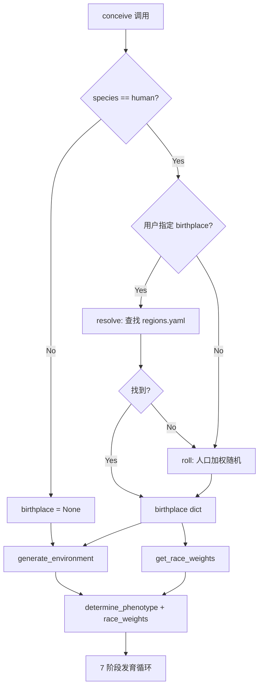
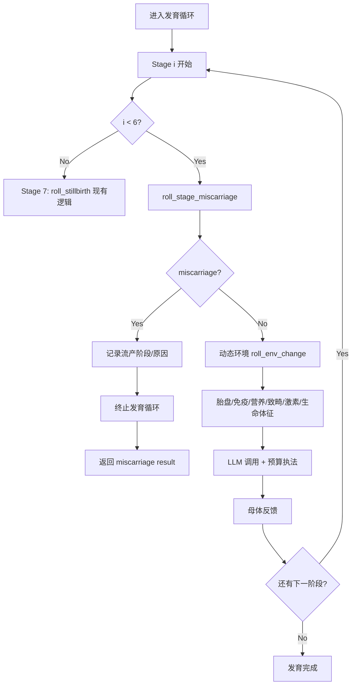
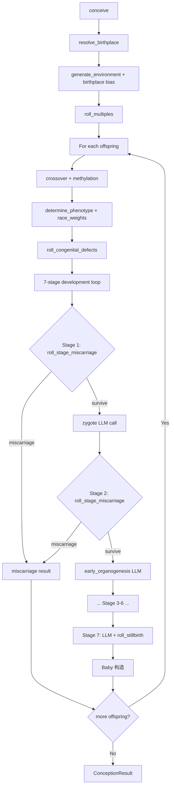

# Design: Birthplace System

## 概述

新增 `womb/birthplace.py` 模块，负责地区数据加载、出生地掷骰、环境修正计算、种族权重提取。数据存放于 `womb/data/regions.yaml`。通过在 `conceive()` 流程最前端插入 birthplace 步骤，将地理维度注入现有环境和表型系统。

同时重构流产机制：在 `fate.py` 新增 `roll_stage_miscarriage()` 函数，将流产判定从 `conceive()` 前置一刀切移入 `stages.py` 的逐阶段发育循环中。

---

## 1. 数据模型

### 1.1 regions.yaml 结构

```yaml
# womb/data/regions.yaml
# 地区数据：国家级粒度，用于 birthplace 系统
# races 引用: East Asian, South Asian, Southeast Asian, European,
#             African, Middle Eastern, Latin American, Oceanian Indigenous, Mixed

# 区域默认值 -- 未列出的国家按所属区域匹配
regional_defaults:
  east_asia:
    race_distribution:
      East Asian: 0.90
      Southeast Asian: 0.03
      Mixed: 0.05
      European: 0.01
      South Asian: 0.01
    environment_modifiers:
      nutrition_baseline: 0.70
      toxin_baseline: 0.35
      healthcare_baseline: 0.70
      stress_baseline: 0.45

  south_asia:
    race_distribution:
      South Asian: 0.92
      Southeast Asian: 0.03
      Mixed: 0.03
      East Asian: 0.01
      Middle Eastern: 0.01
    environment_modifiers:
      nutrition_baseline: 0.45
      toxin_baseline: 0.50
      healthcare_baseline: 0.40
      stress_baseline: 0.55

  southeast_asia:
    race_distribution:
      Southeast Asian: 0.85
      East Asian: 0.05
      South Asian: 0.03
      Mixed: 0.05
      European: 0.02
    environment_modifiers:
      nutrition_baseline: 0.55
      toxin_baseline: 0.40
      healthcare_baseline: 0.50
      stress_baseline: 0.45

  europe:
    race_distribution:
      European: 0.82
      Middle Eastern: 0.05
      African: 0.04
      Mixed: 0.05
      South Asian: 0.02
      East Asian: 0.02
    environment_modifiers:
      nutrition_baseline: 0.80
      toxin_baseline: 0.25
      healthcare_baseline: 0.85
      stress_baseline: 0.35

  sub_saharan_africa:
    race_distribution:
      African: 0.95
      Mixed: 0.03
      Middle Eastern: 0.01
      European: 0.01
    environment_modifiers:
      nutrition_baseline: 0.35
      toxin_baseline: 0.45
      healthcare_baseline: 0.25
      stress_baseline: 0.60

  middle_east:
    race_distribution:
      Middle Eastern: 0.85
      South Asian: 0.05
      African: 0.03
      European: 0.03
      Mixed: 0.03
      Southeast Asian: 0.01
    environment_modifiers:
      nutrition_baseline: 0.60
      toxin_baseline: 0.35
      healthcare_baseline: 0.55
      stress_baseline: 0.50

  latin_america:
    race_distribution:
      Latin American: 0.60
      Mixed: 0.20
      European: 0.10
      African: 0.08
      Oceanian Indigenous: 0.02
    environment_modifiers:
      nutrition_baseline: 0.55
      toxin_baseline: 0.40
      healthcare_baseline: 0.50
      stress_baseline: 0.50

  oceania:
    race_distribution:
      European: 0.55
      Oceanian Indigenous: 0.20
      East Asian: 0.10
      Southeast Asian: 0.05
      Mixed: 0.08
      South Asian: 0.02
    environment_modifiers:
      nutrition_baseline: 0.75
      toxin_baseline: 0.20
      healthcare_baseline: 0.80
      stress_baseline: 0.30

  north_america:
    race_distribution:
      European: 0.55
      Latin American: 0.15
      African: 0.12
      Mixed: 0.08
      East Asian: 0.05
      South Asian: 0.03
      Middle Eastern: 0.02
    environment_modifiers:
      nutrition_baseline: 0.75
      toxin_baseline: 0.25
      healthcare_baseline: 0.80
      stress_baseline: 0.40

# 国家列表（25 个代表性国家）
countries:
  - name: China
    code: CN
    region: east_asia
    coordinates: { lat: 35.86, lng: 104.20 }
    population_weight: 1425.0
    race_distribution:
      East Asian: 0.91
      Southeast Asian: 0.02
      Mixed: 0.04
      South Asian: 0.02
      European: 0.01
    environment_modifiers:
      nutrition_baseline: 0.72
      toxin_baseline: 0.40
      healthcare_baseline: 0.72
      stress_baseline: 0.50

  - name: India
    code: IN
    region: south_asia
    coordinates: { lat: 20.59, lng: 78.96 }
    population_weight: 1460.0  # 修正: 1440 -> 1460
    race_distribution:
      South Asian: 0.93
      Southeast Asian: 0.02
      Mixed: 0.03
      East Asian: 0.01
      Middle Eastern: 0.01
    environment_modifiers:
      nutrition_baseline: 0.45
      toxin_baseline: 0.55
      healthcare_baseline: 0.38
      stress_baseline: 0.55

  - name: United States
    code: US
    region: north_america
    coordinates: { lat: 37.09, lng: -95.71 }
    population_weight: 340.0
    race_distribution:
      European: 0.57  # 修正: 0.52 -> 0.57
      Latin American: 0.19
      African: 0.13
      East Asian: 0.06
      Mixed: 0.03  # 调整: 0.05 -> 0.03 使总和 = 1.0
      South Asian: 0.02  # 调整: 0.03 -> 0.02
    environment_modifiers:
      nutrition_baseline: 0.78
      toxin_baseline: 0.22
      healthcare_baseline: 0.75
      stress_baseline: 0.45

  - name: Indonesia
    code: ID
    region: southeast_asia
    coordinates: { lat: -0.79, lng: 113.92 }
    population_weight: 278.0
    race_distribution:
      Southeast Asian: 0.88
      East Asian: 0.04
      South Asian: 0.02
      Mixed: 0.04
      Middle Eastern: 0.02
    environment_modifiers:
      nutrition_baseline: 0.52
      toxin_baseline: 0.42
      healthcare_baseline: 0.48
      stress_baseline: 0.45

  - name: Pakistan
    code: PK
    region: south_asia
    coordinates: { lat: 30.38, lng: 69.35 }
    population_weight: 240.0  # 修正: 230 -> 240
    race_distribution:
      South Asian: 0.90
      Middle Eastern: 0.04
      Mixed: 0.04
      East Asian: 0.01
      European: 0.01
    environment_modifiers:
      nutrition_baseline: 0.40
      toxin_baseline: 0.50
      healthcare_baseline: 0.32
      stress_baseline: 0.60

  - name: Brazil
    code: BR
    region: latin_america
    coordinates: { lat: -14.24, lng: -51.93 }
    population_weight: 216.0
    race_distribution:
      Mixed: 0.45        # 修正: 原 Latin American 0.43 -> Mixed 0.45
      European: 0.43     # 修正: 原 Mixed 0.25, European 0.20 -> European 0.43
      African: 0.10      # 保持
      Other: 0.02        # 修正: 原 East Asian 0.02 -> Other 0.02
    environment_modifiers:
      nutrition_baseline: 0.58
      toxin_baseline: 0.38
      healthcare_baseline: 0.55
      stress_baseline: 0.48

  - name: Nigeria
    code: NG
    region: sub_saharan_africa
    coordinates: { lat: 9.08, lng: 8.68 }
    population_weight: 230.0  # 修正: 224 -> 230
    race_distribution:
      African: 0.96
      Mixed: 0.02
      Middle Eastern: 0.01
      European: 0.01
    environment_modifiers:
      nutrition_baseline: 0.35
      toxin_baseline: 0.50
      healthcare_baseline: 0.22
      stress_baseline: 0.62

  - name: Bangladesh
    code: BD
    region: south_asia
    coordinates: { lat: 23.68, lng: 90.36 }
    population_weight: 173.0
    race_distribution:
      South Asian: 0.95
      Southeast Asian: 0.02
      Mixed: 0.02
      East Asian: 0.01
    environment_modifiers:
      nutrition_baseline: 0.40
      toxin_baseline: 0.55
      healthcare_baseline: 0.35
      stress_baseline: 0.58

  - name: Russia
    code: RU
    region: europe
    coordinates: { lat: 61.52, lng: 105.32 }
    population_weight: 144.0
    race_distribution:
      European: 0.78
      East Asian: 0.08
      Mixed: 0.06
      Middle Eastern: 0.05
      South Asian: 0.03
    environment_modifiers:
      nutrition_baseline: 0.68
      toxin_baseline: 0.38
      healthcare_baseline: 0.62
      stress_baseline: 0.50

  - name: Japan
    code: JP
    region: east_asia
    coordinates: { lat: 36.20, lng: 138.25 }
    population_weight: 124.0
    race_distribution:
      East Asian: 0.95
      Mixed: 0.02
      Southeast Asian: 0.01
      European: 0.01
      South Asian: 0.01
    environment_modifiers:
      nutrition_baseline: 0.85
      toxin_baseline: 0.20
      healthcare_baseline: 0.92
      stress_baseline: 0.55

  - name: Mexico
    code: MX
    region: latin_america
    coordinates: { lat: 23.63, lng: -102.55 }
    population_weight: 129.0
    race_distribution:
      Latin American: 0.62
      Mixed: 0.22
      European: 0.10
      Oceanian Indigenous: 0.04
      African: 0.02
    environment_modifiers:
      nutrition_baseline: 0.55
      toxin_baseline: 0.38
      healthcare_baseline: 0.52
      stress_baseline: 0.50

  - name: Ethiopia
    code: ET
    region: sub_saharan_africa
    coordinates: { lat: 9.15, lng: 40.49 }
    population_weight: 130.0  # 修正: 127 -> 130
    race_distribution:
      African: 0.97
      Mixed: 0.02
      Middle Eastern: 0.01
    environment_modifiers:
      nutrition_baseline: 0.28
      toxin_baseline: 0.40
      healthcare_baseline: 0.18
      stress_baseline: 0.65

  - name: Germany
    code: DE
    region: europe
    coordinates: { lat: 51.17, lng: 10.45 }
    population_weight: 84.0
    race_distribution:
      European: 0.78
      Middle Eastern: 0.06
      Mixed: 0.06
      African: 0.04
      South Asian: 0.03
      East Asian: 0.03
    environment_modifiers:
      nutrition_baseline: 0.85
      toxin_baseline: 0.18
      healthcare_baseline: 0.92
      stress_baseline: 0.35

  - name: Egypt
    code: EG
    region: middle_east
    coordinates: { lat: 26.82, lng: 30.80 }
    population_weight: 112.0
    race_distribution:
      Middle Eastern: 0.88
      African: 0.05
      Mixed: 0.04
      European: 0.02
      South Asian: 0.01
    environment_modifiers:
      nutrition_baseline: 0.50
      toxin_baseline: 0.42
      healthcare_baseline: 0.45
      stress_baseline: 0.55

  - name: United Kingdom
    code: GB
    region: europe
    coordinates: { lat: 55.38, lng: -3.44 }
    population_weight: 68.0
    race_distribution:
      European: 0.75
      South Asian: 0.08
      African: 0.05
      Mixed: 0.05
      East Asian: 0.03
      Middle Eastern: 0.03
      Latin American: 0.01
    environment_modifiers:
      nutrition_baseline: 0.82
      toxin_baseline: 0.20
      healthcare_baseline: 0.88
      stress_baseline: 0.38

  - name: South Korea
    code: KR
    region: east_asia
    coordinates: { lat: 35.91, lng: 127.77 }
    population_weight: 52.0
    race_distribution:
      East Asian: 0.94
      Southeast Asian: 0.02
      Mixed: 0.02
      European: 0.01
      South Asian: 0.01
    environment_modifiers:
      nutrition_baseline: 0.82
      toxin_baseline: 0.22
      healthcare_baseline: 0.90
      stress_baseline: 0.60  # 修正: 0.58 -> 0.60

  - name: South Africa
    code: ZA
    region: sub_saharan_africa
    coordinates: { lat: -30.56, lng: 22.94 }
    population_weight: 64.0  # 修正: 60 -> 64
    race_distribution:
      African: 0.78     # 调整: 0.80 -> 0.78 为 Indian/Asian 腾出空间
      Mixed: 0.09
      European: 0.07
      South Asian: 0.03  # 补充 Indian/Asian 群体
      East Asian: 0.01
      Other: 0.02       # 新增: 其他群体
    environment_modifiers:
      nutrition_baseline: 0.48
      toxin_baseline: 0.40
      healthcare_baseline: 0.45
      stress_baseline: 0.55

  - name: France
    code: FR
    region: europe
    coordinates: { lat: 46.23, lng: 2.21 }
    population_weight: 68.0
    race_distribution:
      European: 0.72
      African: 0.10
      Middle Eastern: 0.06
      Mixed: 0.06
      South Asian: 0.03
      East Asian: 0.02
      Latin American: 0.01
    environment_modifiers:
      nutrition_baseline: 0.83
      toxin_baseline: 0.20
      healthcare_baseline: 0.90
      stress_baseline: 0.35

  - name: Thailand
    code: TH
    region: southeast_asia
    coordinates: { lat: 15.87, lng: 100.99 }
    population_weight: 72.0
    race_distribution:
      Southeast Asian: 0.85
      East Asian: 0.08
      Mixed: 0.04
      South Asian: 0.02
      European: 0.01
    environment_modifiers:
      nutrition_baseline: 0.62
      toxin_baseline: 0.35
      healthcare_baseline: 0.60
      stress_baseline: 0.42

  - name: Saudi Arabia
    code: SA
    region: middle_east
    coordinates: { lat: 23.89, lng: 45.08 }
    population_weight: 37.0
    race_distribution:
      Middle Eastern: 0.65  # 修正: 0.72 -> 0.65
      South Asian: 0.22    # 修正: 0.15 -> 0.22
      African: 0.04
      Southeast Asian: 0.04
      Mixed: 0.03
      European: 0.02
    environment_modifiers:
      nutrition_baseline: 0.70
      toxin_baseline: 0.30
      healthcare_baseline: 0.72
      stress_baseline: 0.42

  - name: Australia
    code: AU
    region: oceania
    coordinates: { lat: -25.27, lng: 133.78 }
    population_weight: 26.0
    race_distribution:
      European: 0.55
      East Asian: 0.12
      South Asian: 0.08
      Southeast Asian: 0.06
      Oceanian Indigenous: 0.05
      Mixed: 0.08
      Middle Eastern: 0.03
      African: 0.03
    environment_modifiers:
      nutrition_baseline: 0.82
      toxin_baseline: 0.18
      healthcare_baseline: 0.90
      stress_baseline: 0.30

  - name: Canada
    code: CA
    region: north_america
    coordinates: { lat: 56.13, lng: -106.35 }
    population_weight: 39.0
    race_distribution:
      European: 0.58
      East Asian: 0.10
      South Asian: 0.08
      Mixed: 0.08
      African: 0.05
      Latin American: 0.04
      Southeast Asian: 0.03
      Middle Eastern: 0.03
      Oceanian Indigenous: 0.01
    environment_modifiers:
      nutrition_baseline: 0.82
      toxin_baseline: 0.18
      healthcare_baseline: 0.90
      stress_baseline: 0.32

  - name: Vietnam
    code: VN
    region: southeast_asia
    coordinates: { lat: 14.06, lng: 108.28 }
    population_weight: 100.0
    race_distribution:
      Southeast Asian: 0.82
      East Asian: 0.10
      Mixed: 0.05
      South Asian: 0.02
      European: 0.01
    environment_modifiers:
      nutrition_baseline: 0.55
      toxin_baseline: 0.42
      healthcare_baseline: 0.52
      stress_baseline: 0.45

  - name: Turkey
    code: TR
    region: middle_east
    coordinates: { lat: 38.96, lng: 35.24 }
    population_weight: 86.0
    race_distribution:
      Middle Eastern: 0.75
      European: 0.10
      Mixed: 0.08
      South Asian: 0.04
      African: 0.02
      East Asian: 0.01
    environment_modifiers:
      nutrition_baseline: 0.65
      toxin_baseline: 0.32
      healthcare_baseline: 0.62
      stress_baseline: 0.48

  - name: DR Congo
    code: CD
    region: sub_saharan_africa
    coordinates: { lat: -4.04, lng: 21.76 }
    population_weight: 105.0  # 修正: 102 -> 105
    race_distribution:
      African: 0.97
      Mixed: 0.02
      European: 0.01
    environment_modifiers:
      nutrition_baseline: 0.25
      toxin_baseline: 0.48
      healthcare_baseline: 0.15
      stress_baseline: 0.68
```

> 注：population_weight 单位为百万人口（近似值），用于 weighted sampling，无需严格归一化。

### 1.2 数据修正记录

以下修正基于验证发现的数据偏差：

| 国家 | 字段 | 旧值 | 新值 | 说明 |
|------|------|------|------|------|
| Brazil | race_distribution | Latin American 0.43, Mixed 0.25, European 0.20 | Mixed 0.45, European 0.43, African 0.10, Other 0.02 | IBGE 2022 人口普查数据 |
| India | population_weight | 1440 | 1460 | 2024 估计值 |
| South Africa | population_weight | 60 | 64 | 2024 估计值 |
| Pakistan | population_weight | 230 | 240 | 2024 估计值 |
| United States | European | 0.52 | 0.57 | US Census 2020 数据修正 |
| Saudi Arabia | South Asian | 0.15, Middle Eastern 0.72 | South Asian 0.22, Middle Eastern 0.65 | 外劳人口结构修正 |
| Nigeria | population_weight | 224 | 230 | 2024 估计值 |
| South Korea | stress | 0.58 | 0.60 | OECD 心理健康数据修正 |
| South Africa | race_distribution | 无 Indian/Asian | 新增 South Asian 0.03, Other 0.02 | Stats SA 数据补充 |
| DR Congo | population_weight | 102 | 105 | 2024 估计值 |
| Ethiopia | population_weight | 127 | 130 | 2024 估计值 |

---

## 2. 模块设计

### 2.1 新增模块: `womb/birthplace.py`

```
womb/birthplace.py
  - load_regions() -> dict          # 加载并缓存 regions.yaml
  - roll_birthplace(species) -> dict | None   # 人口加权随机抽取
  - resolve_birthplace(species, birthplace_input) -> dict | None  # 解析用户输入或随机
  - get_race_weights(birthplace) -> dict | None  # 提取 race 概率分布
  - get_environment_bias(birthplace) -> dict | None  # 提取环境修正系数
```

**数据缓存策略**: 模块级变量 `_REGIONS_CACHE`，首次调用 `load_regions()` 时加载 YAML 并缓存，后续调用直接返回缓存。满足 C-3 约束（无重复 I/O）。

### 2.2 核心算法

#### roll_birthplace(species: str) -> dict | None

```
输入: species (str)
输出: birthplace dict 或 None

1. if species != "human": return None
2. regions = load_regions()
3. countries = regions["countries"]
4. weights = [c["population_weight"] for c in countries]
5. selected = random.choices(countries, weights=weights, k=1)[0]
6. return {
     "name": selected["name"],
     "code": selected["code"],
     "coordinates": selected["coordinates"],
     "region": selected["region"],
     "race_distribution": selected.get("race_distribution", ...),
     "environment_modifiers": selected.get("environment_modifiers", ...),
   }
```

#### resolve_birthplace(species: str, birthplace_input: str | None) -> dict | None

```
输入: species, birthplace_input (用户传入的 ISO code 或国家名，可为 None)
输出: birthplace dict 或 None

1. if species != "human": return None
2. if birthplace_input is None: return roll_birthplace(species)
3. regions = load_regions()
4. 遍历 countries，匹配 code (case-insensitive) 或 name (case-insensitive)
5. if 找到: return 构造 birthplace dict
6. if 未找到: log warning, return roll_birthplace(species)  # fallback
```

#### get_race_weights(birthplace: dict | None) -> dict | None

```
输入: birthplace dict (含 race_distribution)
输出: {race_name: weight} 或 None

1. if birthplace is None: return None
2. return birthplace.get("race_distribution", None)
```

#### get_environment_bias(birthplace: dict | None) -> dict | None

```
输入: birthplace dict (含 environment_modifiers)
输出: {nutrition_baseline, toxin_baseline, healthcare_baseline, stress_baseline} 或 None

1. if birthplace is None: return None
2. return birthplace.get("environment_modifiers", None)
```

---

## 3. 逐阶段流产模型设计

### 3.1 新增函数: `roll_stage_miscarriage()` (fate.py)

```python
# 阶段流产基础概率（human）
# 条件积: 1 - prod(1 - p_i) = 1 - 0.8687 = 0.1313
# 环境修正因子均值 ~1.17x 将实际率推至 ~15.3%
HUMAN_STAGE_MISCARRIAGE_RATES = {
    "zygote":               0.050,  # 染色体异常、着床失败
    "early_organogenesis":  0.030,  # 遗传 + 营养（叶酸）
    "late_organogenesis":   0.020,  # 胎盘 + 致畸
    "early_neural":         0.015,  # 环境压力 + 免疫
    "late_neural":          0.010,  # 胎盘 + 激素
    "fetal_movement":       0.008,  # 累积风险
    # "birth" 不参与——由 roll_stillbirth() 单独处理
}

# 阶段主导风险因子映射
STAGE_RISK_FACTORS = {
    "zygote":               "chromosomal_and_implantation",
    "early_organogenesis":  "genetic_and_nutritional",
    "late_organogenesis":   "placental_and_teratogenic",
    "early_neural":         "environmental_and_immune",
    "late_neural":          "placental_and_hormonal",
    "fetal_movement":       "cumulative",
}
```

#### roll_stage_miscarriage 签名与算法

```python
def roll_stage_miscarriage(
    species: str,
    stage_name: str,
    env: dict,
    defects: list[dict],
    placenta: dict,
    hormones: dict,
    immune_risks: dict,
    nutrient_effects: dict,
    teratogen_risk: float,
) -> dict:
    """
    阶段流产判定。返回 {miscarriage: bool, cause: str, base_rate: float, adjusted_rate: float}。
    仅 human 物种支持逐阶段模型；其他物种返回 {miscarriage: False}。
    """
```

**调整率计算逻辑**：

```
base_rate = HUMAN_STAGE_MISCARRIAGE_RATES[stage_name]
risk_modifier = 1.0  # 初始

# 阶段特定修正
if stage_name == "zygote":
    # 遗传缺陷越多/越重，流产风险越高
    defect_severity_sum = sum(d.get("severity", 0.5) for d in defects)
    risk_modifier *= (1.0 + defect_severity_sum * 0.5)  # 每 0.5 severity 增加 25%

elif stage_name == "early_organogenesis":
    # 遗传 + 叶酸缺乏
    defect_count = len(defects)
    risk_modifier *= (1.0 + defect_count * 0.15)
    folate_penalty = nutrient_effects.get("risk_effects", {}).get("neural_tube_defect", 1.0)
    risk_modifier *= min(folate_penalty, 2.0)

elif stage_name == "late_organogenesis":
    # 胎盘效率 + 致畸暴露
    placenta_eff = placenta.get("efficiency", 1.0)
    risk_modifier *= (1.0 + (1.0 - placenta_eff) * 1.5)  # 效率低 -> 风险高
    risk_modifier *= min(teratogen_risk, 2.5)

elif stage_name == "early_neural":
    # 环境压力 + 免疫风险
    stress = env.get("stress", "moderate")
    stress_mod = {"minimal": 0.7, "low": 0.85, "moderate": 1.0, "high": 1.3, "severe": 1.8}
    risk_modifier *= stress_mod.get(stress, 1.0)
    immune_mod = immune_risks.get("miscarriage_modifier", 1.0)
    risk_modifier *= immune_mod

elif stage_name == "late_neural":
    # 胎盘 + 激素失衡
    placenta_eff = placenta.get("efficiency", 1.0)
    risk_modifier *= (1.0 + (1.0 - placenta_eff) * 1.0)
    cortisol = hormones.get("cortisol", {}).get("level", 0.5)
    if cortisol > 0.7:
        risk_modifier *= (1.0 + (cortisol - 0.7) * 2.0)

elif stage_name == "fetal_movement":
    # 累积风险：综合前面所有因子的弱化版
    placenta_eff = placenta.get("efficiency", 1.0)
    risk_modifier *= (1.0 + (1.0 - placenta_eff) * 0.8)
    cortisol = hormones.get("cortisol", {}).get("level", 0.5)
    if cortisol > 0.7:
        risk_modifier *= (1.0 + (cortisol - 0.7) * 1.0)

# 全局环境修正（healthcare 越高，风险越低）
healthcare = env.get("modifiers", {}).get("healthcare_baseline",
            env.get("birthplace_modifiers", {}).get("healthcare_baseline", 0.5))
risk_modifier *= max(0.3, 1.5 - healthcare)  # healthcare=0.9 -> 0.6x; healthcare=0.2 -> 1.3x

adjusted_rate = min(base_rate * risk_modifier, 0.50)  # 上限 50%

if roll(adjusted_rate):
    cause = STAGE_RISK_FACTORS[stage_name]
    return {
        "miscarriage": True,
        "stage": stage_name,
        "cause": cause,
        "base_rate": base_rate,
        "adjusted_rate": round(adjusted_rate, 4),
    }
return {
    "miscarriage": False,
    "stage": stage_name,
    "base_rate": base_rate,
    "adjusted_rate": round(adjusted_rate, 4),
}
```

### 3.2 conceive() 流程变更

**删除**: 步骤 3（前置 `roll_miscarriage()` 调用及其提前返回）。

**变更**: 流产判定移入 offspring 循环内部，由 `express()` / `express_stream()` 在每阶段开头执行。如果某阶段流产，express 返回/yield 特殊结果，conceive() 将该 offspring 标记为流产。

```python
# 旧流程（删除）:
# miscarriage_fate = roll_miscarriage(species, ...)
# if miscarriage_fate["miscarriage"]: return ConceptionResult(success=False, miscarriage=True, ...)

# 新流程: 流产判定在 express/express_stream 内部按阶段执行
# conceive() 不再前置流产判定
# 非 human 物种暂保留旧 roll_miscarriage() 直到后续扩展
```

### 3.3 stages.py 发育循环变更

在 `express()` 和 `express_stream()` 的每阶段循环开头（Stage 1-6），插入流产检查：

```python
for i in range(7):
    stage_name = STAGE_NAMES[i]

    # === 新增：阶段流产检查（Stage 1-6） ===
    if i < 6:  # Stage 7 (birth) 由 roll_stillbirth() 处理
        miscarriage_result = roll_stage_miscarriage(
            species, stage_name, env, defects_full,
            placenta_state, hormones_prev, immune_risks_prev,
            nutrient_effects_prev, teratogen_risk_prev,
        )
        if miscarriage_result["miscarriage"]:
            # express(): 返回特殊 miscarriage result
            # express_stream(): yield miscarriage event 后 return
            ...

    # --- 动态环境（原有逻辑不变） ---
    # --- 胎盘更新（原有逻辑不变） ---
    # --- 免疫/营养/致畸/激素/生命体征（原有逻辑不变） ---
    # --- LLM 调用（原有逻辑不变） ---
```

**注意事项**：
- Stage 1（zygote）是第一个阶段，此时 placenta/hormones/immune_risks/nutrient_effects 尚未计算。使用默认值或从 env 中提取初始值。
- Stage 2+ 使用上一阶段计算出的 placenta/hormones 等值。这意味着需要在循环外初始化这些变量，并在循环末尾更新。

### 3.4 express() 流产返回结构

当流产发生时，`express()` 返回：

```python
{
    "miscarriage": True,
    "miscarriage_stage": stage_name,
    "miscarriage_cause": cause,
    "gestation_log": gestation_log,  # 包含截止到流产阶段的所有日志
    "total_gestation_days": gestation_day,
}
```

### 3.5 express_stream() 流产事件

当流产发生时，yield：

```python
yield {
    "stage": stage_name,
    "status": "miscarriage",
    "stage_num": i + 1,
    "cause": cause,
    "base_rate": base_rate,
    "adjusted_rate": adjusted_rate,
    "gestation_day": gestation_day,
}
# 然后 return 终止生成器
```

### 3.6 ConceptionResult 扩展

```python
@dataclass
class ConceptionResult:
    success: bool
    babies: list = field(default_factory=list)
    offspring_count: int = 1
    miscarriage: bool = False
    miscarriage_stage: str = ""      # 新增: 流产阶段名
    miscarriage_cause: str = ""      # 新增: 主导风险因子类别
    fate_log: dict = field(default_factory=dict)
```

---

## 4. 现有模块修改

### 4.1 environment.py -- generate_environment() 扩展

**签名变更**:

```python
def generate_environment(
    nutrition=None, stress=None, toxin_exposure=None,
    maternal_age_factor=None, nutrients=None,
    birthplace=None,  # 新增
) -> dict:
```

**修改逻辑**:

环境修正通过偏移权重分布实现，而非直接覆盖值。核心思路：birthplace 的 baseline 值调整 `_weighted_choice` 的概率分布。

```
birthplace_bias = get_environment_bias(birthplace)
if birthplace_bias and 用户未显式传入对应参数:
    nutrition_weights = _bias_weights(NUTRITION_LEVELS, birthplace_bias["nutrition_baseline"])
    stress_weights = _bias_weights(STRESS_LEVELS, 1.0 - birthplace_bias["stress_baseline"])
    toxin_weights = _bias_weights(TOXIN_EXPOSURES, 1.0 - birthplace_bias["toxin_baseline"])
```

**`_bias_weights` 算法**:

baseline 值 (0-1) 表示该国家在该维度上的水平：
- `nutrition_baseline = 0.85` 表示营养条件好，应倾斜向 "excellent"/"adequate"
- `toxin_baseline = 0.55` 表示毒素暴露高，应倾斜向 "moderate"/"severe"

```python
def _bias_weights(
    levels: list[tuple[str, float]],
    favorable_bias: float,  # 0-1, 越高越倾向分布前端（favorable 端）
) -> list[tuple[str, float]]:
    """
    根据 bias 值重新分配权重。
    bias=0.5 时权重不变（中性）。
    bias>0.5 时向分布前端（favorable）倾斜。
    bias<0.5 时向分布后端（unfavorable）倾斜。

    算法: 对每个等级的原始权重乘以位置相关的缩放因子。
    """
    n = len(levels)
    new_weights = []
    for i, (label, w) in enumerate(levels):
        # position: 0.0 (最 favorable) -> 1.0 (最 unfavorable)
        position = i / (n - 1) if n > 1 else 0.5
        # shift: favorable_bias 高时，低 position 的权重放大
        shift = (1.0 - position) * favorable_bias + position * (1.0 - favorable_bias)
        new_weights.append((label, w * max(shift, 0.05)))
    return new_weights
```

**环境输出扩展**: `env` dict 中新增 `birthplace` 字段（简化版，仅含 name/code/coordinates）。

### 4.2 baby.py -- determine_phenotype() 扩展

**签名变更**:

```python
def determine_phenotype(species: str, override: str = None, race_weights: dict = None) -> dict:
```

**修改逻辑**:

```python
races = attrs.get("races")
if races:
    if override and override in races:
        phenotype["race"] = override
    elif race_weights:
        # 使用 birthplace 提供的权重
        available = [r for r in races if r in race_weights]
        weights = [race_weights[r] for r in available]
        phenotype["race"] = random.choices(available, weights=weights, k=1)[0]
    else:
        phenotype["race"] = random.choice(races)
```

### 4.3 baby.py -- Baby dataclass 扩展

新增字段:

```python
@dataclass
class Baby:
    # ... 现有字段 ...
    birthplace: dict = field(default_factory=dict)  # 新增: {name, code, coordinates}
```

`to_dict()` 中新增:

```python
result["birthplace"] = self.birthplace
```

### 4.4 womb/__init__.py -- conceive() 流程调整

```python
def conceive(
    species: str,
    model: str | None = None,
    father_genome: dict | None = None,
    mother_genome: dict | None = None,
    birthplace: str | None = None,  # 新增
) -> ConceptionResult:

    # 0. Birthplace (新增，在所有其他步骤之前)
    from .birthplace import resolve_birthplace, get_race_weights, get_environment_bias
    bp = resolve_birthplace(species, birthplace)
    race_weights = get_race_weights(bp)
    fate_log["birthplace"] = {
        "selected": {"name": bp["name"], "code": bp["code"], "coordinates": bp["coordinates"]} if bp else None,
        "method": "specified" if birthplace and bp else "random" if bp else "skipped",
    }

    # 1. Parent genomes (不变)

    # 2. Environment (修改: 传入 birthplace)
    env = generate_environment(birthplace=bp)

    # 3. 删除前置 roll_miscarriage（非 human 物种暂保留旧逻辑）
    if species != "human":
        miscarriage_fate = roll_miscarriage(species, env_risk_modifier=miscarriage_risk_mod)
        fate_log["miscarriage_roll"] = miscarriage_fate
        if miscarriage_fate["miscarriage"]:
            return ConceptionResult(success=False, miscarriage=True, fate_log=fate_log)

    # 4. Offspring count (不变)

    # 5. 每个 offspring (修改: determine_phenotype 传入 race_weights)
    phenotype = determine_phenotype(species, race_weights=race_weights)

    # express() 调用（不变，但内部会做阶段流产判定）
    result = express(...)

    # 检查 express 返回的流产结果
    if result.get("miscarriage"):
        individual_fate["miscarriage"] = True
        individual_fate["miscarriage_stage"] = result["miscarriage_stage"]
        individual_fate["miscarriage_cause"] = result["miscarriage_cause"]
        continue  # 不构造 Baby

    # Baby 构造 (修改: 传入 birthplace)
    baby = Baby(
        ...,
        birthplace={"name": bp["name"], "code": bp["code"], "coordinates": bp["coordinates"]} if bp else {},
    )

    # 最终返回
    # 如果所有 offspring 都流产：
    if not babies and any(fate_log.get(f"offspring_{i}", {}).get("miscarriage") for i in range(offspring_count)):
        first_miscarriage = next(
            fate_log[f"offspring_{i}"] for i in range(offspring_count)
            if fate_log.get(f"offspring_{i}", {}).get("miscarriage")
        )
        return ConceptionResult(
            success=False,
            miscarriage=True,
            miscarriage_stage=first_miscarriage.get("miscarriage_stage", ""),
            miscarriage_cause=first_miscarriage.get("miscarriage_cause", ""),
            fate_log=fate_log,
        )
```

### 4.5 api/conceive.py -- API 参数扩展

**POST /conceive**:

```python
@router.post("/conceive")
def do_conceive(species: str, model: Optional[str] = None, birthplace: Optional[str] = None):
    result = conceive(species=species, model=model, birthplace=birthplace)
```

**GET /conceive/stream**:

```python
@router.get("/conceive/stream")
def do_conceive_stream(
    ...,
    birthplace: Optional[str] = None,  # 新增: ISO code 或国家名
):
```

在 `event_generator()` 中，environment 生成前插入 birthplace 解析:

```python
from womb.birthplace import resolve_birthplace, get_race_weights

bp = resolve_birthplace(species, birthplace)
race_weights = get_race_weights(bp)

# environment 事件中附带 birthplace
yield _sse({"event": "environment", "result": env, "birthplace": bp_summary})

# determine_phenotype 传入 race_weights
baby_phenotype = determine_phenotype(species, override=phenotype, race_weights=race_weights)
```

stream 的 `express_stream()` 调用不变，但内部会 yield miscarriage 事件。API 层需要将 miscarriage 事件转发为 SSE：

```python
for event in gen:
    if event.get("status") == "miscarriage":
        yield _sse({"event": "miscarriage", **event})
        # 终止该 offspring 的 stream
        break
```

---

## 5. 数据流 (Mermaid)

### 5.1 Birthplace 解析流程



### 5.2 逐阶段流产判定流程



### 5.3 完整 conceive 数据流



---

## 6. 文件变更清单

| 文件 | 变更类型 | 说明 |
|------|----------|------|
| `womb/data/regions.yaml` | **新增** | 地区数据（25 个国家 + 9 个区域默认值），含数据修正 |
| `womb/birthplace.py` | **新增** | 出生地模块（加载/掷骰/解析/提取） |
| `womb/fate.py` | 修改 | 新增 `roll_stage_miscarriage()` + 阶段基础概率表 + 风险因子映射；`roll_miscarriage()` 标记 deprecated |
| `womb/stages.py` | 修改 | `express()` 和 `express_stream()` 在每阶段开头插入流产检查；流产时提前终止 |
| `womb/baby.py` | 修改 | `Baby` 新增 `birthplace` 字段；`ConceptionResult` 新增 `miscarriage_stage`/`miscarriage_cause`；`determine_phenotype()` 新增 `race_weights` 参数 |
| `womb/environment.py` | 修改 | `generate_environment()` 新增 `birthplace` 参数 + `_bias_weights()` |
| `womb/__init__.py` | 修改 | `conceive()` 新增 `birthplace` 参数 + 步骤 0；删除前置 `roll_miscarriage()`（human）；处理 express 返回的流产结果 |
| `api/conceive.py` | 修改 | 两个 endpoint 新增 `birthplace` query parameter；stream 转发 miscarriage 事件 |
| `womb/CLAUDE.md` | 修改 | 更新成员清单、数据流、SSE 事件文档 |

---

## 7. 边界条件处理

| 场景 | 处理方式 |
|------|----------|
| `regions.yaml` 缺失 | `load_regions()` 返回空结构，`resolve_birthplace()` 返回 None，系统退回无 birthplace 模式 |
| `regions.yaml` 格式错误 | 同上，额外 log warning |
| 用户传入无效 birthplace | `resolve_birthplace()` log warning 后 fallback 到 random |
| race_distribution 不含某个 race | `determine_phenotype()` 仅从有权重的 race 中选择 |
| race_distribution 总和 != 1.0 | `random.choices` 内部归一化，无需额外处理 |
| species != "human" | 所有 birthplace 函数返回 None，现有逻辑不受影响；流产使用旧 `roll_miscarriage()` |
| 用户同时指定 birthplace 和 phenotype override | phenotype override 优先（AC-4.2）|
| 用户同时指定 birthplace 和 environment override | environment override 优先（AC-3.4）|
| Stage 1 缺少 placenta/hormones 数据 | 使用默认值（placenta efficiency=1.0, hormones=空 dict），仅遗传缺陷驱动风险 |
| 多胎妊娠中部分 offspring 流产 | 其余 offspring 继续发育，ConceptionResult 的 babies 仅含存活者，fate_log 记录每个 offspring 的流产信息 |
| 所有 offspring 均流产 | ConceptionResult: success=False, miscarriage=True，取第一个流产的阶段/原因 |
| Stage 6 流产后 express_stream 事件 | yield miscarriage 事件后 return 终止生成器，不再 yield born 事件 |
