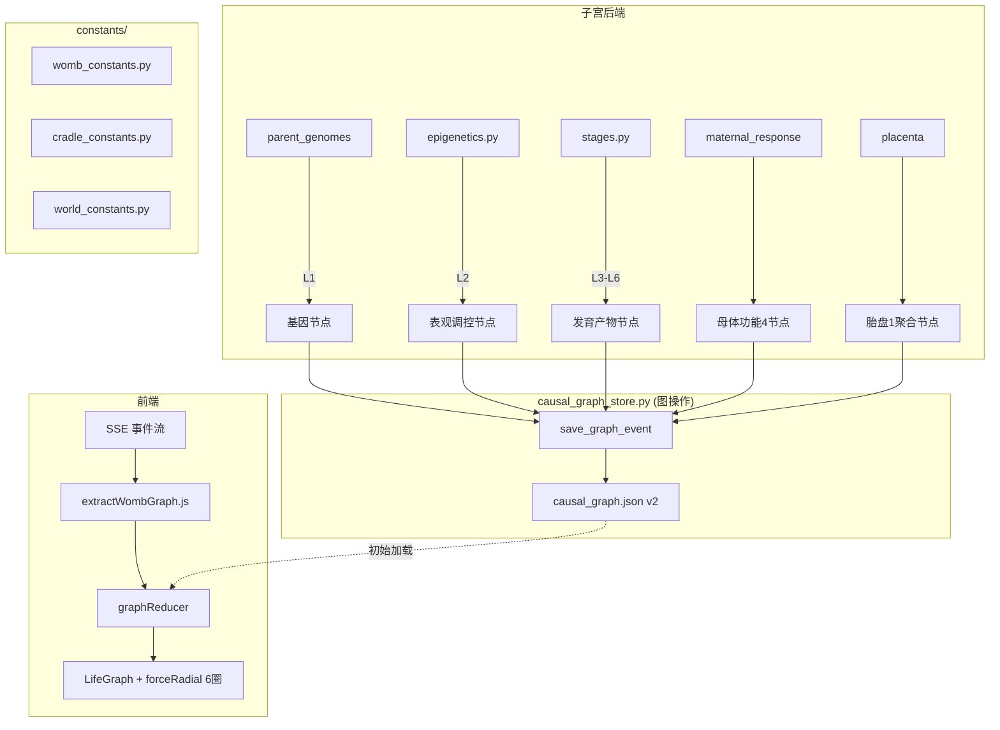
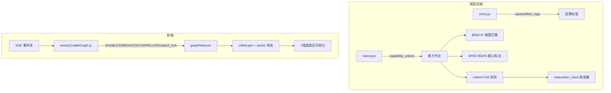
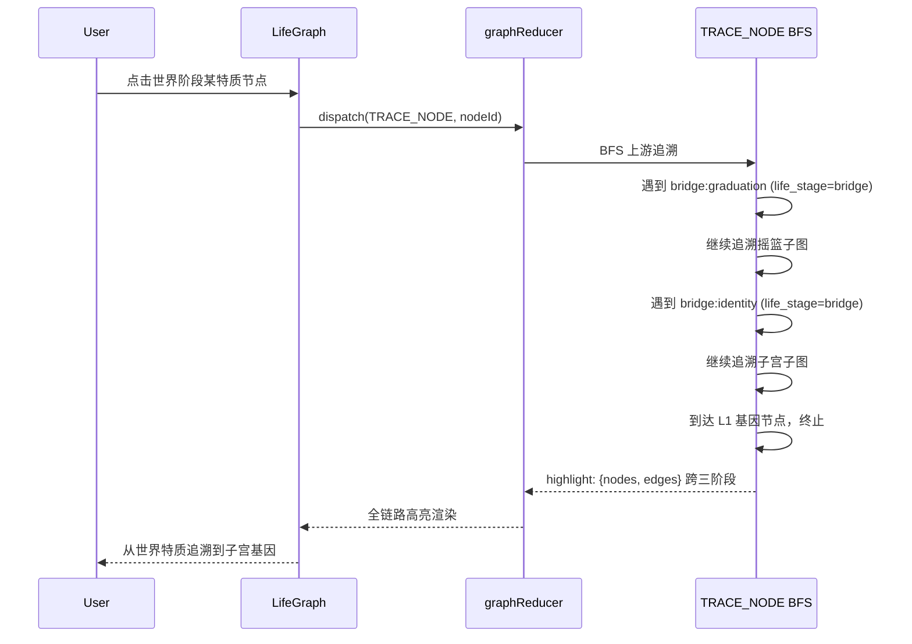

# 因果图谱重构 - 技术设计文档

> 在已有基础设施上改造：react-force-graph-2d, graphReducer, SSE 集成, BFS 追溯已就绪。
> 聚焦：2 层 -> 6 层、三阶段差异化、三种边类型（confirmed/weak_causal/correlation）、
> latent fork 替代 shared_maturation、Bridge 衔接、per-stage 力布局、默认简化视图。

---

## 1. 数据模型扩展

### 1.1 CausalNode 扩展（向后兼容）

在现有 node 结构上新增字段，缺失时使用默认值：

```python
# 新增字段（添加到现有 node dict 中）
{
    # 现有字段不变: node_id, category, name, display_name, life_stage, weight
    
    # 新增字段
    "layer": 0,                    # 子宫层级 L1-L6 (0=未分层, 1-6=子宫层)
    "plasticity": 1.0,             # 可塑性 0-1，子宫阶段随孕期递减
    "plasticity_type": "sustained",# per-locus 类型: "early_lock" | "sustained"
    "bsid_dimension": null,        # 摇篮: BSID-IV 维度归属
    "dunbar_layer": 0,             # 世界: Dunbar 圈层 (0=自我, 1-4=四圈)
    "fiske_model": null,           # 世界: Fiske 关系模型
    "fiske_valence": 0,            # 世界: Fiske 关系效价 (-10~10)
    "who_window": null,            # 摇篮运动里程碑: {"min_months": 3.8, "max_months": 9.2}
    "evidence_sources": [],        # 证据来源引用列表
    "parental_origin": null,       # 表观遗传: 亲本来源 ("maternal"|"paternal"|null)
    "synthetic": false,            # bridge 节点: 是否为合成的默认节点
    "simplified_label": null,      # 简化视图标签 (如 "听懂话")
    "metadata": {}                 # 扩展数据
}
```

**node_id 命名约定扩展（新增类型）：**

| category | node_id 格式 | 阶段 | 示例 |
|----------|-------------|------|------|
| epigenetic | `epigenetic:{gene}:{modification}` | 子宫 L2 | `epigenetic:BDNF:methylation` |
| pathway | `pathway:{name}` | 子宫 L3 | `pathway:Wnt`, `pathway:FGF` |
| cell_type | `cell_type:{name}` | 子宫 L4 | `cell_type:neural_crest` |
| organ | `organ:{name}` | 子宫 L5 | `organ:neural_tube` |
| function | `function:{name}` | 子宫 L6 | `function:temperament_seed` |
| maternal_fn | `maternal_fn:{name}` | 子宫 | `maternal_fn:hormonal_shift` |
| placenta | `placenta:aggregate` | 子宫 | `placenta:aggregate` |
| latent | `latent:maturation_clock_{stage}` | 摇篮 | `latent:maturation_clock_6m` |
| dimension | `dimension:{name}` | 摇篮 | `dimension:cognitive` |
| person | `person:{id}` | 世界 | `person:friend_001` |
| organization | `org:{name}` | 世界 | `org:kindergarten` |
| community | `community:{name}` | 世界 | `community:neighborhood` |
| bridge | `bridge:{name}` | 跨阶段 | `bridge:identity`, `bridge:graduation` |

### 1.2 CausalEdge 扩展（向后兼容）

```python
{
    # 现有字段不变: edge_id, source_id, target_id, edge_type, weight, description

    # 新增字段
    "evidence_level": "theoretical",   # meta_analysis | rct | natural_experiment
                                       # | longitudinal | correlation | theoretical
    "evidence_source": "",             # 证据来源引用 (如 "Walle & Campos 2014")
    "causality_type": "confirmed",     # confirmed | weak_causal | correlation
    "is_feedback_loop": false,         # 是否为正反馈回路的一部分
    "schema_version": 2                # 版本号升级到 2
}
```

**证据等级排序**（循证医学金字塔）：
```
meta_analysis >= rct > natural_experiment > longitudinal > correlation > theoretical
```

**causality_type 枚举定义**：
- `confirmed`: 有直接实验操控证据（RCT/自然实验），或教科书共识
- `weak_causal`: 有分子机制证据但非直接操控（如通路 crosstalk），或跨物种推断
- `correlation`: 统计相关但因果方向/机制不确定

**edge_type 扩展（新增类型，保留全部旧类型）：**

| edge_type | 语义 | 阶段 | 默认 causality_type |
|-----------|------|------|---------------------|
| *旧类型全部保留* | | | |
| `ENABLES` | 前置解锁 | 摇篮 | confirmed |
| `MEDIATES` | 中介路径 | 摇篮 | confirmed |
| `MEDIATED` | 间接中介(A->M->Y) | 摇篮 | confirmed |
| `MODERATED` | 调节关系 | 摇篮 | correlation |
| `CORRELATES` | 统计相关 | 摇篮/世界 | correlation |
| `SEEDS` | 子宫播种 | 跨阶段 | confirmed |
| `SCAFFOLDS` | 照护者脚手架 | 摇篮 | confirmed/correlation |
| `epigenetic_regulation` | 表观调控 | 子宫 L1->L2 | confirmed |
| `signal_transduction` | 信号传导 | 子宫 L2->L3 | confirmed |
| `crosstalk` | 通路交互 | 子宫 L3<->L3 | weak_causal |
| `differentiation` | 细胞分化 | 子宫 L3->L4 | confirmed |
| `morphogenesis` | 器官形成 | 子宫 L4->L5 | confirmed |
| `functional_emergence` | 功能涌现 | 子宫 L5->L6 | confirmed |
| `feedback_loop` | 正反馈回路 | 子宫 | confirmed |
| `latent_fork` | 隐变量分叉 | 摇篮 | confirmed |
| `social_tie` | 社会关系 | 世界 | correlation |
| `life_event_impact` | 生命事件影响 | 世界 | longitudinal |

### 1.3 世界阶段边属性扩展

```python
# 世界阶段 social_tie 边的 metadata 扩展
{
    "frequency": "weekly",              # daily | weekly | monthly | rarely (输入属性)
    "emotional_closeness": 7,           # 1-10 (派生属性，基于 frequency + 互动质量)
    "multiplexity": 2,                  # 关系角色数量 (如 同事+朋友=2)
    "reciprocity": 0.8,                # 互惠度 0-1
    "duration_days": 365,              # 持续时长
    "support_type": ["emotional", "instrumental"],  # 支持类型列表
    "fiske_model": "equality_matching", # Fiske 四模型
    "fiske_valence": 5,                # 关系效价 -10~10
}
```

### 1.4 持久化方案变更

```
backend/archive/{baby_id}/
    causal_graph.json    # 现有格式 (schema_version=1)，保持兼容
                         # 新宝宝使用 schema_version=2，新增字段有默认值
```

**向后兼容策略**：
- 读取时检测 schema_version，缺失视为 v1
- v1 节点自动填充默认值：layer=0, plasticity=1.0, evidence_level="theoretical"
- v1 边自动填充默认值：evidence_level="theoretical", causality_type="confirmed"
- 不做破坏性迁移，新旧数据共存

---

## 2. 子宫六层因果链引擎

### 2.1 层级映射规则

常量定义拆分到 constants/womb_constants.py：

```python
# constants/womb_constants.py
# 子宫六层因果链层级映射
WOMB_LAYER_MAP = {
    # L1 基因层 -- 来自 parent_genomes + offspring_fate
    "gene": 1,
    "origin": 1,
    
    # L2 表观调控层 -- 来自 epigenetics.py
    "epigenetic": 2,
    
    # L3 信号通路层 -- 从阶段响应推断
    "pathway": 3,
    
    # L4 细胞分化层
    "cell_type": 4,
    
    # L5 器官/系统层 -- 来自 organ_primordia, organ_maturation
    "organ": 5,
    "milestone": 5,  # organ_primordia, organ_maturation 归入 L5
    
    # L6 功能/行为层 -- 来自 temperament_seed, reflexes, tendencies
    "function": 6,
    "trait": 6,      # sensory_bias, primary_sense 等归入 L6
}

# 阶段 -> 主要产出层级
STAGE_TO_LAYERS = {
    "zygote": [1],                        # L1 基因
    "early_organogenesis": [2, 4, 5],     # L2 表观 + L4 分化 + L5 器官前体
    "late_organogenesis": [3, 4, 5],      # L3 通路 + L4/L5 器官成熟
    "early_neural": [3, 5],               # L3 通路 + L5 神经系统
    "late_neural": [5, 6],                # L5 髓鞘化 + L6 功能涌现
    "fetal_movement": [6],                # L6 行为
    "birth": [6],                         # L6 最终性状
}

# 同心圆半径公式: r = r0 * sqrt(layer)
WOMB_LAYER_RADIUS_BASE = 80  # r0
# L1: 80, L2: 113, L3: 138, L4: 160, L5: 179, L6: 196
```

### 2.2 表观遗传入图

在 causal_graph_store.py 的 save_graph_event() 中新增处理分支：

```python
# 在 offspring_fate 事件处理后，检查表观遗传数据
if event == "offspring_fate" and event_data.get("epigenetic_notes"):
    methylation = event_data.get("methylation_profile", {})
    for trait, value in methylation.items():
        if abs(value) > 0.15:  # 显著修饰
            epi_id = f"epigenetic:{trait}:methylation"
            _add_node(g, epi_id, "epigenetic", 
                      f"Methylation: {trait} ({value:+.3f})",
                      f"Epi: {_to_title(trait)}", 
                      weight=abs(value),
                      layer=2, plasticity=0.8,
                      plasticity_type="sustained")
            # L1 基因 -> L2 表观
            gene_id = f"gene:mother:{trait}" if f"gene:mother:{trait}" in g["nodes"] else f"gene:father:{trait}"
            if gene_id in g["nodes"]:
                _add_edge(g, f"{gene_id}->{epi_id}", gene_id, epi_id,
                         "epigenetic_regulation", 0.6, 
                         f"Methylation modifies {trait} expression",
                         evidence_level="longitudinal",
                         causality_type="confirmed")

    # 三条关键表观链
    KEY_EPI_CHAINS = [
        ("BDNF", "methylation", "attribute:neural_density",
         "BDNF methylation -> neural density", "longitudinal",
         "confirmed", None),
        ("IGF2_H19", "imprinting", "attribute:body_constitution",
         "IGF2/H19 imprinting -> growth regulation", "natural_experiment",
         "confirmed", "paternal"),  # parental_origin 标注
        ("NR3C1", "methylation", "attribute:arousal_baseline",
         "NR3C1 methylation -> stress sensitivity (animal models + observational)",
         "observational|cross_species",  # 降级：非 RCT
         "confirmed", None),  # causality_type 保持 confirmed 但 evidence_level 降级
    ]
    for gene, mod, target, desc, evidence, causality, parental in KEY_EPI_CHAINS:
        epi_id = f"epigenetic:{gene}:{mod}"
        _add_node(g, epi_id, "epigenetic", f"{gene} {mod}", f"Epi: {gene}",
                  weight=0.7, layer=2, plasticity=0.7,
                  parental_origin=parental)
        if target in g["nodes"]:
            _add_edge(g, f"{epi_id}->{target}", epi_id, target,
                     "epigenetic_regulation", 0.7, desc,
                     evidence_level=evidence, causality_type=causality)
```

### 2.3 信号通路网络

```python
# constants/womb_constants.py (续)

# 七条核心信号通路
SIGNAL_PATHWAYS = ["Wnt", "BMP", "FGF", "Shh", "Notch", "RA", "Hedgehog"]

# 通路 crosstalk 矩阵（简化为离散耦合）
# causality_type = weak_causal（有分子机制但非直接操控证据）
PATHWAY_CROSSTALK = [
    ("Wnt", "Notch", "Wnt activates Notch ligand Dll1 transcription"),
    ("Wnt", "BMP", "dorsoventral patterning"),
    ("FGF", "Wnt", "mesodermal induction"),
    ("Shh", "BMP", "Hedgehog directly antagonizes BMP signaling"),
    ("Shh", "FGF", "limb outgrowth"),
    ("Notch", "BMP", "boundary formation"),
    ("RA", "FGF", "anteroposterior axis"),
]

# 在 late_organogenesis/early_neural 阶段创建通路节点和 crosstalk 边
def _add_pathway_network(g, resp):
    for pw in SIGNAL_PATHWAYS:
        pw_id = f"pathway:{pw}"
        _add_node(g, pw_id, "pathway", f"{pw} Signaling", pw,
                  weight=0.8, layer=3, plasticity=0.6)
    
    for src, tgt, desc in PATHWAY_CROSSTALK:
        eid = f"pathway:{src}<->pathway:{tgt}"
        _add_edge(g, eid, f"pathway:{src}", f"pathway:{tgt}",
                 "crosstalk", 0.4, desc,
                 evidence_level="meta_analysis",
                 causality_type="weak_causal")  # 否决1: 改为 weak_causal
```

### 2.4 母体功能节点（4+1 精简版）

```python
# constants/womb_constants.py (续)

# 母体 4 功能节点 -- 直接映射现有数据源字段
MATERNAL_FUNCTIONS = [
    ("maternal_fn:hormonal_shift", "Hormonal Regulation", "激素调节"),
    ("maternal_fn:physical_adaptation", "Physical Adaptation", "身体适应"),
    ("maternal_fn:nutrient_redistribution", "Nutrient Redistribution", "营养分配"),
    ("maternal_fn:stress_response", "Stress Response", "应激响应"),
]

# 胎盘 1 聚合节点（合并物质交换/免疫屏障/激素生产）
PLACENTA_NODE = (
    "placenta:aggregate", "Placenta", "胎盘",
    {"sub_dimensions": ["exchange", "barrier", "hormone_production"]}
)

# 替换现有单一 maternal 节点的处理逻辑
def _add_maternal_system(g, maternal_response):
    for nid, name, display in MATERNAL_FUNCTIONS:
        _add_node(g, nid, "maternal_fn", name, display, weight=1.5)
    
    # 胎盘聚合节点
    pid, pname, pdisplay, pmeta = PLACENTA_NODE
    _add_node(g, pid, "placenta", pname, pdisplay, weight=1.2,
              metadata=pmeta)
    
    # 母体功能 -> 胎盘 -> 胎儿 因果链
    _add_edge(g, "maternal_fn:nutrient_redistribution->placenta:aggregate",
             "maternal_fn:nutrient_redistribution", "placenta:aggregate",
             "triggers", 0.7, "Nutrients pass through placenta",
             evidence_level="textbook_consensus")
    _add_edge(g, "placenta:aggregate->origin",
             "placenta:aggregate", "origin",
             "environmental_impact", 0.8, "Nourishes embryo",
             evidence_level="textbook_consensus")
    # ... 其余连接
```

### 2.5 可塑性计算（per-locus 两类）

```python
# constants/womb_constants.py (续)

# 可塑性随孕期递减（基于阶段索引）
STAGE_PLASTICITY = {
    "zygote": 0.95,              # 几乎完全可塑
    "early_organogenesis": 0.85,
    "late_organogenesis": 0.70,
    "early_neural": 0.55,
    "late_neural": 0.40,
    "fetal_movement": 0.25,
    "birth": 0.15,               # 大部分系统已固化
}

def _get_plasticity(stage_name: str, field: str) -> tuple[float, str]:
    """获取特定发育产物在特定阶段的可塑性和类型。
    返回 (plasticity_value, plasticity_type)。"""
    base = STAGE_PLASTICITY.get(stage_name, 0.5)
    
    # sustained: 神经系统可塑性衰减更慢（neuroplasticity）
    if "neural" in field or "synapse" in field:
        return (min(1.0, base + 0.15), "sustained")
    
    # early_lock: 器官结构可塑性衰减更快，窗口关闭后急剧下降
    if "organ" in field:
        return (max(0.0, base - 0.10), "early_lock")
    
    return (base, "sustained")  # 默认 sustained
```

### 2.6 回路检测与标记

```python
# 已知正反馈回路
KNOWN_FEEDBACK_LOOPS = [
    # 心跳-FGF 回路
    ["organ:heart", "pathway:FGF", "organ:heart_development", "organ:heart"],
    # 神经活动-表观修饰回路
    ["organ:neural_tube", "epigenetic:neural_activity", "attribute:neural_density", "organ:neural_tube"],
]

def _mark_feedback_loops(g):
    """标记图谱中的已知正反馈回路。"""
    for loop in KNOWN_FEEDBACK_LOOPS:
        for i in range(len(loop)):
            src = loop[i]
            tgt = loop[(i + 1) % len(loop)]
            eid = f"{src}->{tgt}"
            if eid in g["edges"]:
                g["edges"][eid]["is_feedback_loop"] = True
```

---

## 3. 摇篮因果引擎扩展

### 3.1 BSID-IV 维度锚点

```python
# constants/cradle_constants.py

# BSID-IV 5+2 维度定义
BSID_DIMENSIONS = {
    "cognitive": {
        "display_name": "认知",
        "simplified_label": "认知",
        "color": "#6366F1",
        "sector_angle": 0,
    },
    "receptive_language": {
        "display_name": "接受性语言",
        "simplified_label": "听懂话",
        "color": "#06B6D4",
        "sector_angle": 51,
    },
    "expressive_language": {
        "display_name": "表达性语言",
        "simplified_label": "学说话",
        "color": "#0EA5E9",
        "sector_angle": 103,
    },
    "gross_motor": {
        "display_name": "粗大运动",
        "simplified_label": "大动作",
        "color": "#10B981",
        "sector_angle": 154,
    },
    "fine_motor": {
        "display_name": "精细运动",
        "simplified_label": "小动作",
        "color": "#22C55E",
        "sector_angle": 206,
    },
    "social_emotional": {
        "display_name": "社会情绪",
        "simplified_label": "情绪与社交",
        "color": "#F59E0B",
        "sector_angle": 257,
    },
    "adaptive_behavior": {
        "display_name": "适应行为",
        "simplified_label": "生活自理",
        "color": "#EF4444",
        "sector_angle": 309,
        "deferred": True,  # 推迟到 6 月后激活
    },
}

# 能力 -> BSID-IV 维度映射
CAPABILITY_TO_DIMENSION = {
    "head_control": "gross_motor",
    "rolling": "gross_motor",
    "sitting": "gross_motor",
    "crawling": "gross_motor",
    "standing": "gross_motor",
    "walking": "gross_motor",
    "grasping": "fine_motor",
    "pointing": "fine_motor",
    "pincer_grip": "fine_motor",
    "babbling": "expressive_language",
    "first_word": "expressive_language",
    "name_recognition": "receptive_language",
    "social_smile": "social_emotional",
    "stranger_anxiety": "social_emotional",
    "object_permanence": "cognitive",
    "cause_effect": "cognitive",
    "self_feeding": "adaptive_behavior",
    # ... 扩展映射
}

# 遗传 weight 按维度分设
GENETIC_WEIGHT_BY_DIMENSION = {
    "gross_motor": (0.7, 0.8),
    "fine_motor": (0.6, 0.7),
    "cognitive": (0.4, 0.5),
    "receptive_language": (0.3, 0.5),
    "expressive_language": (0.3, 0.5),
    "social_emotional": (0.4, 0.6),
    "adaptive_behavior": (0.3, 0.5),
}

# 依恋阈值模型
ATTACHMENT_THRESHOLD = {
    "secure": 0.0,          # 安全依恋 = 基线，无额外效应
    "insecure_avoidant": -0.2,
    "insecure_anxious": -0.25,
    "disorganized": -0.3,
}
```

### 3.2 WHO MGRS 窗口

```python
# constants/cradle_constants.py (续)

# WHO MGRS 运动里程碑正常窗口（月龄）
WHO_MGRS_WINDOWS = {
    "sitting": {"min_months": 3.8, "max_months": 9.2, "median_months": 5.9},
    "standing_with_support": {"min_months": 4.8, "max_months": 11.4, "median_months": 7.6},
    "walking": {"min_months": 8.2, "max_months": 17.6, "median_months": 12.1},
    "crawling": {"min_months": 5.2, "max_months": 13.5, "median_months": 8.5},
    "standing_alone": {"min_months": 6.9, "max_months": 16.9, "median_months": 11.0},
}

def annotate_milestone_with_who(node: dict, capability: str, actual_age_days: int) -> dict:
    """为运动里程碑节点附加 WHO MGRS 窗口注释。"""
    window = WHO_MGRS_WINDOWS.get(capability)
    if not window:
        return node
    actual_months = actual_age_days / 30.44
    node["who_window"] = window
    node["who_status"] = (
        "early" if actual_months < window["min_months"]
        else "normal" if actual_months <= window["max_months"]
        else "delayed"
    )
    return node
```

### 3.3 摇篮边类型与权重规则

```python
# constants/cradle_constants.py (续)

# 摇篮边类型定义（含新增 mediated/moderated）
CRADLE_EDGE_RULES = {
    "enables": {
        "edge_type": "ENABLES",
        "causality_type": "confirmed",
        "visual": "solid",
        "evidence_level": "longitudinal",
    },
    "mediates": {
        "edge_type": "MEDIATES",
        "causality_type": "confirmed",
        "visual": "semi_dashed",
        "evidence_level": "longitudinal",
    },
    "mediated": {
        "edge_type": "MEDIATED",
        "causality_type": "confirmed",
        "visual": "semi_dashed",
        "evidence_level": "longitudinal",
    },
    "moderated": {
        "edge_type": "MODERATED",
        "causality_type": "correlation",
        "visual": "dashed",
        "evidence_level": "longitudinal",
    },
    "correlates": {
        "edge_type": "CORRELATES",
        "causality_type": "correlation",
        "visual": "dashed",
        "evidence_level": "correlation",
    },
    "seeds": {
        "edge_type": "SEEDS",
        "causality_type": "confirmed",
        "visual": "dotted_gradient",
        "evidence_level": "longitudinal",
    },
    "scaffolds": {
        "edge_type": "SCAFFOLDS",
        "causality_type": "confirmed",
        "visual": "solid",
        "evidence_level": "correlation",
    },
}

# 权重上限规则（基于实证证据）
WEIGHT_CAPS = {
    "attachment_secure": 0.0,    # 安全依恋是基线
    "attachment_insecure": -0.3, # 不安全依恋是负效应上限
    "genetic_motor": (0.7, 0.8),
    "genetic_cognitive": (0.4, 0.5),
    "genetic_language": (0.3, 0.5),
    "severe_malnutrition": 0.9,
    "lead_exposure": 0.85,
    "institutional_deprivation": 0.9,
}

# 运动->认知/语言 必须走中介或相关路径
MEDIATION_RULES = [
    # (source_dimension, target_dimension, mediator, evidence, edge_type)
    ("gross_motor", "expressive_language", "social_interaction_change",
     "Walle & Campos 2014", "CORRELATES"),  # 改为 CORRELATES，证据更弱
    ("gross_motor", "cognitive", "environmental_exploration",
     "Campos et al. 2000", "MEDIATES"),
]
```

### 3.4 Latent Fork 替代 Shared Maturation

```python
# constants/cradle_constants.py (续)

# 已知的共享成熟时钟组（同期解锁的无因果关系能力）
MATURATION_CLOCK_GROUPS = {
    "6m": ["sitting", "object_permanence"],
    "9m": ["crawling", "stranger_anxiety"],
    "12m": ["standing_alone", "first_word"],
    # ... 扩展
}

def create_latent_fork(g, stage_label: str, capabilities: list):
    """为同期解锁的无因果关系能力创建 latent fork 结构。"""
    latent_id = f"latent:maturation_clock_{stage_label}"
    _add_node(g, latent_id, "latent",
              f"Maturation Clock ({stage_label})",
              f"发育时钟 ({stage_label})",
              weight=0.5, layer=0,
              metadata={"description": "不可直接观测的隐变量，代表发育成熟时钟"})
    
    for cap in capabilities:
        cap_id = f"capability:{cap}"
        if cap_id in g["nodes"]:
            _add_edge(g, f"{latent_id}->{cap_id}", latent_id, cap_id,
                     "latent_fork", 0.4,
                     f"Maturation clock drives {cap} emergence",
                     evidence_level="theoretical",
                     causality_type="confirmed")
```

### 3.5 摇篮图谱初始化（compile_identity 扩展）

```python
def compile_cradle_initial_graph(identity, bridge_node_id="bridge:identity"):
    """在入摇篮时创建初始图谱：BSID-IV 维度锚点 + SEEDS 边。"""
    nodes = []
    edges = []
    
    # 创建维度锚点（adaptive_behavior 推迟）
    for dim_key, dim_config in BSID_DIMENSIONS.items():
        if dim_config.get("deferred"):
            continue  # 推迟到 6 月后激活
        nodes.append({
            "node_id": f"dimension:{dim_key}",
            "category": "dimension",
            "name": dim_config["display_name"],
            "display_name": dim_config["display_name"],
            "simplified_label": dim_config["simplified_label"],
            "life_stage": "cradle",
            "weight": 2.0,
            "bsid_dimension": dim_key,
            "layer": 0,
        })
    
    # bridge 节点 life_stage 为独立 "bridge" 类别
    # SEEDS 边：从 bridge:identity 到先天影响的维度
    if identity:
        sense = None
        if identity.sensory_profile and identity.sensory_profile.dominant:
            sense = identity.sensory_profile.dominant
        target_dim = {
            "hearing": "receptive_language",
            "vision": "cognitive",
            "touch": "fine_motor",
            "proprioception": "gross_motor",
        }.get(sense, "cognitive") if sense else "cognitive"
        edges.append({
            "edge_id": f"{bridge_node_id}->dimension:{target_dim}",
            "source_id": bridge_node_id,
            "target_id": f"dimension:{target_dim}",
            "edge_type": "SEEDS",
            "weight": 0.6,
            "evidence_level": "longitudinal",
            "causality_type": "confirmed",
            "description": f"Innate {sense or 'default'} dominance seeds {target_dim} development",
        })
    
    return nodes, edges

def compile_synthetic_bridge():
    """跳过子宫时合成默认 bridge:identity 节点。"""
    return {
        "node_id": "bridge:identity",
        "category": "bridge",
        "name": "Identity (Synthetic)",
        "display_name": "先天身份（合成）",
        "life_stage": "bridge",
        "weight": 2.5,
        "synthetic": True,
        "metadata": {"source": "population_baseline_defaults"},
    }
```

---

## 4. 世界因果引擎

### 4.1 Fiske 四模型 + Dunbar 圈层

```python
# constants/world_constants.py

# Fiske 四模型定义（新增 valence 属性）
FISKE_MODELS = {
    "communal_sharing": {
        "display": "共享型",
        "color": "#EC4899",
        "description": "家人、至亲——无条件共享资源",
        "typical_closeness": (8, 10),
        "default_valence": 8,  # 通常正向
    },
    "authority_ranking": {
        "display": "等级型",
        "color": "#8B5CF6",
        "description": "师生、上下级——基于等级的不对称关系",
        "typical_closeness": (4, 7),
        "default_valence": 3,
    },
    "equality_matching": {
        "display": "对等型",
        "color": "#06B6D4",
        "description": "朋友、同事——基于互惠的对等关系",
        "typical_closeness": (5, 8),
        "default_valence": 5,
    },
    "market_pricing": {
        "display": "市场型",
        "color": "#84CC16",
        "description": "商业关系——基于成本收益分析",
        "typical_closeness": (1, 4),
        "default_valence": 0,
    },
}

# Dunbar 圈层定义（150 为软上限）
DUNBAR_LAYERS = {
    1: {"max_size": 5, "label": "亲密圈", "closeness_range": (8, 10)},
    2: {"max_size": 15, "label": "同情圈", "closeness_range": (6, 8)},
    3: {"max_size": 50, "label": "关系圈", "closeness_range": (3, 6)},
    4: {"max_size": 150, "label": "熟人圈", "closeness_range": (1, 3),
        "soft_cap": True},  # 150 为软上限，超出时节点自动折叠
}

def assign_dunbar_layer(emotional_closeness: float) -> int:
    """根据情感亲密度分配 Dunbar 圈层。"""
    if emotional_closeness >= 8:
        return 1
    elif emotional_closeness >= 6:
        return 2
    elif emotional_closeness >= 3:
        return 3
    else:
        return 4

def derive_emotional_closeness(frequency: str, interaction_quality: float) -> float:
    """从 frequency（输入）和互动质量派生 emotional_closeness。"""
    freq_base = {"daily": 7, "weekly": 5, "monthly": 3, "rarely": 1}
    return min(10.0, freq_base.get(frequency, 3) * interaction_quality)
```

### 4.2 生命事件效应引擎

```python
# constants/world_constants.py (续)

# 生命事件对社会网络的影响参数
# 基线标注: 西方工业社会基线，设为可配置参数
LIFE_EVENT_EFFECTS = {
    "university": {
        "description": "大学/新环境",
        "baseline_culture": "western_industrial",  # 可配置
        "weak_tie_decay": 0.65,
        "strong_tie_decay": 0.05,
        "threshold_break": 0.2,
        "evidence": "Oswald & Clark 2003",
    },
    "marriage": {
        "description": "结婚",
        "baseline_culture": "western_industrial",
        "independent_friend_decay": 0.25,
        "strong_tie_decay": 0.0,
        "new_nodes": [{"type": "person", "dunbar_layer": 1, "closeness": 9}],
        "evidence": "Kalmijn 2012",
    },
    "childbirth_female": {
        "description": "生育(女性)",
        "baseline_culture": "western_industrial",
        "non_kin_decay": 0.50,
        "kin_boost": 0.10,
        "evidence": "Abendroth & den Dulk 2011",
    },
    "relocation": {
        "description": "搬迁",
        "baseline_culture": "western_industrial",
        "outer_circle_break": True,
        "inner_circle_decay": 0.05,
        "evidence": "社会车队模型 Kahn & Antonucci 1980",
    },
}

def apply_life_event(graph, event_type: str) -> list:
    """应用生命事件，返回受影响的边列表。"""
    config = LIFE_EVENT_EFFECTS.get(event_type)
    if not config:
        return []
    
    affected = []
    for eid, edge in list(graph["edges"].items()):
        if edge["edge_type"] != "social_tie":
            continue
        metadata = edge.get("metadata", {})
        closeness = metadata.get("emotional_closeness", 5)
        dunbar = assign_dunbar_layer(closeness)
        
        decay = 0
        if event_type == "relocation" and dunbar >= 3:
            graph["edges"].pop(eid)
            affected.append({"edge_id": eid, "action": "break"})
            continue
        elif event_type == "university":
            decay = config["weak_tie_decay"] if dunbar >= 3 else config["strong_tie_decay"]
        
        if decay > 0:
            new_weight = edge["weight"] * (1 - decay)
            if new_weight < config.get("threshold_break", 0.1):
                graph["edges"].pop(eid)
                affected.append({"edge_id": eid, "action": "break"})
            else:
                edge["weight"] = new_weight
                affected.append({"edge_id": eid, "action": "decay", "new_weight": new_weight})
    
    return affected
```

### 4.3 Bridge: compile_graduation()

```python
def compile_graduation(baby_state, cradle_graph):
    """摇篮->世界桥接：编译毕业身份。"""
    bridge_id = "bridge:graduation"
    nodes = [{
        "node_id": bridge_id,
        "category": "bridge",
        "name": "Graduation",
        "display_name": "毕业",
        "life_stage": "bridge",  # 独立 bridge 类别
        "weight": 3.0,
    }]
    edges = []
    
    key_attrs = [
        f"attribute:attachment_{baby_state.attachment_style}",
        f"attribute:temperament",
    ]
    for milestone in baby_state.milestones:
        key_attrs.append(f"milestone:{milestone.name}")
    
    for attr_id in key_attrs:
        if attr_id in cradle_graph.get("nodes", {}):
            edges.append({
                "edge_id": f"{attr_id}->{bridge_id}",
                "source_id": attr_id,
                "target_id": bridge_id,
                "edge_type": "bridge",
                "weight": 0.8,
                "evidence_level": "implemented",
                "causality_type": "confirmed",
            })
    
    return nodes, edges
```

---

## 5. 前端架构扩展

### 5.1 新增文件清单

```
src/
├── components/
│   ├── graphConfig.js          # 扩展: 新增节点/边类型配置
│   ├── stageConfig.js          # 新增: per-stage 力布局配置
│   ├── LifeGraph.jsx           # 改造: 只留力引擎编排和数据接入
│   ├── nodeRenderer.js         # 新增: 节点渲染（从 LifeGraph 拆出）
│   ├── edgeRenderer.js         # 新增: 边渲染（从 LifeGraph 拆出）
│   ├── loopPulseEffect.js      # 新增: 回路脉冲动画（从 LifeGraph 拆出）
│   ├── EntityLegend.jsx        # 改造: 支持新节点类型
│   └── GraphToolbar.jsx        # 改造: 新增证据过滤
├── hooks/
│   └── useCausalGraph.js       # 改造: 支持跨 bridge BFS
├── extractWombGraph.js         # 改造: 六层节点提取
├── extractCradleGraph.js       # 新增: 摇篮图谱提取
├── extractWorldGraph.js        # 新增: 世界图谱提取
```

### 5.2 stageConfig.js -- Per-Stage 力布局

```javascript
export const STAGE_CONFIGS = {
  womb: {
    name: "womb",
    forces: {
      // forceRadial 按 BFS 深度分 6 圈
      // 同心圆半径公式: r = r0 * sqrt(layer)
      radial: {
        enabled: true,
        strength: 0.4,  // 从 0.8 降到 0.4，与 drift 力兼容
        r0: 80,
        // 层级 -> 半径映射 (r = 80 * sqrt(layer))
        layerRadius: {
          1: 80,    // L1 基因（最内）
          2: 113,   // L2 表观调控
          3: 138,   // L3 信号通路
          4: 160,   // L4 细胞分化
          5: 179,   // L5 器官系统
          6: 196,   // L6 功能行为（最外）
        },
      },
      // drift 力沿 radial 切线方向施加
      drift: {
        enabled: true,
        strength: 0.15,
        direction: "tangential",  // 沿 radial 切线方向
      },
      charge: { strength: -60 },
      collision: { radius: 8 },
    },
    transition: { duration: 1100, easing: "cubicInOut" },
    // 分步动画: 淡出(300ms) -> 切换力(0ms) -> 稳定(500ms) -> 淡入(300ms)
    steppedTransition: {
      fadeOut: 300,
      forceSwitch: 0,
      settle: 500,
      fadeIn: 300,
    },
  },
  
  cradle: {
    name: "cradle",
    forces: {
      radial: {
        enabled: true,
        strength: 0.6,
        dimensionRadius: 280,
        capabilityRadius: 150,
      },
      sector: {
        enabled: true,
        strength: 0.4,
        dimensions: {/* 从 BSID_DIMENSIONS 映射 */},
      },
      charge: { strength: -40 },
      collision: { radius: 6 },
    },
    transition: { duration: 1100, easing: "cubicInOut" },
    steppedTransition: {
      fadeOut: 300,
      forceSwitch: 0,
      settle: 500,
      fadeIn: 300,
    },
  },
  
  world: {
    name: "world",
    forces: {
      // Dunbar 控距离(r)，Louvain 控角度(theta)，正交分离
      cluster: {
        enabled: true,
        strength: 0.5,
        algorithm: "louvain",
        controlAxis: "theta",  // 控制角度
      },
      center: {
        enabled: true,
        strength: 0.03,
      },
      dunbar: {
        enabled: true,
        strength: 0.4,
        controlAxis: "r",  // 控制距离
        softCap: 150,       // 软上限
        // 同心圆半径: r = r0 * sqrt(layer)
        layerRadius: {
          0: 0,
          1: 60,
          2: 85,    // 60 * sqrt(2) ≈ 85
          3: 104,   // 60 * sqrt(3) ≈ 104
          4: 120,   // 60 * sqrt(4) = 120
        },
      },
      charge: { strength: -30 },
      collision: { radius: 5 },
    },
    transition: { duration: 1100, easing: "cubicInOut" },
    steppedTransition: {
      fadeOut: 300,
      forceSwitch: 0,
      settle: 500,
      fadeIn: 300,
    },
  },
}
```

### 5.3 graphConfig.js 扩展

```javascript
// 新增节点类型配置（追加到现有 NODE_CONFIG）
export const NODE_CONFIG_EXTENDED = {
  // 现有配置全部保留...
  
  // 子宫新增
  epigenetic:  { color: '#A855F7', shape: 'hexagon', size: 2.5, label: 'Epigenetic' },
  pathway:     { color: '#14B8A6', shape: 'diamond', size: 3, label: 'Pathway' },
  cell_type:   { color: '#F97316', shape: 'circle', size: 2.5, label: 'Cell Type' },
  organ:       { color: '#EF4444', shape: 'circle', size: 3.5, label: 'Organ' },
  function:    { color: '#EC4899', shape: 'star', size: 3, label: 'Function' },
  maternal_fn: { color: '#F59E0B', shape: 'roundedRect', size: 3, label: 'Maternal Fn' },
  placenta:    { color: '#D946EF', shape: 'roundedRect', size: 2.5, label: 'Placenta' },
  
  // 摇篮新增
  dimension:   { color: '#6366F1', shape: 'circle', size: 5, label: 'BSID Dimension' },
  latent:      { color: '#9CA3AF', shape: 'circle', size: 2, label: 'Latent',
                 strokeStyle: 'dashed', opacity: 0.6 },  // 灰色虚线圆，不可直接观测
  
  // 世界新增
  person:      { color: '#3B82F6', shape: 'circle', size: 3, label: 'Person' },
  organization:{ color: '#6B7280', shape: 'rect', size: 3, label: 'Organization' },
  community:   { color: '#10B981', shape: 'hexagon', size: 3.5, label: 'Community' },
  
  // 跨阶段
  bridge:      { color: 'gradient', shape: 'diamond', size: 4, label: 'Bridge' },
}

// 新增边类型配置
export const EDGE_CONFIG_EXTENDED = {
  // 现有配置全部保留...
  
  // 子宫新增
  epigenetic_regulation: { color: '#A855F7', dash: [],     label: 'Epigenetic Reg.' },
  signal_transduction:   { color: '#14B8A6', dash: [],     label: 'Signal' },
  crosstalk:             { color: '#14B8A6', dash: [6, 3], label: 'Crosstalk' },  // 半虚线 weak_causal
  differentiation:       { color: '#F97316', dash: [],     label: 'Differentiation' },
  morphogenesis:         { color: '#EF4444', dash: [],     label: 'Morphogenesis' },
  functional_emergence:  { color: '#EC4899', dash: [],     label: 'Emergence' },
  feedback_loop:         { color: '#F59E0B', dash: [],     label: 'Feedback' },
  
  // 摇篮新增
  ENABLES:               { color: '#22C55E', dash: [],     label: 'Enables' },
  MEDIATES:              { color: '#06B6D4', dash: [6, 3], label: 'Mediates' },
  MEDIATED:              { color: '#06B6D4', dash: [6, 3], label: 'Mediated' },
  MODERATED:             { color: '#8B5CF6', dash: [3, 3], label: 'Moderated' },
  CORRELATES:            { color: '#9CA3AF', dash: [3, 3], label: 'Correlates' },
  SEEDS:                 { color: '#8B5CF6', dash: [2, 4], label: 'Seeds' },
  SCAFFOLDS:             { color: '#F59E0B', dash: [],     label: 'Scaffolds' },
  latent_fork:           { color: '#9CA3AF', dash: [2, 2], label: 'Maturation Clock' },
  
  // 世界新增
  social_tie:            { color: '#3B82F6', dash: [],     label: 'Social Tie' },
  life_event_impact:     { color: '#EF4444', dash: [5, 3], label: 'Life Event' },
}

// 证据等级视觉映射 -- 简化为 2 种线型
// 实线 = 因果确认 (meta_analysis/rct/natural_experiment)
// 虚线 = 其余 (longitudinal/correlation/theoretical)
// 细节通过 hover/filter 交互展示
export const EVIDENCE_VISUAL = {
  meta_analysis:       { lineStyle: 'solid', opacity: 1.0 },
  rct:                 { lineStyle: 'solid', opacity: 1.0 },
  natural_experiment:  { lineStyle: 'solid', opacity: 0.9 },
  longitudinal:        { lineStyle: 'dashed', opacity: 0.7 },
  "observational|cross_species": { lineStyle: 'dashed', opacity: 0.6 },
  correlation:         { lineStyle: 'dashed', opacity: 0.5 },
  theoretical:         { lineStyle: 'dashed', opacity: 0.4 },
}

// 证据等级排序（用于过滤）
export const EVIDENCE_RANK = {
  meta_analysis: 6,
  rct: 6,  // meta_analysis >= rct
  natural_experiment: 5,
  longitudinal: 4,
  "observational|cross_species": 3,
  correlation: 2,
  theoretical: 1,
}

// 可塑性视觉编码: 边框粗细
// 高可塑(>0.7) = 细边框(1px), 低可塑(<0.3) = 粗边框(4px)
export const PLASTICITY_BORDER = {
  high: 1,    // plasticity > 0.7
  medium: 2,  // 0.3 <= plasticity <= 0.7
  low: 4,     // plasticity < 0.3
}
```

### 5.4 LifeGraph.jsx 改造要点（拆分后）

```javascript
// LifeGraph.jsx -- 只留力引擎编排和数据接入
import { STAGE_CONFIGS } from './stageConfig'
import { renderNode } from './nodeRenderer'
import { renderEdge } from './edgeRenderer'
import { applyLoopPulse } from './loopPulseEffect'

// 1. 接入 stageConfig 进行 per-stage 力布局
useEffect(() => {
  if (!graphRef.current) return
  const config = STAGE_CONFIGS[stage]
  const fg = graphRef.current
  
  if (config.forces.radial?.enabled) {
    fg.d3Force('radial', forceRadial(
      node => config.forces.radial.layerRadius?.[node.layer] || 150,
      config.forces.radial.strength
    ))
  }
  // drift 力沿 radial 切线方向
  if (config.forces.drift?.enabled) {
    fg.d3Force('drift', driftTangentialForce(config.forces.drift.strength))
  }
  // Dunbar 控 r, Louvain 控 theta
  if (config.forces.dunbar?.enabled) {
    fg.d3Force('dunbar', dunbarRadialForce(config.forces.dunbar))
  }
  if (config.forces.cluster?.enabled) {
    fg.d3Force('cluster', louvainThetaForce(config.forces.cluster))
  }
}, [stage])

// 2. 分步阶段切换过渡动画
// 淡出旧节点(300ms) -> 切换力参数(0ms) -> 力模拟稳定(500ms) -> 淡入新节点(300ms)
function handleStageTransition(fromStage, toStage) {
  const stepped = STAGE_CONFIGS[toStage].steppedTransition
  fadeOutNodes(stepped.fadeOut)
    .then(() => switchForces(toStage))
    .then(() => waitForSettle(stepped.settle))
    .then(() => fadeInNodes(stepped.fadeIn))
}

// 3. 节点/边渲染委托给拆分模块
nodeCanvasObject={(node, ctx) => renderNode(node, ctx, { stage, expertMode })}
linkCanvasObject={(link, ctx) => renderEdge(link, ctx, { stage, expertMode })}
```

```javascript
// nodeRenderer.js -- 节点渲染
// plasticity 影响边框粗细（高可塑=细边框, 低可塑=粗边框）
// latent 节点用灰色虚线圆
// bridge 节点用菱形 + 渐变色 + 流动粒子
// 简化视图用 simplified_label

// edgeRenderer.js -- 边渲染
// 2 种线型: 实线(因果确认) / 虚线(其余)
// 证据过滤: 淡化(opacity=0.15) 而非隐藏
// weak_causal 用半虚线

// loopPulseEffect.js -- 回路脉冲动画
// is_feedback_loop 边使用 strokeDashOffset 动画
// 仅视口内回路启用，发光用离屏 Canvas 缓存，粒子限同屏 20 条
```

### 5.5 useCausalGraph.js 改造要点

```javascript
// TRACE_NODE action 增强：遇 bridge 跨阶段追溯
case 'TRACE_NODE': {
  const nodeId = action.payload
  if (!nodeId) return { ...state, highlight: null }
  const visitedNodes = new Set()
  const visitedEdges = new Set()
  const queue = [nodeId]
  while (queue.length > 0) {
    const current = queue.shift()
    if (visitedNodes.has(current)) continue
    visitedNodes.add(current)
    for (const edge of state.edges) {
      if (edge.target_id === current || edge.target === current) {
        visitedEdges.add(edge.edge_id)
        const src = edge.source_id || edge.source
        if (!visitedNodes.has(src)) queue.push(src)
      }
    }
    // Bridge 跳转：bridge 节点在两个子图中都有边，BFS 自然跨越
  }
  return { ...state, highlight: { nodes: visitedNodes, edges: visitedEdges } }
}

// LIFE_EVENT action: 批量衰减/断裂关系边
case 'LIFE_EVENT': {
  const { event_type, affected } = action.payload
  // 原子化应用，只触发一次渲染
  // ...
}
```

### 5.6 extractCradleGraph.js（新增）

```javascript
// 核心职责：从摇篮 SSE 事件提取图谱数据
export default function extractCradleGraphData(data, graphDispatch, graphState) {
  const nodes = []
  const edges = []
  
  // 能力解锁 -> ENABLES 边 + WHO 窗口标注
  if (data.event === 'capability_unlock') {
    const cap = data.capability
    const dim = CAPABILITY_TO_DIMENSION[cap]
    const node = {
      node_id: `capability:${cap}`,
      category: 'milestone',
      name: cap,
      display_name: toTitle(cap),
      life_stage: 'cradle',
      bsid_dimension: dim,
    }
    if (WHO_MGRS_WINDOWS[cap]) {
      node.who_window = WHO_MGRS_WINDOWS[cap]
    }
    nodes.push(node)
    if (dim) {
      edges.push({
        edge_id: `capability:${cap}->dimension:${dim}`,
        source_id: `capability:${cap}`,
        target_id: `dimension:${dim}`,
        edge_type: 'ENABLES',
        evidence_level: 'longitudinal',
        causality_type: 'confirmed',
      })
    }
  }
  
  if (nodes.length > 0) graphDispatch({ type: 'ADD_NODES', payload: nodes })
  if (edges.length > 0) graphDispatch({ type: 'ADD_EDGES', payload: edges })
}
```

### 5.7 extractWorldGraph.js（新增）

```javascript
// 核心职责：从世界 SSE 事件提取社会网络图谱
export default function extractWorldGraphData(data, graphDispatch, graphState) {
  const nodes = []
  const edges = []
  
  if (data.event === 'relationship_formed') {
    nodes.push({
      node_id: `person:${data.person_id}`,
      category: 'person',
      name: data.person_name,
      display_name: data.person_name,
      life_stage: 'world',
      dunbar_layer: assignDunbarLayer(data.emotional_closeness),
      fiske_model: data.fiske_model,
      fiske_valence: data.fiske_valence || 0,
    })
    edges.push({
      edge_id: `self->person:${data.person_id}`,
      source_id: 'self',
      target_id: `person:${data.person_id}`,
      edge_type: 'social_tie',
      weight: data.emotional_closeness / 10,
      causality_type: 'correlation',
      metadata: {
        frequency: data.frequency,
        emotional_closeness: data.emotional_closeness,
        multiplexity: data.multiplexity || 1,
        reciprocity: data.reciprocity || 0.5,
        support_type: data.support_type || [],
        fiske_model: data.fiske_model,
        fiske_valence: data.fiske_valence || 0,
      },
    })
  }
  
  if (data.event === 'life_event') {
    graphDispatch({
      type: 'LIFE_EVENT',
      payload: { event_type: data.life_event_type, affected: data.affected_edges },
    })
  }
  
  if (nodes.length > 0) graphDispatch({ type: 'ADD_NODES', payload: nodes })
  if (edges.length > 0) graphDispatch({ type: 'ADD_EDGES', payload: edges })
}
```

---

## 6. 数据流 Mermaid 图

### 6.1 子宫六层因果链数据流



### 6.2 摇篮 BSID-IV 数据流（含 latent fork）



### 6.3 世界社会网络数据流

```mermaid
graph TD
    subgraph "世界后端"
        WORLD[world.py] -->|relationship_formed| REL[关系数据]
        WORLD -->|life_event| EVT[生命事件]
        REL --> FISKE[Fiske 四模型+valence 标注]
        REL --> DUNBAR[Dunbar 圈层(r) + Louvain(theta)]
        EVT --> DECAY[关系衰减计算]
    end
    
    subgraph "前端"
        SSE[SSE 事件流] --> EXG[extractWorldGraph.js]
        EXG --> GR[graphReducer]
        GR --> LG[LifeGraph + dunbar(r)+louvain(theta)]
        EVT -.->|LIFE_EVENT action| GR
    end
```

### 6.4 跨阶段 Bridge 追溯流



---

## 7. 影响评估

### 7.1 后端改动

| 文件 | 改动类型 | 侵入程度 | 向后兼容 |
|------|----------|----------|----------|
| constants/womb_constants.py | 新增：六层常量、通路矩阵、母体 4+1、可塑性 | 新增 | 是 |
| constants/cradle_constants.py | 新增：BSID-IV、WHO、边类型、latent fork、依恋阈值 | 新增 | 是 |
| constants/world_constants.py | 新增：Fiske+valence、Dunbar、生命事件衰减 | 新增 | 是 |
| causal_graph_store.py | 改造：图操作函数（常量已拆出） | 中 | 是（新增字段有默认值） |
| cradle/causality.py | 扩展：引用 cradle_constants | 低 | 是（纯添加） |
| cradle/identity.py | 扩展：compile_cradle_initial_graph() + compile_synthetic_bridge() | 低 | 是 |
| cradle/nanny.py | 扩展：能力->维度映射 + WHO 标注 | 低 | 是 |
| world.py | 新增：compile_graduation() + 社会网络引擎 | 新增 | 是 |

### 7.2 前端改动

| 文件 | 改动类型 | 说明 |
|------|----------|------|
| graphConfig.js | 扩展 | 新增节点/边配置 + latent + 简化 EVIDENCE_VISUAL |
| stageConfig.js | 新增 | per-stage 力布局 + 分步动画 + Dunbar/Louvain 正交 |
| LifeGraph.jsx | 拆分改造 | 只留力引擎编排，渲染委托 |
| nodeRenderer.js | 新增 | 节点渲染（plasticity 边框粗细、latent 虚线圆） |
| edgeRenderer.js | 新增 | 边渲染（2 种线型、证据淡化） |
| loopPulseEffect.js | 新增 | 回路脉冲（视口内、离屏缓存、粒子限 20） |
| extractWombGraph.js | 改造 | 六层提取 + 表观 + 通路 + 母体 4+1 |
| extractCradleGraph.js | 新增 | 摇篮图谱提取 |
| extractWorldGraph.js | 新增 | 世界图谱提取 |
| useCausalGraph.js | 改造 | 跨 bridge BFS + LIFE_EVENT action |
| EntityLegend.jsx | 改造 | 支持 latent/bridge 新节点类型 |
| GraphToolbar.jsx | 改造 | 证据过滤（淡化模式）+ 简化/专家切换 |

### 7.3 数据兼容性

- **零破坏性变更**：旧 causal_graph.json (v1) 自动填充默认值正常加载
- **schema_version 升级到 2**：新数据写入 v2，读取兼容 v1+v2
- **前端 graphReducer**：新增 action type (LIFE_EVENT) 不影响已有 action

---

## 8. 架构决策记录

### ADR-7: 六层分层不引入新存储格式

**决策**: 层级信息作为节点属性（layer 字段）嵌入现有 causal_graph.json，不创建独立的层级存储。
**原因**: 层级本质是节点的元数据，不是独立实体。嵌入节点属性避免额外 JOIN 操作。
**后果**: 前端按 layer 字段分圈渲染，后端按 layer 过滤，零额外 I/O。

### ADR-8: 通路 crosstalk 用静态矩阵 + weak_causal 因果类型

**决策**: 七条通路的 crosstalk 关系用硬编码矩阵定义，causality_type 标记为 weak_causal 而非 correlation。
**原因**: 通路 crosstalk 有分子层面的明确因果机制（如 Wnt 激活 Notch 配体 Dll1 转录），但不是直接实验操控证据。使用 weak_causal 在因果推断层面更准确。
**后果**: 视觉上使用半虚线渲染，区别于实线（confirmed）和全虚线（correlation）。

### ADR-9: 摇篮边类型用大写（ENABLES/MEDIATES）区分旧类型

**决策**: 摇篮新边类型用全大写命名，与子宫旧边类型（小写 snake_case）视觉区分。
**原因**: 避免与现有 edge_type 混淆。大写命名一眼可识别为重构后的语义边。
**后果**: 前端 EDGE_CONFIG 需要同时支持两种命名风格。

### ADR-10: 世界阶段 LIFE_EVENT 用独立 reducer action 处理

**决策**: 生命事件引发的批量关系衰减/断裂用独立的 LIFE_EVENT action 处理。
**原因**: 生命事件影响数十条边，逐条 dispatch 触发数十次渲染。单次 dispatch 原子化应用。
**后果**: graphReducer 新增一个 case。

### ADR-11: evidence_level 属性是字符串枚举 + 显式排序

**决策**: evidence_level 使用语义字符串，排序通过独立 EVIDENCE_RANK 映射定义。
**原因**: 字符串自文档化。排序遵循循证医学金字塔：meta_analysis >= rct > natural_experiment > longitudinal > correlation > theoretical。
**后果**: 过滤时查 EVIDENCE_RANK 映射。

### ADR-12: 废弃 shared_maturation，改用 latent fork

**决策**: 不使用 shared_maturation 边类型，引入 latent 类型节点（maturation_clock）建模为 fork 结构。
**原因**: 共享成熟时钟本质是 common cause（Pearl fork），不是标准因果推断构件。latent fork 语义更准确且与因果推断理论一致。
**后果**: 新增 latent 节点类型，灰色虚线圆渲染。摇篮同期解锁的无因果关系能力通过共享 latent 节点连接。

### ADR-13: 常量拆分到 constants/ 目录

**决策**: causal_graph_store.py 中的常量拆分为 constants/womb_constants.py、constants/cradle_constants.py、constants/world_constants.py。
**原因**: store 本体应只留图操作函数，常量体量大且按阶段独立，拆分提升可维护性。
**后果**: store 引入三个常量模块，常量修改不影响图操作逻辑。

---

## 评审记录

**评审日期**: 2026-04-14
**评审参与**: 12 位跨领域专家

### 设计层关键变更

| 编号 | 变更 | 原因 |
|------|------|------|
| V1 | crosstalk causality_type: correlation -> weak_causal | 有分子机制证据 |
| V2 | 证据排序: meta_analysis >= rct 并列最高 | 循证医学金字塔 |
| V3 | 废弃 shared_maturation，新增 latent fork | Pearl fork 语义更准确 |
| V4 | NR3C1 evidence_level: confirmed -> observational cross_species | 非 RCT 证据 |
| V5 | 母体 6+3=9 节点 -> 4+1=5 节点 | 数据源只有 4 字段 |
| V8 | 视觉编码简化为 2 种线型 | 降低认知负荷 |
| V9 | radial strength 0.8 -> 0.4, drift 沿切线 | 与 drift 力兼容 |
| V10 | 阶段切换改为分步动画 1100ms | 更流畅的用户体验 |
| V12 | causal_graph_store 常量拆分到 constants/ | 职责分离 |
| V13 | Dunbar 控 r, Louvain 控 theta | 正交分离 |
| V14 | 同心圆半径 r = r0 * sqrt(layer) | 外圈面积更大 |
| V15 | plasticity 视觉编码改为边框粗细 | 避免与其他颜色编码冲突 |
