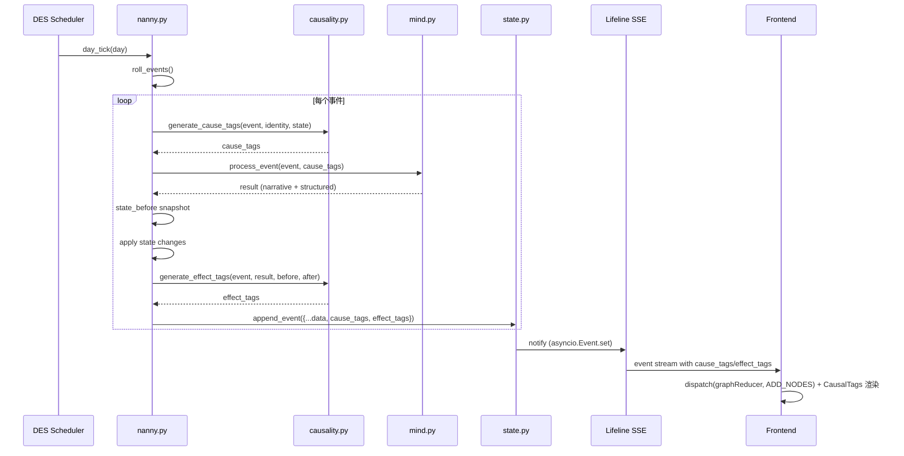
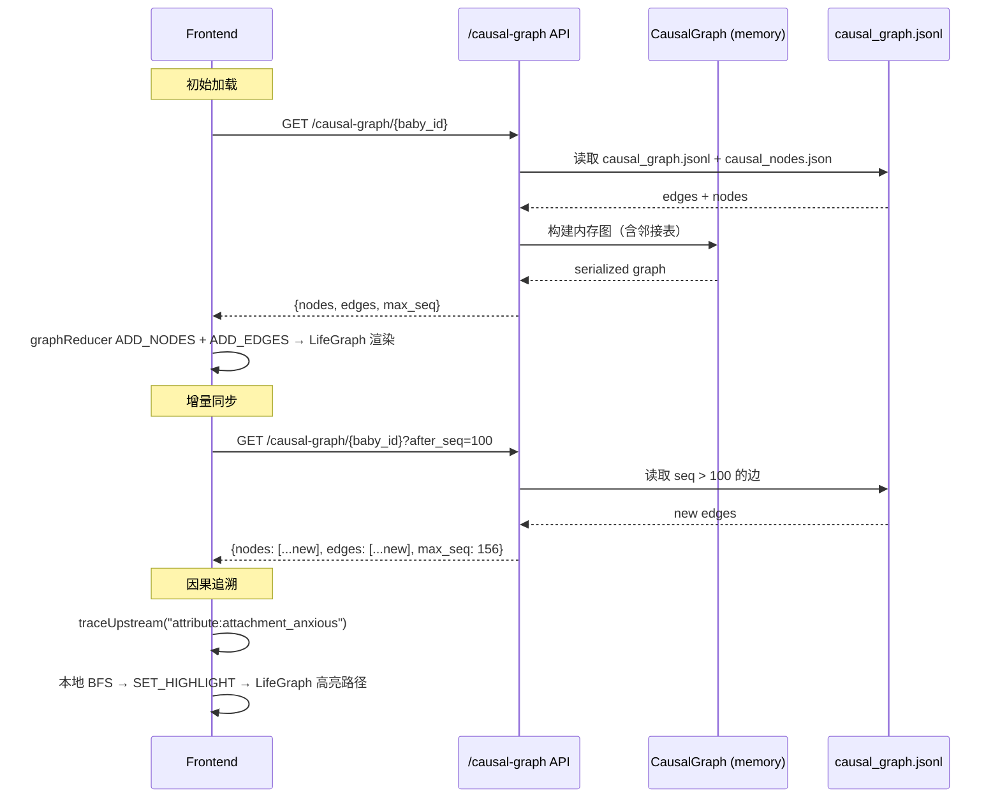
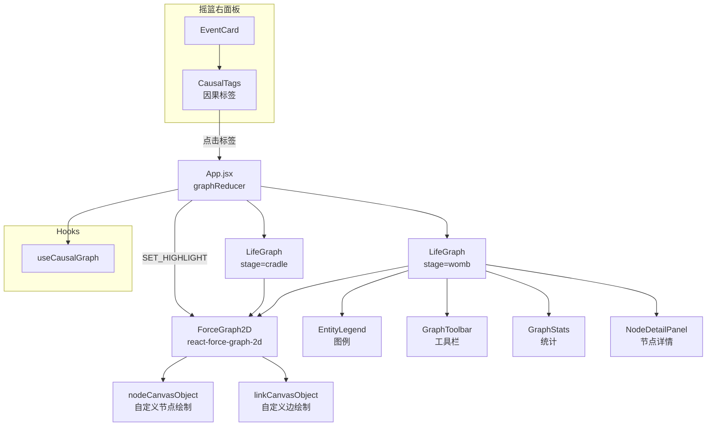

# 全生命因果图谱 - 技术设计文档

## 1. 数据模型

### 1.1 CausalNode（因果节点）

```python
@dataclass
class CausalNode:
    """因果图谱中的一个节点。"""
    node_id: str                    # 唯一标识，格式: {category}:{name}:{qualifier}
                                    # 例: gene:metabolism:fast, event:feeding_difficulty:phase0_day3
    category: str                   # gene | trait | event | milestone | decision | attribute | bridge
    name: str                       # 人类可读名称
    display_name: str               # 前端显示名称（中文）
    life_stage: str                 # womb | cradle | world
    phase: int                      # 所属阶段索引（womb: 0-6, cradle: 0-11, world: 0+）
    age_days: int                   # 发生时日龄（womb 用负数表示孕期天数）
    weight: float = 1.0             # 节点权重/重要性（用于折叠排序）
    metadata: dict = field(default_factory=dict)  # 扩展数据（如事件详情、基因表达等）

    # 折叠控制
    parent_group: str = ""          # 所属折叠组（如 "cradle:phase:3"）
    is_group: bool = False          # 是否为折叠组节点
```

**node_id 命名约定：**

| category | node_id 格式 | 示例 |
|----------|-------------|------|
| gene | `gene:{trait_name}` | `gene:metabolism_fast` |
| trait | `trait:{trait_name}` | `trait:sensory_dominant_hearing` |
| event | `event:{event_name}:{phase}_{day}` | `event:feeding_difficulty:p3_d45` |
| milestone | `milestone:{name}:{phase}` | `milestone:first_word:p5` |
| decision | `decision:{caregiver}:{event}:{phase}_{day}` | `decision:parent:naming:p1_d15` |
| attribute | `attribute:{name}` | `attribute:attachment_anxious` |
| bridge | `bridge:{type}` | `bridge:identity`, `bridge:world_readiness` |

### 1.2 CausalEdge（因果边）

```python
@dataclass
class CausalEdge:
    """一条因果关系。"""
    edge_id: str                    # 唯一标识: {source_id}->{target_id}
    source_id: str                  # 源节点 node_id
    target_id: str                  # 目标节点 node_id
    edge_type: str                  # 因果类型（开放枚举，见下）
    weight: float = 1.0             # 关系强度 0-1
    confidence: str = "rule"        # rule（规则确定）| llm（LLM 推断）| observed（观测到）
    description: str = ""           # 人类可读的因果说明
    created_at_seq: int = 0         # 创建时的全局 seq（用于增量同步）
    schema_version: int = 1         # schema 版本号
```

**edge_type 开放枚举（初始值）：**

| edge_type | 语义 | 示例 |
|-----------|------|------|
| `genetic_expression` | 基因 → 表型 | gene:metabolism_fast → trait:high_arousal |
| `sensory_development` | 感官发育因果 | trait:hearing_dominant → attribute:noise_sensitive |
| `environmental_impact` | 环境影响 | event:stress_increase → trait:temperament_shift |
| `parental_decision` | 父母决策因果 | decision:parent:naming → attribute:cultural_identity |
| `stress_cascade` | 压力级联 | event:sleep_disruption → attribute:stress_high |
| `attachment_formation` | 依恋形成 | decision:parent:responsive → attribute:attachment_secure |
| `capability_unlock` | 能力解锁 | milestone:first_word → trait:verbal_expression |
| `regression` | 压力回退 | attribute:stress_high → attribute:capability_regression |
| `bridge` | 跨阶段桥接 | bridge:identity → trait:sensory_dominant_hearing |

### 1.3 CausalGraph（因果图谱）

```python
@dataclass
class CausalGraph:
    """完整的因果图谱（内存中的工作结构）。"""
    baby_id: str
    nodes: dict[str, CausalNode]    # node_id -> CausalNode
    edges: list[CausalEdge]         # 所有因果边
    _adjacency: dict[str, list[str]]  # node_id -> [downstream node_ids]（缓存）
    _reverse_adj: dict[str, list[str]]  # node_id -> [upstream node_ids]（缓存）

    def trace_upstream(self, node_id: str, max_depth: int = 10) -> list[CausalEdge]:
        """从目标节点向上追溯所有因果链。BFS，max_depth 防止异常环。"""

    def trace_downstream(self, node_id: str, max_depth: int = 10) -> list[CausalEdge]:
        """从源节点向下追踪所有影响链。"""

    def get_subgraph(self, life_stage: str = None, phase: int = None) -> CausalGraph:
        """按生命阶段/阶段索引提取子图。"""

    def collapse_to_level(self, level: int) -> list[CausalNode]:
        """折叠到指定层级：0=生命周期, 1=阶段, 2=事件。"""
```

### 1.4 因果标签（Phase 0 轻量结构）

Phase 0 不引入完整 CausalNode/CausalEdge，仅在现有事件 payload 中增加标签字段：

```python
# events.jsonl 中每条事件新增字段
{
    "seq": 42,
    "type": "autonomous_event",
    "data": {
        # ...现有字段不变...
        "cause_tags": [           # 新增：原因标签列表
            "sensory_dominant:hearing",
            "arousal:high",
            "phase:3"
        ],
        "effect_tags": [          # 新增：影响标签列表
            "stress:+0.1",
            "preference:add:music",
            "memory:positive"
        ]
    }
}
```

**标签命名规范：**

| 前缀 | 含义 | 示例 |
|------|------|------|
| `sensory_dominant:{sense}` | 主导感官因果 | `sensory_dominant:hearing` |
| `sensory_weak:{sense}` | 薄弱感官因果 | `sensory_weak:vision` |
| `arousal:{level}` | 唤醒基线因果 | `arousal:high` |
| `temperament:{seed}` | 气质因果 | `temperament:reactive` |
| `defect:{name}` | 先天缺陷因果 | `defect:hearing_impaired` |
| `stress:{delta}` | 压力变化效果 | `stress:+0.15` |
| `attachment:{direction}` | 依恋变化效果 | `attachment:toward_secure` |
| `capability:{action}` | 能力变化效果 | `capability:unlock:crawling` |
| `preference:{action}:{item}` | 偏好变化效果 | `preference:add:music` |
| `fear:{action}:{item}` | 恐惧变化效果 | `fear:add:loud_sounds` |
| `phase:{index}` | 阶段上下文 | `phase:3` |
| `caregiver:{id}:{trait}` | 照护者因果 | `caregiver:parent:responsive` |

### 1.5 持久化方案

```
backend/babies/{baby_id}/
    state.json          # 现有状态（不变）
    events.jsonl        # 现有事件日志（Phase 0: 新增 cause_tags/effect_tags 字段）
    causal_graph.jsonl  # Phase 1 新增：每行一条 CausalEdge JSON
    causal_nodes.json   # Phase 1 新增：全量节点快照（Identity 编译时写入，事件时追加）
```

**causal_graph.jsonl 格式（append-only）：**
```json
{"edge_id":"gene:metabolism_fast->trait:high_arousal","source_id":"gene:metabolism_fast","target_id":"trait:high_arousal","edge_type":"genetic_expression","weight":0.8,"confidence":"rule","description":"快速代谢基因表达为高唤醒基线","created_at_seq":1,"schema_version":1}
```

---

## 2. 因果标签生成引擎（Phase 0 核心）

### 2.1 规则引擎：cradle/causality.py（新文件）

```
cradle/causality.py
  ├── generate_cause_tags(event, identity, state) -> list[str]
  ├── generate_effect_tags(event, result, state_before, state_after) -> list[str]
  ├── SENSORY_CAUSE_RULES: dict    # 感官通道 → cause_tag 映射
  ├── EVENT_EFFECT_RULES: dict     # 事件类型 → effect_tag 模板映射
  └── rebuild_tags_from_memory(memory: Memory) -> tuple[list[str], list[str]]
```

**因果标签生成规则：**

```
generate_cause_tags(event, identity, state):
    tags = []
    # 1. 感官通道匹配
    for channel in event.sensory_channels:
        if channel == identity.sensory_profile.dominant:
            tags.append(f"sensory_dominant:{channel}")
        if channel == identity.sensory_profile.weak:
            tags.append(f"sensory_weak:{channel}")

    # 2. 唤醒基线 × 事件强度
    if identity.arousal_baseline == "high" and event.intensity > 0.3:
        tags.append("arousal:high")
    if identity.arousal_baseline == "low" and event.intensity < 0.2:
        tags.append("arousal:low")

    # 3. 压力状态上下文
    if state.stress.stress_level > 0.5:
        tags.append("stress:accumulated")

    # 4. 缺陷匹配
    for defect in identity.defects:
        for channel in event.sensory_channels:
            if channel in defect.lower():
                tags.append(f"defect:{defect}")

    # 5. 阶段上下文
    tags.append(f"phase:{state.current_phase}")

    return tags
```

```
generate_effect_tags(event, result, state_before, state_after):
    tags = []
    # 1. 压力变化
    delta = state_after.stress.stress_level - state_before.stress.stress_level
    if abs(delta) > 0.01:
        tags.append(f"stress:{'+' if delta > 0 else ''}{delta:.2f}")

    # 2. 依恋变化
    if state_after.attachment_style != state_before.attachment_style:
        tags.append(f"attachment:toward_{state_after.attachment_style}")

    # 3. 能力变化
    new_caps = set(state_after.capabilities) - set(state_before.capabilities)
    for cap in new_caps:
        tags.append(f"capability:unlock:{cap}")

    # 4. 回退检测
    if len(state_after.stress.regressed_capabilities) > len(state_before.stress.regressed_capabilities):
        for reg in state_after.stress.regressed_capabilities:
            if reg not in state_before.stress.regressed_capabilities:
                tags.append(f"capability:regress:{reg['capability']}")

    # 5. 情绪效价
    tags.append(f"memory:{result.get('emotional_valence', 'neutral')}")

    return tags
```

### 2.2 mind.py 改造：先决策再叙事

**当前流程（要改）：**
```
event → LLM(event + context) → narrative_string（含隐式因果）
```

**目标流程：**
```
event → causality.generate_cause_tags() → cause_tags
      → LLM(event + context + cause_tags) → structured_response
      → causality.generate_effect_tags() → effect_tags
      → 事件 payload = {..., cause_tags, effect_tags}
```

关键变更点（mind.py 中 4 个 LLM 调用函数）：

1. **process_daily_with_nanny()**: 完全用规则生成因果标签，无需改 LLM prompt
2. **process_environment_events()**: 在 LLM prompt 中注入 cause_tags 作为上下文，LLM 输出 JSON 新增 `llm_cause_tags` 字段
3. **process_critical_event()**: 同上，且 effect_tags 在父母决策后生成
4. **generate_heartbeat_evaluation()**: 心跳事件用规则标签，LLM 不改

### 2.3 旧数据兼容：rebuild_tags_from_memory()

```python
def rebuild_tags_from_memory(memory: Memory, identity: Identity) -> tuple[list, list]:
    """从已有 Memory 反推因果标签（尽力而为）。"""
    cause_tags = []
    effect_tags = []

    # 从 Memory.trace 提取（trace 字段记录了"追溯到哪条先天约束"）
    if memory.trace:
        # trace 通常是自然语言，做关键词匹配
        for sense in ["hearing", "vision", "touch", "smell", "proprioception"]:
            if sense in memory.trace.lower():
                cause_tags.append(f"sensory_related:{sense}")
        if "arousal" in memory.trace.lower():
            cause_tags.append("arousal:related")

    # 从 Memory.emotional_valence 提取 effect
    effect_tags.append(f"memory:{memory.emotional_valence}")

    # 从 Memory.growth_signal 提取
    if memory.growth_signal:
        effect_tags.append(f"growth:{memory.growth_signal}")

    cause_tags.append(f"phase:{memory.phase}")
    return cause_tags, effect_tags
```

---

## 3. 因果图谱编译器（Phase 1 核心）

### 3.1 子宫因果子图编译：identity.py 扩展

在 `compile_identity()` 完成后调用 `compile_womb_causal_graph(baby_data, identity)`：

```
compile_womb_causal_graph(baby_data, identity) -> list[CausalNode], list[CausalEdge]:
    节点：
      genes = baby_data["genes"]
      for trait in genes.get("expression", []):
          add node: gene:{trait}
      
      # 感官画像节点
      add node: trait:sensory_dominant_{identity.sensory_profile.dominant}
      add node: trait:sensory_weak_{identity.sensory_profile.weak}
      
      # 唤醒基线节点
      add node: trait:arousal_{identity.arousal_baseline}
      
      # 气质节点
      add node: trait:temperament_{identity.temperament[:20]}
      
      # 缺陷节点
      for defect in identity.defects:
          add node: trait:defect_{defect}
      
      # 行为约束节点（每条约束一个节点）
      for i, constraint in enumerate(identity.constraints):
          add node: attribute:constraint_{i}
      
      # Identity 桥接节点
      add node: bridge:identity

    边：
      gene → trait（genetic_expression）
      trait → attribute（sensory_development / environmental_impact）
      trait → bridge:identity（bridge）
```

**子宫期 gestation_log 的因果提取规则：**

从 dynamic_env.py 的 ENV_CHANGE_TYPES 和 rule_engine.py 的级联因果链，可以确定性地生成以下因果边：

| 源 | 目标 | 依据 |
|----|------|------|
| gene:metabolism_{type} | trait:arousal_{level} | rule_engine._METABOLISM_BONUS 映射 |
| gene:division_rate_{speed} | trait:cell_quality_{level} | rule_engine._QUALITY_GIVEN_DIVISION 条件概率 |
| env:stress_{level} | trait:arousal_shift | dynamic_env.ENV_CHANGE_TYPES 映射 |
| env:nutrition_{level} | trait:development_pace | dynamic_env.compute_budget_delta 映射 |
| womb_stage:late_org | trait:sensory_dominant_{sense} | identity._extract_sensory_profile 从 primary_sense 读取 |
| womb_stage:late_neural | trait:arousal_{baseline} | identity._extract_arousal_baseline 从 arousal_baseline 读取 |
| womb_stage:fetal_movement | trait:temperament_{seed} | identity._extract_temperament 从 temperament_seed 读取 |

### 3.2 摇篮因果子图：实时累积

每次事件处理后，调用 `append_causal_edges(baby_id, edges)`:

```
append_causal_edges(baby_id, edges: list[CausalEdge]):
    path = babies_dir / baby_id / "causal_graph.jsonl"
    with open(path, "a") as f:
        for edge in edges:
            f.write(json.dumps(edge.to_dict()) + "\n")
```

**摇篮期因果边生成规则（嵌入 nanny.py 流程）：**

| 触发点 | 生成的边 | edge_type |
|--------|---------|-----------|
| `_update_stress()` 压力增加 | event → attribute:stress_level | stress_cascade |
| `_check_stress_regression()` 能力回退 | attribute:stress_high → attribute:capability_regression | regression |
| `_check_regression_recovery()` 恢复 | attribute:recovery → attribute:resilience | capability_unlock |
| `_update_phase_state()` 依恋变化 | caregiver_responsiveness → attachment_style | attachment_formation |
| `resolve_critical_event()` 父母决策 | decision:{caregiver}:{event} → attribute:{effect} | parental_decision |
| `complete_phase()` 能力解锁 | milestone:{name} → capability:{name} | capability_unlock |

### 3.3 跨阶段桥接

```
Identity 桥接（子宫 → 摇篮）：
  bridge:identity 节点同时是子宫子图的汇聚点和摇篮子图的发散点
  子宫侧: 所有 trait 节点 → bridge:identity
  摇篮侧: bridge:identity → 所有初始 attribute 节点（constraints）

WorldReadiness 桥接（摇篮 → 世界）：
  bridge:world_readiness 节点在 check_world_readiness() 成功时创建
  摇篮侧: 关键 attribute/milestone 节点 → bridge:world_readiness
  世界侧: bridge:world_readiness → 世界初始 attribute 节点
```

---

## 4. API 设计

### 4.1 因果标签 API（Phase 0 — 复用现有 SSE）

因果标签直接嵌入现有 events.jsonl 和 lifeline SSE 流，无需新 API。前端从 SSE 事件中读取 cause_tags/effect_tags。

### 4.2 因果图谱 API（Phase 1）

```
GET /cradle/baby/{baby_id}/causal-graph
  Query params:
    after_seq: int = 0          # 增量查询起点
    life_stage: str = null      # 过滤生命阶段（womb/cradle/world）
    phase: int = null            # 过滤阶段
    collapse_level: int = 2     # 折叠级别（0=生命周期, 1=阶段, 2=全展开）

  Response:
  {
    "nodes": [
      {
        "node_id": "gene:metabolism_fast",
        "category": "gene",
        "name": "metabolism_fast",
        "display_name": "快速代谢基因",
        "life_stage": "womb",
        "phase": 0,
        "age_days": -280,
        "weight": 0.8,
        "parent_group": "womb:genes",
        "is_group": false,
        "metadata": {}
      }
    ],
    "edges": [
      {
        "edge_id": "gene:metabolism_fast->trait:high_arousal",
        "source_id": "gene:metabolism_fast",
        "target_id": "trait:high_arousal",
        "edge_type": "genetic_expression",
        "weight": 0.8,
        "confidence": "rule",
        "description": "快速代谢基因表达为高唤醒基线",
        "created_at_seq": 1,
        "schema_version": 1
      }
    ],
    "max_seq": 156,
    "total_nodes": 87,
    "total_edges": 142
  }
```

```
GET /cradle/baby/{baby_id}/causal-trace/{node_id}
  Query params:
    direction: str = "upstream"   # upstream | downstream | both
    max_depth: int = 10

  Response:
  {
    "target_node": { ... },
    "trace_edges": [ ... ],       # 按因果链顺序排列
    "trace_nodes": [ ... ],       # 链路上的所有节点
    "chain_depth": 5
  }
```

---

## 5. 前端架构（力导向关系图方案）

### 5.1 统一布局架构

三个页面共用 `<LifeGraph>` 组件，左侧始终是图谱，右侧各自不同：

```
子宫页面 (App.jsx renderConceiving):
├── 左面板 w-1/2: <LifeGraph stage="womb" />
└── 右面板: 阶段卡片 + 母体监视器 + 控制台（保持现有）

摇篮页面 (Cradle.jsx):
├── 左面板 w-[45%]: <LifeGraph stage="cradle" />
└── 右面板: 事件日志 + 对话区（保持现有）

世界页面 (future):
├── 左面板: <LifeGraph stage="world" />
└── 右面板: 世界事件 + 行为日志
```

### 5.2 组件架构

```
<LifeGraph>                        // 统一入口组件
├── <ForceGraph2D>                 // react-force-graph-2d 核心
│   ├── nodeCanvasObject()         // 自定义节点渲染（按类型着色+形状）
│   ├── linkCanvasObject()         // 自定义边渲染（标签+箭头）
│   └── onNodeClick/onNodeHover    // 交互回调
├── <EntityLegend>                 // 底部图例（Entity Types + 颜色）
├── <GraphToolbar>                 // 工具栏（边标签开关、聚类、过滤）
├── <GraphStats>                   // 统计信息（N nodes, M edges）
└── <NodeDetailPanel>              // 点击节点后的详情浮窗
```

**文件清单：**

```
src/
├── components/
│   ├── LifeGraph.jsx              // 统一图谱组件（ForceGraph2D 容器）
│   ├── EntityLegend.jsx           // 底部图例
│   ├── GraphToolbar.jsx           // 工具栏（边标签开关、聚类、过滤）
│   ├── GraphStats.jsx             // 统计信息
│   ├── NodeDetailPanel.jsx        // 节点详情浮窗
│   ├── CausalTags.jsx             // 因果标签芯片组（保留不变）
│   └── ConsolePanel.jsx           // 控制台面板（不变）
├── hooks/
│   └── useCausalGraph.js          // 因果图数据管理 hook
├── App.jsx                        // 新增 graphReducer + renderConceiving 左面板改造
└── Cradle.jsx                     // 左面板替换为 LifeGraph
```

### 5.3 CausalTags 组件规格（保留不变）

```jsx
// EventCard 中嵌入
<CausalTags
  causeTags={["sensory_dominant:hearing", "arousal:high"]}
  effectTags={["stress:+0.10", "memory:positive"]}
  onTagClick={(tag) => highlightInGraph(tag)}
/>

// 渲染规则:
// - cause_tags 使用左箭头 icon，浅蓝底色
// - effect_tags 使用右箭头 icon，浅绿底色
// - 先天因素标签（sensory_dominant/arousal/defect）使用星形 icon，金色底色
// - 点击标签 → 图谱面板高亮对应节点
```

### 5.4 状态管理

App.jsx 顶层新增 `graphReducer`，独立于 wombReducer 和 cradleReducer：

```javascript
// graphReducer actions
const graphReducer = (state, action) => {
  switch (action.type) {
    case 'ADD_NODES':      // 追加节点（去重 by node_id）
    case 'ADD_EDGES':      // 追加边（去重 by edge_id）
    case 'CLEAR_GRAPH':    // 清空（仅调试用，正常不清空）
    case 'SET_FILTER':     // 设置节点类型过滤（如只看 gene+trait）
    case 'TOGGLE_LABELS':  // 开关边标签
    case 'SET_HIGHLIGHT':  // 设置高亮节点/边集合（追溯用）
  }
}

// 初始状态
const graphInitial = {
  nodes: new Map(),        // node_id -> CausalNode
  edges: [],               // CausalEdge[]
  filter: null,            // null = 全部，Set<category> = 过滤
  showLabels: false,       // 边标签开关
  highlight: null,         // null = 无高亮，{ nodes: Set, edges: Set } = 追溯高亮
}
```

关键设计：
- 路由切换时 graph state **不销毁**（App 级别 state）
- sessionStorage 缓存节点坐标（key: `graph-layout-{babyId}`），恢复布局避免乱跳
- graphReducer 与页面 reducer 解耦，SSE 事件同时 dispatch 到 wombReducer/cradleReducer 和 graphReducer

### 5.5 节点视觉规格

| 类型 | 颜色 | 形状 | 大小规则 | 出现阶段 |
|------|------|------|----------|----------|
| gene（基因） | #E9D5FF 淡紫 | 六边形 | 固定 8px | 子宫 |
| stage（阶段） | #DBEAFE 蓝 | 圆形 | 固定 14px（大） | 子宫 |
| environment（环境） | #DCFCE7 绿 | 方形 | 强度映射 6-10px | 子宫 |
| trait（性状） | #FCE7F3 粉 | 星形 | 影响度映射 6-10px | 子宫+摇篮 |
| event（事件） | #FEF3C7 黄 | 菱形 | 强度映射 4-8px | 摇篮 |
| decision（决策） | #FEEDDC 橙 | 圆角方形 | 固定 8px | 摇篮 |
| milestone（里程碑） | #FEE2E2 红 | 大圆 | 固定 12px（大） | 摇篮 |
| attribute（属性） | #EDE9FE 深紫 | 钻石形 | 权重映射 6-10px | 摇篮+世界 |

**nodeCanvasObject 渲染逻辑：**
```javascript
// 在 Canvas 上绘制自定义形状
function nodeCanvasObject(node, ctx, globalScale) {
  const { category, weight } = node
  const config = NODE_VISUAL_CONFIG[category]  // 颜色、形状、基础大小
  const size = config.fixedSize || (config.baseSize + weight * config.sizeRange)
  const fontSize = 12 / globalScale

  // 1. 绘制形状（hexagon/circle/rect/star/diamond/roundedRect）
  drawShape(ctx, config.shape, node.x, node.y, size, config.color)

  // 2. 节点名称（缩放 > 1.5 时显示）
  if (globalScale > 1.5) {
    ctx.fillText(node.display_name, node.x, node.y + size + fontSize)
  }

  // 3. 高亮态：外发光环
  if (node.__highlighted) {
    ctx.shadowColor = config.color
    ctx.shadowBlur = 15
    drawShape(ctx, config.shape, node.x, node.y, size + 2, config.color, 0.3)
    ctx.shadowBlur = 0
  }

  // 4. 淡化态（追溯时非相关节点）
  if (node.__dimmed) {
    ctx.globalAlpha = 0.15
  }
}
```

### 5.6 边视觉规格

| 类型 | 线型 | 颜色 | 箭头 | 标签示例 |
|------|------|------|------|----------|
| genetic_expression | 实线 | #C084FC 紫 | 有 | 基因->表型 |
| environmental_impact | 实线 | #86EFAC 绿 | 有 | 环境->发育 |
| caregiver_decision | 虚线 | #FDBA74 橙 | 有 | 决策->结果 |
| shapes_personality | 波浪 | #F9A8D4 粉 | 有 | 经验->性格 |
| triggers | 点线 | #9CA3AF 灰 | 有 | 事件->事件 |
| stress_cascade | 实线 | #FCA5A5 红 | 有 | 压力->级联 |
| attachment_formation | 实线 | #93C5FD 蓝 | 有 | 响应->依恋 |
| capability_unlock | 虚线 | #6EE7B7 绿 | 有 | 里程碑->能力 |
| bridge | 粗实线 | #A78BFA 紫 | 有 | 跨阶段桥接 |

**linkCanvasObject 渲染逻辑：**
```javascript
function linkCanvasObject(link, ctx, globalScale) {
  const config = EDGE_VISUAL_CONFIG[link.edge_type]

  // 1. 线型（实线/虚线/点线/波浪）
  ctx.setLineDash(config.dashPattern || [])
  ctx.strokeStyle = link.__highlighted ? config.color : `${config.color}40`
  ctx.lineWidth = link.__highlighted ? 2 : 0.5

  // 2. 绘制连线 + 箭头
  drawArrowLine(ctx, link.source, link.target)

  // 3. 边标签（showLabels 开启时）
  if (showLabels && globalScale > 1.2) {
    const midX = (link.source.x + link.target.x) / 2
    const midY = (link.source.y + link.target.y) / 2
    ctx.fillText(link.description || config.defaultLabel, midX, midY)
  }
}
```

### 5.7 数据流

```
子宫 SSE → wombReducer（现有）
         → 提取 babyState/stages/environment
         → dispatch(graphReducer, ADD_NODES + ADD_EDGES)

摇篮 SSE → cradleReducer（现有）
         → 提取 logs/events/cause_tags/effect_tags
         → dispatch(graphReducer, ADD_NODES + ADD_EDGES)

graphReducer → <LifeGraph nodes={graphState.nodes} edges={graphState.edges} ... />
```

### 5.8 useCausalGraph Hook

```javascript
function useCausalGraph(babyId) {
  // 1. 首次加载：GET /baby/{id}/causal-graph → 完整图
  // 2. SSE 增量：新 CausalEdge → 100ms 批量合并 → ADD_EDGES
  // 3. 回溯：traceUpstream(nodeId) → 本地 BFS → 高亮路径

  const [loading, setLoading] = useState(true)
  const [stats, setStats] = useState({ nodes: 0, edges: 0 })

  // 初始加载
  useEffect(() => {
    if (!babyId) return
    fetch(`/cradle/baby/${babyId}/causal-graph`)
      .then(r => r.json())
      .then(data => {
        dispatch({ type: 'ADD_NODES', payload: data.nodes })
        dispatch({ type: 'ADD_EDGES', payload: data.edges })
        setStats({ nodes: data.total_nodes, edges: data.total_edges })
        setLoading(false)
      })
  }, [babyId])

  // 追溯：本地 BFS
  const traceUpstream = useCallback((nodeId) => {
    const visited = new Set()
    const queue = [nodeId]
    const traceEdges = []
    while (queue.length > 0) {
      const current = queue.shift()
      if (visited.has(current)) continue
      visited.add(current)
      for (const edge of edges) {
        if (edge.target_id === current) {
          traceEdges.push(edge)
          queue.push(edge.source_id)
        }
      }
    }
    dispatch({ type: 'SET_HIGHLIGHT', payload: { nodes: visited, edges: new Set(traceEdges.map(e => e.edge_id)) } })
  }, [edges])

  return { nodes, edges, loading, traceUpstream, stats }
}
```

### 5.9 性能优化

1. **默认折叠**: 阶段级视图（~20 节点），点击展开聚类查看详情
2. **SSE 批量合并**: 100ms 窗口合并多条事件为一次 graphReducer dispatch
3. **力导向收敛控制**: react-force-graph-2d 的 `cooldownTicks=100` + `warmupTicks=50`，避免无限模拟
4. **节点 >200 自动聚类**: 使用 d3-force cluster 力，将同阶段节点聚合
5. **移动端降级**: `<768px` 时隐藏 ForceGraph2D，显示线性时间线
6. **坐标缓存**: sessionStorage 存储节点 x/y 坐标，切换页面后恢复布局
7. **因果追溯缓存**: LRU 缓存最近 20 次 traceUpstream 结果

---

## 6. 数据流 Mermaid 图

### 6.1 Phase 0 数据流



### 6.2 Phase 1 因果图谱数据流



### 6.3 组件关系图



---

## 7. 影响评估

### 7.1 后端影响（Phase 0）

| 文件 | 改动 | 侵入程度 | 向后兼容 |
|------|------|----------|----------|
| cradle/causality.py | 新增 | -- | ✅ |
| cradle/mind.py | LLM prompt 注入 cause_tags | 中 | ✅ |
| cradle/nanny.py | state 快照 + 因果标签注入 | 中 | ✅ |
| api/cradle.py | 新增因果图谱路由（Phase 1）| 低 | ✅ |
| 其他文件 | 不改动 | 无 | ✅ |

### 7.2 前端影响

| 文件 | 改动程度 | 说明 |
|------|----------|------|
| App.jsx | 中 | 新增 graphReducer + renderConceiving 左面板替换（约 50 行改动）|
| Cradle.jsx | 低 | 左面板替换为 LifeGraph（约 20 行改动）|
| package.json | 低 | 新增 react-force-graph-2d 依赖 |
| ConsolePanel.jsx | 不改 | 不受影响 |
| i18n.js | 不改 | 不受影响 |
| index.css | 不改 | 不受影响 |

### 7.3 数据影响

- **无破坏性变更**: 旧宝宝无因果数据时，图谱面板显示空状态
- **增量兼容**: events.jsonl 新增 cause_tags/effect_tags 字段，旧事件缺失时默认空数组
- **新增文件**: causal_graph.jsonl + causal_nodes.json（仅 Phase 1，不影响现有文件）

---

## 8. 架构决策记录

### ADR-1: 因果数据骨架优先，可视化是皮肤

**决策**: 先构建结构化因果数据层（causality.py + CausalEdge schema），再做可视化。
**原因**: 从 LLM 散文提取因果关系不可靠，且不可回溯验证。规则引擎生成的因果标签是确定性的。
**后果**: Phase 0 的因果标签即使没有图谱可视化也有独立价值（在事件卡片上展示）。

### ADR-2: append-only causal_graph.jsonl 而非嵌入 state.json

**决策**: 因果边存储为独立的 append-only JSONL 文件，不嵌入 BabyState。
**原因**:
  - state.json 已经很大（Memory + Milestone + 多个子状态），加入全量因果图会膨胀
  - JSONL append-only 与 events.jsonl 一致，支持增量读取和 seq 游标
  - 崩溃恢复只需重建内存邻接表，不需要回写文件
**后果**: 需要额外的文件 I/O，但复杂度可控（与 events.jsonl 同模式）。

### ADR-3: 前端追溯优先本地 BFS，复杂查询 fallback API

**决策**: useCausalGraph 维护本地邻接表，追溯操作优先在前端执行。仅在图谱过大（> 500 节点）时 fallback 到 API。
**原因**: 大多数宝宝的因果图在 100-300 个节点范围，本地 BFS 耗时 < 1ms。调 API 引入网络延迟（50-200ms）。
**后果**: 前端需要维护完整的节点和边数据，内存占用约 50-200KB（可接受）。

### ADR-4: react-force-graph-2d 替代 React Flow + Canvas 双层

**决策**: 使用 react-force-graph-2d 作为唯一图谱渲染引擎，放弃 React Flow + Canvas 粒子双层方案。
**原因**:
  - react-force-graph-2d 基于 Canvas 2D，单层渲染无需坐标同步
  - 内置 d3-force 力模拟，无需自行实现布局算法
  - nodeCanvasObject/linkCanvasObject 回调支持完全自定义绘制
  - 内建缩放/平移/节点拖拽，无需额外库
  - 依赖更轻量（react-force-graph-2d vs @xyflow/react + framer-motion）
**后果**: 失去 React Flow 的 DOM 节点能力（无法在节点内嵌 React 组件），但 Canvas 自定义绘制足够满足需求。

### ADR-5: 因果标签命名空间设计

**决策**: 标签使用 `namespace:key` 或 `namespace:action:detail` 格式。
**原因**: 扁平字符串（如 "hearing_dominant"）无法区分原因和影响。命名空间前缀允许前端按类别渲染不同样式。
**后果**: 解析成本极低（split(":")），可读性强，可扩展。

### ADR-6: App 级 graphReducer 实现跨页面图谱持久化

**决策**: graphReducer 放在 App.jsx 顶层，路由切换不销毁图谱状态。
**原因**: 图谱跨子宫/摇篮/世界三个生命阶段持续增长，切换页面不应重置。
**后果**: App.jsx 新增一个 useReducer，通过 props 向下传递 graphState 和 dispatch。内存占用恒定（图谱数据只增不减，但单宝宝上限可控）。
