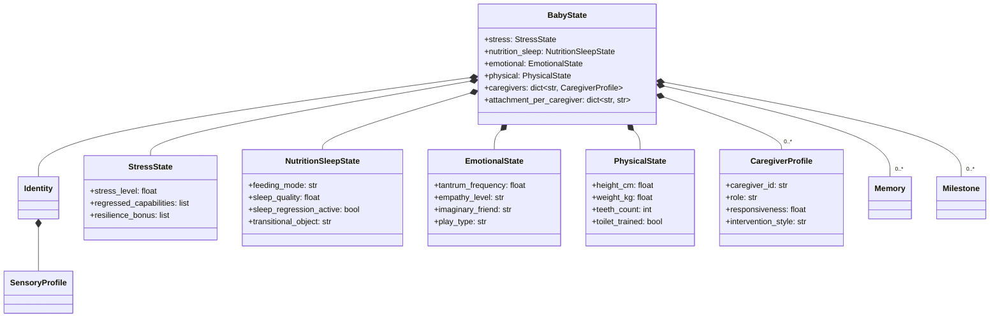
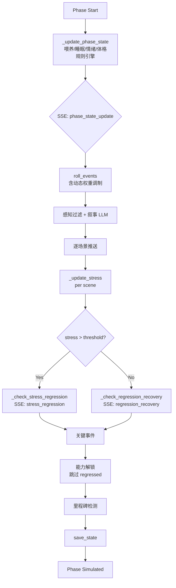

# 技术设计：摇篮增强 (Cradle Enhancement)

## 0. 设计原则

1. **融入，不并行** -- 所有新机制嵌入现有文件（state.py, events.py, nanny.py, mind.py），不新增模块文件
2. **规则优先** -- 新增维度优先用规则引擎处理，只在需要叙事差异化时走 LLM
3. **向后兼容** -- 所有新字段有默认值，from_dict 用 .get() 兼容旧数据
4. **LLM 调用零增长** -- 新增事件全部打包进现有的 narrate_phase_events 批量调用

---

## 1. 数据模型扩展 -- state.py

### 1.1 新增: StressState (嵌入 BabyState)

```python
@dataclass
class StressState:
    """压力与回退状态。"""
    stress_level: float = 0.0           # 0.0-1.0，当前压力值
    regressed_capabilities: list[dict] = field(default_factory=list)
    # 每项: {"capability": str, "regressed_at": int, "original_phase": int}
    resilience_bonus: list[str] = field(default_factory=list)
    # 从回退中恢复后获得韧性加成的能力

    def to_dict(self) -> dict:
        return {
            "stress_level": self.stress_level,
            "regressed_capabilities": self.regressed_capabilities,
            "resilience_bonus": self.resilience_bonus,
        }

    @classmethod
    def from_dict(cls, d: dict) -> StressState:
        return cls(
            stress_level=d.get("stress_level", 0.0),
            regressed_capabilities=d.get("regressed_capabilities", []),
            resilience_bonus=d.get("resilience_bonus", []),
        )
```

### 1.2 新增: NutritionSleepState (嵌入 BabyState)

```python
@dataclass
class NutritionSleepState:
    """喂养与睡眠状态。"""
    feeding_mode: str = "breast_milk"
    # breast_milk / introducing_solids / self_feeding_learning / family_meals
    food_allergies: list[str] = field(default_factory=list)
    picky_foods: list[str] = field(default_factory=list)
    sleep_quality: float = 0.7          # 0-1, 当前睡眠质量
    sleep_regression_active: bool = False
    night_waking_frequency: int = 3     # 每夜平均醒来次数
    room_separated: bool = False
    transitional_object: str = ""       # 过渡客体名称

    def to_dict(self) -> dict:
        return {
            "feeding_mode": self.feeding_mode,
            "food_allergies": self.food_allergies,
            "picky_foods": self.picky_foods,
            "sleep_quality": self.sleep_quality,
            "sleep_regression_active": self.sleep_regression_active,
            "night_waking_frequency": self.night_waking_frequency,
            "room_separated": self.room_separated,
            "transitional_object": self.transitional_object,
        }

    @classmethod
    def from_dict(cls, d: dict) -> NutritionSleepState:
        return cls(**{k: d.get(k, v) for k, v in cls.__dataclass_fields__.items()
                      if k in d or hasattr(cls, k)})
        # 简化: 逐字段 get 即可
```

实际实现用逐字段 from_dict 模式（与现有 ParentProfile.from_dict 一致）:

```python
@classmethod
def from_dict(cls, d: dict) -> NutritionSleepState:
    return cls(
        feeding_mode=d.get("feeding_mode", "breast_milk"),
        food_allergies=d.get("food_allergies", []),
        picky_foods=d.get("picky_foods", []),
        sleep_quality=d.get("sleep_quality", 0.7),
        sleep_regression_active=d.get("sleep_regression_active", False),
        night_waking_frequency=d.get("night_waking_frequency", 3),
        room_separated=d.get("room_separated", False),
        transitional_object=d.get("transitional_object", ""),
    )
```

### 1.3 CaregiverProfile (直接替换 ParentProfile)

> **决策**: 删除 ParentProfile，全局替换为 CaregiverProfile。
> 引用点有限（state.py, nanny.py, mind.py, social.py），一次性替换比代理更干净。

```python
@dataclass
class CaregiverProfile:
    """单个照护者画像。"""
    caregiver_id: str = "primary_parent"
    role: str = "parent"                # parent / grandparent / nanny / teacher
    display_name: str = "Parent"
    responsiveness: float = 0.5
    intervention_style: str = "balanced"  # protective / balanced / hands_off
    teaching_frequency: float = 0.5
    emotional_tone: str = "warm"         # warm / neutral / anxious / strict
    total_interventions: int = 0
    interaction_count: int = 0
    intervention_log: list[dict] = field(default_factory=list)

    def to_dict(self) -> dict:
        return {
            "caregiver_id": self.caregiver_id,
            "role": self.role,
            "display_name": self.display_name,
            "responsiveness": self.responsiveness,
            "intervention_style": self.intervention_style,
            "teaching_frequency": self.teaching_frequency,
            "emotional_tone": self.emotional_tone,
            "total_interventions": self.total_interventions,
            "interaction_count": self.interaction_count,
            "intervention_log": self.intervention_log[-20:],
        }

    @classmethod
    def from_dict(cls, d: dict) -> CaregiverProfile:
        return cls(
            caregiver_id=d.get("caregiver_id", "primary_parent"),
            role=d.get("role", "parent"),
            display_name=d.get("display_name", "Parent"),
            responsiveness=d.get("responsiveness", 0.5),
            intervention_style=d.get("intervention_style", "balanced"),
            teaching_frequency=d.get("teaching_frequency", 0.5),
            emotional_tone=d.get("emotional_tone", "warm"),
            total_interventions=d.get("total_interventions", 0),
            interaction_count=d.get("interaction_count", 0),
            intervention_log=d.get("intervention_log", []),
        )
```

### 1.4 扩展: EmotionalState (嵌入 BabyState)

```python
@dataclass
class EmotionalState:
    """情绪调节状态。"""
    tantrum_frequency: float = 0.0      # 当前阶段发脾气概率
    emotional_vocabulary: list[str] = field(default_factory=list)
    # 已掌握的情绪词汇: ["cry", "no", "angry", "sad", "angry_because"]
    empathy_level: str = "none"         # none / contagion / primitive / true
    self_regulation_score: float = 0.0  # 0-1, 自我调节能力
    imaginary_friend: str = ""          # 想象伙伴名称（空=无）
    play_type: str = "functional"       # functional / constructive / symbolic / rule_based

    def to_dict(self) -> dict:
        return {
            "tantrum_frequency": self.tantrum_frequency,
            "emotional_vocabulary": self.emotional_vocabulary,
            "empathy_level": self.empathy_level,
            "self_regulation_score": self.self_regulation_score,
            "imaginary_friend": self.imaginary_friend,
            "play_type": self.play_type,
        }

    @classmethod
    def from_dict(cls, d: dict) -> EmotionalState:
        return cls(
            tantrum_frequency=d.get("tantrum_frequency", 0.0),
            emotional_vocabulary=d.get("emotional_vocabulary", []),
            empathy_level=d.get("empathy_level", "none"),
            self_regulation_score=d.get("self_regulation_score", 0.0),
            imaginary_friend=d.get("imaginary_friend", ""),
            play_type=d.get("play_type", "functional"),
        )
```

### 1.5 扩展: PhysicalState (嵌入 BabyState)

```python
@dataclass
class PhysicalState:
    """体格状态。"""
    height_cm: float = 50.0            # 出生身高
    weight_kg: float = 3.3             # 出生体重
    teeth_count: int = 0               # 已萌出牙齿数
    toilet_trained: bool = False
    fine_motor_level: int = 0          # 0-5, 精细运动等级

    def to_dict(self) -> dict:
        return {
            "height_cm": round(self.height_cm, 1),
            "weight_kg": round(self.weight_kg, 1),
            "teeth_count": self.teeth_count,
            "toilet_trained": self.toilet_trained,
            "fine_motor_level": self.fine_motor_level,
        }

    @classmethod
    def from_dict(cls, d: dict) -> PhysicalState:
        return cls(
            height_cm=d.get("height_cm", 50.0),
            weight_kg=d.get("weight_kg", 3.3),
            teeth_count=d.get("teeth_count", 0),
            toilet_trained=d.get("toilet_trained", False),
            fine_motor_level=d.get("fine_motor_level", 0),
        )
```

### 1.6 BabyState 字段变更

**删除**: `parent_profile: ParentProfile`
**新增**（所有有默认值）:

```python
stress: StressState = field(default_factory=StressState)
nutrition_sleep: NutritionSleepState = field(default_factory=NutritionSleepState)
caregivers: dict[str, CaregiverProfile] = field(default_factory=dict)
# key = caregiver_id
emotional: EmotionalState = field(default_factory=EmotionalState)
physical: PhysicalState = field(default_factory=PhysicalState)
attachment_per_caregiver: dict[str, str] = field(default_factory=dict)
# caregiver_id -> attachment_style ("secure"/"anxious"/"avoidant"/"forming")
```

**向后兼容迁移**（在 from_dict 中）:

```python
# 迁移: 旧 parent_profile -> caregivers
caregivers = {}
if "caregivers" in d:
    for cid, cd in d["caregivers"].items():
        caregivers[cid] = CaregiverProfile.from_dict(cd)
elif "parent_profile" in d:
    # 旧数据: 将 parent_profile 字段直接映射到 CaregiverProfile
    pp = d["parent_profile"]
    caregivers["primary_parent"] = CaregiverProfile(
        caregiver_id="primary_parent",
        role="parent",
        display_name="Parent",
        responsiveness=pp.get("responsiveness", 0.5),
        intervention_style=pp.get("intervention_style", "balanced"),
        teaching_frequency=pp.get("teaching_frequency", 0.5),
        emotional_tone=pp.get("emotional_tone", "warm"),
        total_interventions=pp.get("total_interventions", 0),
        interaction_count=pp.get("interaction_count", 0),
        intervention_log=pp.get("intervention_log", []),
    )
```

**全局替换清单** — 以下位置的 `parent_profile` / `ParentProfile` 需替换为 `caregivers` / `CaregiverProfile`:

| 文件 | 行号 | 变更 |
|------|------|------|
| state.py:102-135 | 删除 ParentProfile 类 |
| state.py:222 | `parent_profile` → `caregivers` |
| state.py:249 | `to_dict` 序列化改为 caregivers |
| state.py:272 | `from_dict` 用上述迁移逻辑 |
| nanny.py:562,590-592 | `_update_parent_profile` → `_update_caregiver_profile`，接收 caregiver_id |
| mind.py:567 | `state.parent_profile.interaction_count` → `state.caregivers[cid].interaction_count` |
| social.py:397 | 同上 |
| CLAUDE.md | 更新成员清单 |

---

## 2. 事件系统扩展 -- events.py

### 2.1 新增日常事件 (规则引擎, 0 LLM)

```python
# 喂养相关
Event("teething_discomfort", "daily", "Teething Discomfort",
      "Gums swollen and painful, drooling increases, biting everything.",
      ["touch"], 0.3, False, (3, 7)),

Event("picky_eating", "daily", "Picky Eating",
      "Refuses certain foods, pushes plate away, only wants familiar tastes.",
      ["smell", "touch"], 0.2, False, (7, 9)),

Event("common_cold", "daily", "Common Cold",
      "Runny nose, mild cough, slightly fussy but still alert.",
      ["touch"], 0.25, False, (0, 11)),

# 睡眠相关
Event("sleep_regression", "daily", "Sleep Regression",
      "After weeks of sleeping through, suddenly waking multiple times.",
      ["touch"], 0.3, False, (2, 7)),

# 游戏相关
Event("play_session", "daily", "Play Session",
      "Engaging with age-appropriate toys and activities.",
      ["vision", "touch", "hearing"], 0.2, False, (1, 11)),

# 体格相关
Event("growth_spurt", "daily", "Growth Spurt",
      "Increased appetite, slight fussiness, measurable growth.",
      ["touch"], 0.15, False, (0, 11)),
```

### 2.2 新增环境事件 (LLM 处理)

```python
Event("tantrum_trigger", "environment", "Tantrum Trigger",
      "Something small sets off a disproportionate emotional explosion.",
      ["hearing", "touch"], 0.7, False, (6, 9), weight=0.5),

Event("imaginary_friend_appears", "environment", "Imaginary Friend",
      "The child begins talking to someone invisible, with a name and personality.",
      ["hearing", "vision"], 0.3, False, (8, 11), weight=0.4),

Event("first_drawing", "environment", "First Drawing",
      "Crayon meets paper. Something intentional appears for the first time.",
      ["vision", "touch"], 0.4, False, (5, 9), weight=0.5),

Event("empathy_moment", "environment", "Empathy Moment",
      "Another child is crying. How does this child respond?",
      ["hearing", "vision"], 0.4, False, (5, 11), weight=0.4),
```

### 2.3 新增关键事件 (父母介入)

```python
Event("food_allergy", "critical", "Food Allergy",
      "After trying new food, face swells, skin rashes appear.",
      ["touch", "smell"], 0.8, True, (3, 5), weight=0.15,
      parent_choices=[
          {"action": "rush_hospital", "display": "Rush to hospital", "effect": "Safety first → medical trust"},
          {"action": "observe_carefully", "display": "Observe symptoms carefully", "effect": "Calm assessment → resilience"},
          {"action": "remove_food", "display": "Remove food, apply cold compress", "effect": "Practical response → problem-solving"},
      ]),

Event("room_separation", "critical", "Room Separation",
      "It might be time for the child to sleep in their own room.",
      ["vision", "hearing"], 0.5, True, (5, 7), weight=0.3,
      parent_choices=[
          {"action": "gradual", "display": "Gradual transition over weeks", "effect": "Independence + security balance"},
          {"action": "immediate", "display": "Move to own room tonight", "effect": "Independence boost / stress risk"},
          {"action": "delay", "display": "Not ready yet, wait longer", "effect": "Continued co-sleeping security"},
      ]),

Event("toilet_training", "critical", "Toilet Training",
      "The child shows signs of readiness. Time to start?",
      ["touch", "proprioception"], 0.4, True, (7, 8), weight=0.6,
      parent_choices=[
          {"action": "patient_encourage", "display": "Praise every attempt", "effect": "Autonomy + positive reinforcement"},
          {"action": "strict_schedule", "display": "Set strict bathroom schedule", "effect": "Discipline / pressure risk"},
          {"action": "wait_readiness", "display": "Wait for more readiness signs", "effect": "No pressure → natural timing"},
      ]),

Event("kindergarten_entry", "critical", "Kindergarten Entry",
      "First day at kindergarten. The child faces a room full of strangers without parents.",
      ["vision", "hearing", "touch"], 0.8, True, (8, 8), weight=0.9,
      parent_choices=[
          {"action": "stay_briefly", "display": "Stay for the first hour, then leave", "effect": "Gradual separation → adapted"},
          {"action": "quick_goodbye", "display": "Quick hug and confident goodbye", "effect": "'Parent believes I can do this' → confidence"},
          {"action": "sneak_away", "display": "Slip away while distracted", "effect": "Unpredictable abandonment → anxiety"},
      ]),

Event("night_terror", "critical", "Night Terror",
      "Child sits up screaming, eyes open but unseeing. Cannot be woken.",
      ["hearing", "touch"], 0.7, True, (8, 10), weight=0.2,
      parent_choices=[
          {"action": "stay_safe", "display": "Stay nearby, keep them safe", "effect": "Safety without interference → passes naturally"},
          {"action": "try_wake", "display": "Try to wake them up", "effect": "Prolonged confusion / disorientation"},
          {"action": "hold_gently", "display": "Hold gently until it passes", "effect": "Physical safety anchor"},
      ]),

Event("imaginary_friend_discovery", "critical", "Imaginary Friend Discovery",
      "You realize your child has been having conversations with an invisible friend.",
      ["hearing"], 0.3, True, (8, 11), weight=0.35,
      parent_choices=[
          {"action": "curious", "display": "Ask about the friend with interest", "effect": "Imagination validated → creativity"},
          {"action": "worried", "display": "Express concern, discourage it", "effect": "Shame / hidden inner world"},
          {"action": "play_along", "display": "Set a place at the table for them", "effect": "Full acceptance → trust + creativity"},
      ]),
```

### 2.4 事件权重动态调制

在 `roll_events()` 中新增阶段性权重调制（规则引擎，无 LLM）:

```python
# 在 roll_events 中添加
def _phase_weight_modifier(event: Event, phase_index: int, state: BabyState | None) -> float:
    """根据阶段和状态动态调制事件权重。"""
    mod = 1.0

    if state is None:
        return mod

    # 睡眠回归高发期
    if event.name == "sleep_regression" and phase_index in (2, 3, 6, 7):
        mod *= 3.0

    # Tantrum 频率曲线
    if event.name == "tantrum_trigger":
        tantrum_curve = {6: 1.0, 7: 1.8, 8: 1.0, 9: 0.4}
        mod *= tantrum_curve.get(phase_index, 0.3)

    # 压力高时负面事件更敏感
    if state.stress.stress_level > 0.5:
        if event.intensity > 0.5:
            mod *= 1.3

    return mod
```

---

## 3. 压力回退引擎 -- nanny.py

### 3.1 压力值更新 (规则引擎)

```python
def _update_stress(state: BabyState, emotional_valence: str,
                   intensity: float, parent_present: bool) -> None:
    """事件后更新压力值。纯规则，无 LLM。"""
    stress = state.stress

    # 依恋安全感修正
    attachment_mod = {
        "secure": 0.7,      # 安全型 -> 压力衰减快
        "forming": 1.0,
        "anxious": 1.3,     # 焦虑型 -> 压力积累快
        "avoidant": 1.1,
    }
    att_mod = attachment_mod.get(state.attachment_style, 1.0)

    if emotional_valence == "negative":
        delta = intensity * 0.15 * att_mod
        stress.stress_level = min(1.0, stress.stress_level + delta)
    elif emotional_valence == "positive":
        recovery = intensity * 0.1
        if parent_present:
            recovery *= 1.5
        stress.stress_level = max(0.0, stress.stress_level - recovery)

    # 自然衰减（每阶段末）
    stress.stress_level = max(0.0, stress.stress_level * 0.85)
```

### 3.2 能力回退检查 (规则引擎)

```python
# 不可回退的核心能力
UNREGRESSIVE_CAPABILITIES = {"startle_reflex", "sucking_reflex", "crying",
                              "sleep_wake_cycle", "object_permanence"}

def _check_stress_regression(state: BabyState) -> list[str]:
    """检查是否触发能力回退。返回回退的能力名。"""
    if state.stress.stress_level < 0.6:
        return []

    # 安全依恋提高阈值
    threshold = 0.6
    if state.attachment_style == "secure":
        threshold = 0.7
    elif state.attachment_style == "anxious":
        threshold = 0.5

    if state.stress.stress_level < threshold:
        return []

    # 从最近解锁的能力中选取可回退的
    already_regressed = {r["capability"] for r in state.stress.regressed_capabilities}
    candidates = [
        cap for cap in reversed(state.capabilities)
        if cap not in UNREGRESSIVE_CAPABILITIES
        and cap not in already_regressed
    ]

    if not candidates:
        return []

    # 回退 1-2 个
    count = min(random.randint(1, 2), len(candidates))
    regressed = random.sample(candidates[:5], count)  # 只从最近5个中选

    for cap in regressed:
        state.stress.regressed_capabilities.append({
            "capability": cap,
            "regressed_at": state.age_days,
            "original_phase": state.current_phase,
        })

    return regressed
```

### 3.3 回退恢复检查 (规则引擎)

```python
def _check_regression_recovery(state: BabyState) -> list[str]:
    """检查回退能力是否恢复。"""
    recovered = []
    remaining = []

    for reg in state.stress.regressed_capabilities:
        days_regressed = state.age_days - reg["regressed_at"]

        # 基础恢复: 压力降低到 0.3 以下 或 经过足够天数
        base_recovery = state.stress.stress_level < 0.3
        time_recovery = days_regressed > 60  # 约2个月

        # 安全依恋加速恢复
        if state.attachment_style == "secure":
            time_recovery = days_regressed > 30

        if base_recovery or time_recovery:
            recovered.append(reg["capability"])
            # 韧性成长: 30% 概率
            if random.random() < 0.3:
                state.stress.resilience_bonus.append(reg["capability"])
        else:
            remaining.append(reg)

    state.stress.regressed_capabilities = remaining
    return recovered
```

### 3.4 集成到 simulate_phase_stream

在现有 `simulate_phase_stream` 中插入，不改变整体流程:

```
simulate_phase_stream(state)
    ├── 阶段开始
    ├── _update_phase_state(state, phase_index)     ★ 新增: 更新喂养/睡眠/情绪/体格
    ├── roll_events()
    ├── 感知过滤 + 叙事 LLM
    ├── _update_stress() for each scene             ★ 新增: 每个场景后更新压力
    ├── _check_stress_regression()                  ★ 新增: 检查回退
    ├── _check_regression_recovery()                ★ 新增: 检查恢复
    ├── 关键事件
    ├── 能力解锁（回退的能力跳过）                    ★ 修改: 尊重回退
    ├── 里程碑
    └── 阶段完成
```

---

## 4. 阶段状态自动更新 -- nanny.py

```python
# 喂养模式映射（纯规则）
FEEDING_MODE_BY_PHASE = {
    (0, 2): "breast_milk",
    (3, 4): "introducing_solids",
    (5, 6): "self_feeding_learning",
    (7, 11): "family_meals",
}

# 夜醒次数基线
NIGHT_WAKING_BY_PHASE = {
    0: 5, 1: 4, 2: 3, 3: 3, 4: 2, 5: 2, 6: 1, 7: 1,
    8: 0, 9: 0, 10: 0, 11: 0,
}

# 睡眠回归高发阶段
SLEEP_REGRESSION_PHASES = {2, 3, 6, 7}

# Tantrum 频率曲线
TANTRUM_FREQUENCY = {
    6: 0.4, 7: 0.7, 8: 0.4, 9: 0.15, 10: 0.1, 11: 0.05,
}

# 共情发展
EMPATHY_BY_PHASE = {
    (0, 4): "none",
    (5, 7): "primitive",
    (8, 11): "true",
}

# 游戏类型
PLAY_TYPE_BY_PHASE = {
    (0, 4): "functional",
    (5, 6): "constructive",
    (7, 9): "symbolic",
    (10, 11): "rule_based",
}

# 标准身高体重曲线（每阶段末值，含随机偏差）
GROWTH_CURVE = [
    # (phase, height_cm, weight_kg)
    (0, 54, 4.0), (1, 62, 5.8), (2, 68, 7.5), (3, 72, 8.5),
    (4, 76, 9.5), (5, 82, 10.5), (6, 87, 12.0), (7, 95, 14.0),
    (8, 102, 16.0), (9, 108, 18.0), (10, 115, 20.0), (11, 121, 22.0),
]

# 出牙时间线
TEETH_BY_PHASE = {
    3: 2, 4: 4, 5: 8, 6: 12, 7: 16, 8: 20, 9: 20, 10: 20, 11: 20,
}

def _update_phase_state(state: BabyState, phase_index: int) -> list[dict]:
    """
    阶段开始时自动更新喂养/睡眠/情绪/体格状态。
    返回变更事件列表（用于 SSE 推送）。
    纯规则引擎，0 LLM。
    """
    changes = []
    ns = state.nutrition_sleep
    em = state.emotional
    ph = state.physical

    # 1. 喂养模式
    for (lo, hi), mode in FEEDING_MODE_BY_PHASE.items():
        if lo <= phase_index <= hi and ns.feeding_mode != mode:
            old = ns.feeding_mode
            ns.feeding_mode = mode
            changes.append({"type": "feeding_transition", "from": old, "to": mode})

    # 2. 夜醒次数
    base_waking = NIGHT_WAKING_BY_PHASE.get(phase_index, 0)
    if ns.sleep_regression_active:
        base_waking += 2
    ns.night_waking_frequency = base_waking

    # 3. 睡眠回归
    if phase_index in SLEEP_REGRESSION_PHASES:
        if random.random() < 0.8:
            ns.sleep_regression_active = True
            ns.sleep_quality = max(0.2, ns.sleep_quality - 0.3)
            changes.append({"type": "sleep_regression_onset"})
    else:
        if ns.sleep_regression_active:
            ns.sleep_regression_active = False
            ns.sleep_quality = min(0.9, ns.sleep_quality + 0.2)
            changes.append({"type": "sleep_regression_resolved"})

    # 4. Tantrum 频率
    em.tantrum_frequency = TANTRUM_FREQUENCY.get(phase_index, 0.0)

    # 5. 共情等级
    for (lo, hi), level in EMPATHY_BY_PHASE.items():
        if lo <= phase_index <= hi:
            em.empathy_level = level

    # 6. 游戏类型
    for (lo, hi), ptype in PLAY_TYPE_BY_PHASE.items():
        if lo <= phase_index <= hi:
            em.play_type = ptype

    # 7. 体格更新
    for p, h, w in GROWTH_CURVE:
        if p == phase_index:
            variance = random.gauss(0, 0.03)  # 3% 偏差
            ph.height_cm = round(h * (1 + variance), 1)
            ph.weight_kg = round(w * (1 + variance), 1)
            changes.append({
                "type": "physical_growth",
                "height_cm": ph.height_cm,
                "weight_kg": ph.weight_kg,
            })

    # 8. 出牙
    expected_teeth = TEETH_BY_PHASE.get(phase_index, ph.teeth_count)
    if expected_teeth > ph.teeth_count:
        new_teeth = expected_teeth - ph.teeth_count
        ph.teeth_count = expected_teeth
        changes.append({"type": "new_teeth", "count": new_teeth, "total": ph.teeth_count})

    # 9. 情绪词汇（渐进解锁）
    vocab_by_phase = {
        5: ["no", "scared"],
        6: ["no", "scared", "want", "mine"],
        7: ["angry", "sad", "happy", "why"],
        8: ["angry_because", "sorry", "friend", "fair"],
        9: ["frustrated", "proud", "embarrassed", "if_then"],
        10: ["worried", "excited", "disappointed", "jealous"],
        11: ["grateful", "lonely", "confused", "determined"],
    }
    new_vocab = vocab_by_phase.get(phase_index, [])
    for word in new_vocab:
        if word not in em.emotional_vocabulary:
            em.emotional_vocabulary.append(word)

    return changes
```

---

## 5. 多照护者集成 -- nanny.py

### 5.1 resolve_critical_event 扩展

```python
def resolve_critical_event(
    state: BabyState,
    event_name: str,
    parent_action: str,
    parent_input: str = "",
    caregiver_id: str = "primary_parent",   # ★ 新增参数
) -> dict:
```

- `_update_attachment()` 改为按 caregiver_id 更新 `state.attachment_per_caregiver[caregiver_id]`
- `_update_parent_profile()` 改为更新 `state.caregivers[caregiver_id]`
- 保留 `state.attachment_style` 作为主照护者的依恋（兼容）

### 5.2 入园自动添加 teacher

```python
# 在 resolve_critical_event 中
if event_name == "kindergarten_entry":
    if "teacher" not in state.caregivers:
        state.caregivers["teacher"] = CaregiverProfile(
            caregiver_id="teacher",
            role="teacher",
            display_name="Teacher",
            responsiveness=0.6,
            intervention_style="balanced",
            emotional_tone="warm",
        )
        state.attachment_per_caregiver["teacher"] = "forming"
```

---

## 6. LLM Prompt 扩展 -- mind.py

### 6.1 narrate_phase_events 上下文注入

在现有 prompt 的 `## Current State` 部分追加:

```
## Physical State
- Height: {ph.height_cm}cm, Weight: {ph.weight_kg}kg, Teeth: {ph.teeth_count}
- Feeding mode: {ns.feeding_mode}
- Sleep quality: {ns.sleep_quality}, Night wakings: {ns.night_waking_frequency}
{f"- Sleep regression ACTIVE" if ns.sleep_regression_active else ""}
{f"- Transitional object: {ns.transitional_object}" if ns.transitional_object else ""}

## Stress & Regression
- Stress level: {state.stress.stress_level:.1f}
- Regressed capabilities: {regressed_caps or "None"}
- Resilience strengths: {state.stress.resilience_bonus or "None"}

## Emotional Development
- Tantrum frequency: {em.tantrum_frequency}
- Empathy level: {em.empathy_level}
- Emotional vocabulary: {em.emotional_vocabulary}
- Play type: {em.play_type}
{f"- Imaginary friend: {em.imaginary_friend}" if em.imaginary_friend else ""}

## Caregivers
{caregivers_text}
```

不增加额外 LLM 调用，仅扩展现有调用的上下文。

### 6.2 process_critical_event prompt 同样扩展

添加同样的状态上下文，让 LLM 在生成反应时考虑压力/回退/情绪等维度。

---

## 7. API 变更 -- api/cradle.py

### 7.1 新增端点

| 端点 | 方法 | 说明 |
|------|------|------|
| `/cradle/{id}/caregivers` | GET | 列出照护者 |
| `/cradle/{id}/caregivers` | POST | 添加照护者 |
| `/cradle/{id}/caregivers/{cid}` | PUT | 更新照护者信息 |

### 7.2 修改端点

| 端点 | 变更 |
|------|------|
| `/cradle/{id}/intervene` | 新增 caregiver_id 参数 |
| `/cradle/{id}/status` | 返回新增的 stress/nutrition_sleep/emotional/physical 字段 |
| `/cradle/{id}/advance/stream` | SSE 事件流新增 phase_state_update 事件类型 |

### 7.3 SSE 新增事件类型

```javascript
// 阶段状态更新
{"event": "phase_state_update", "changes": [
  {"type": "feeding_transition", "from": "breast_milk", "to": "introducing_solids"},
  {"type": "physical_growth", "height_cm": 72.1, "weight_kg": 8.6},
  {"type": "new_teeth", "count": 2, "total": 4}
]}

// 压力回退
{"event": "stress_regression", "regressed": ["walking", "self_recognition"],
 "stress_level": 0.72}

// 回退恢复
{"event": "regression_recovery", "recovered": ["walking"],
 "strengthened": ["walking"], "stress_level": 0.18}
```

---

## 8. 前端展示 -- Cradle.jsx

### 8.1 状态面板增强

在现有的 baby status card 中添加:

```
[身高/体重]  72.1cm / 8.6kg  牙: 4颗
[压力值]     ████░░░░░░  0.38
[睡眠]       回归期 | 夜醒 3次
[喂养]       辅食引入期
[情绪]       共情: 原始 | 脾气频率: 中
```

### 8.2 照护者面板

```
[照护者]
  母亲(primary)  响应性:0.7  风格:均衡  依恋:安全
  祖母           响应性:0.9  风格:保护  依恋:安全
  老师           响应性:0.6  风格:均衡  依恋:形成中
```

### 8.3 回退/恢复 log 展示

在 SSE log 流中，stress_regression 和 regression_recovery 事件用特殊样式高亮:
- 回退: 黄色警告色，图标用向下箭头
- 恢复: 绿色成功色，图标用向上箭头
- 韧性成长: 金色星标

---

## 9. Mermaid 架构图

### 9.1 数据模型关系



### 9.2 阶段模拟流程（增强版）



---

## 10. 向后兼容保证

| 场景 | 策略 |
|------|------|
| 旧 state.json 无 stress 字段 | from_dict 返回 StressState() 默认值 |
| 旧 state.json 无 caregivers 有 parent_profile | from_dict 自动迁移为 caregivers["primary_parent"] |
| 旧 state.json 无 nutrition_sleep | from_dict 返回默认值 |
| 旧 state.json 无 emotional | from_dict 返回默认值 |
| 旧 state.json 无 physical | from_dict 返回默认值 |
| 现有代码访问 state.parent_profile | **已删除**，全局替换为 state.caregivers[cid] |
| 现有代码访问 state.attachment_style | 保留字段，同步为主照护者的值 |
