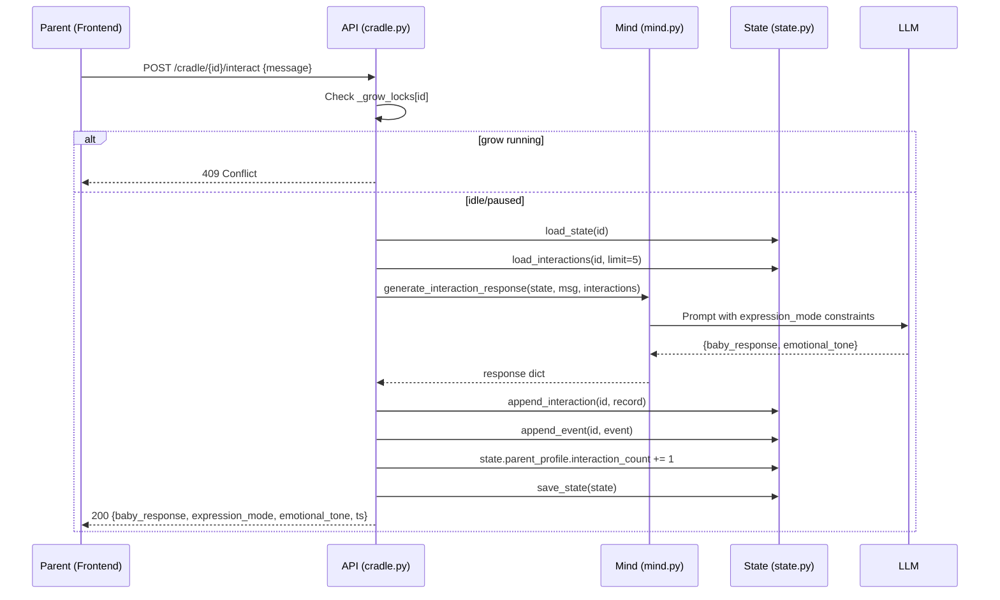

# Design: Parent-Child Interaction (interaction)

## Architecture Overview

```
Frontend (Cradle.jsx)
  |  POST /cradle/{baby_id}/interact  { message: str }
  v
API Layer (api/cradle.py)
  |  1. Check grow lock -> 409 if running
  |  2. Load state
  |  3. Load recent interactions (last 5)
  |  4. Call mind.generate_interaction_response()
  |  5. Dual-write: interactions.jsonl + events.jsonl
  |  6. Update parent_profile.interaction_count
  |  7. Save state
  v
Response JSON -> Frontend renders chat bubble
```

---

## 1. API Design

### POST /cradle/{baby_id}/interact

**Request:**
```json
{
  "message": "Hello little one, how are you today?"
}
```

**Response (200):**
```json
{
  "baby_response": "*Eyes widen, arms wave excitedly, 'ahhh—oooh', head turns toward voice*",
  "expression_mode": "coo_and_gaze",
  "emotional_tone": "positive",
  "timestamp": 1712678400.123
}
```

**Error (409 - grow running):**
```json
{
  "detail": "Growth simulation is running. Please wait or pause first."
}
```

**Error (404):**
```json
{
  "detail": "Baby '{baby_id}' not found in cradle"
}
```

---

## 2. Concurrency Control: Hard Lock

A module-level dictionary tracks which babies have an active `grow_stream` running.

### Implementation in `api/cradle.py`

```python
# Module-level grow lock: baby_id -> True when grow_stream is active
_grow_locks: dict[str, bool] = {}
```

**Lock protocol:**
- `grow/stream` endpoint: Set `_grow_locks[baby_id] = True` before starting the generator. Clear on stream end (both normal and error).
- `interact` endpoint: Check `_grow_locks.get(baby_id)`. If True, return 409.
- `paused` state: When grow_stream yields `paused`, clear the lock (`_grow_locks.pop(baby_id, None)`), because the SSE stream has ended and the generator has returned.

This works because:
1. `grow_stream` is a generator that blocks the request thread. When it yields `paused` and returns, the SSE stream closes.
2. The next `grow/stream` call re-enters and re-acquires the lock.
3. `interact` only needs to check -- no race condition because Python's GIL protects dict reads/writes, and both endpoints run in the same ASGI event loop thread pool.

### Lock lifecycle:

```
GET /grow/stream  -->  _grow_locks[baby_id] = True
  ... streaming ...
  yield "paused"  -->  _grow_locks.pop(baby_id)  (stream ends)
  OR
  yield "growth_complete"  -->  _grow_locks.pop(baby_id)
  OR
  exception  -->  _grow_locks.pop(baby_id)

POST /interact  -->  if _grow_locks.get(baby_id): return 409
```

---

## 3. LLM Prompt Design (mind.py)

### New function: `generate_interaction_response()`

```python
def generate_interaction_response(
    state: BabyState,
    parent_message: str,
    recent_interactions: list[dict],
) -> dict:
```

**Prompt template:**

```
You are simulating a {species} infant's reaction to their parent talking to them.

## The Infant
- Name: {name or '(unnamed)'}
- Age: {age_days} days ({phase.age_range})
- Phase: {phase.display_name} -- {phase.description}
- Expression mode: {expr_mode['description']}
- Expression format: {expr_mode['format']}
- Example: {expr_mode['example']}

## Innate Identity (CANNOT be violated)
- Dominant sense: {sensory_profile.dominant}
- Weak sense: {sensory_profile.weak}
- Arousal baseline: {arousal_baseline}
- Temperament: {temperament}

## Behavioral Constraints (MUST follow)
{constraints}

## Defects
{defects or 'None'}

## Current State
- Capabilities: {capabilities}
- Fears: {fears}
- Preferences: {preferences}
- Comfort sources: {comfort_sources}
- Attachment: {attachment_style}

## Recent Memories
{last 3 memories formatted}

## Recent Conversation
{last 5 interaction turns: "Parent: ..." / "Baby: ..."}

## Parent Says
"{parent_message}"

## Task

Generate the infant's reaction to this parent message. Rules:
1. Baby's response MUST use the expression format: {expr_mode['format']}
2. Baby CANNOT exceed their developmental capabilities
3. A cry_only baby CANNOT use words. A coo_and_gaze baby CANNOT form syllables beyond vowels.
4. The response should reflect the baby's current emotional state, temperament, and relationship with the parent
5. Keep the response concise (1-3 sentences / actions)

Output as JSON:
{
  "baby_response": "the baby's reaction in correct expression format",
  "emotional_tone": "positive/negative/neutral/mixed"
}
```

**Degradation:** If LLM fails, return a minimal reaction based on expression_mode:
- `cry_only`: `"*Stirs slightly, a soft whimper escapes*"`
- `coo_and_gaze`: `"*Turns head toward the sound, blinks slowly*"`
- Other modes: `"*Pauses, looks at you*"`

---

## 4. Persistence Design

### 4.1 interactions.jsonl

**Location:** `nursery/{baby_id}/interactions.jsonl`

**Record format (one JSON per line):**
```json
{
  "ts": 1712678400.123,
  "parent_message": "Hello little one",
  "baby_response": "*Eyes widen, 'ahhh'*",
  "expression_mode": "coo_and_gaze",
  "emotional_tone": "positive",
  "phase": 1,
  "age_days": 14
}
```

### 4.2 events.jsonl sync

Each interaction also appends to `events.jsonl`:
```json
{
  "ts": 1712678400.123,
  "event": "interaction",
  "parent_message": "Hello little one",
  "baby_response": "*Eyes widen, 'ahhh'*",
  "expression_mode": "coo_and_gaze",
  "emotional_tone": "positive"
}
```

### 4.3 New functions in state.py

```python
def append_interaction(baby_id: str, record: dict) -> None:
    """Append to interactions.jsonl."""

def load_interactions(baby_id: str, limit: int = 5) -> list[dict]:
    """Load last N interactions from interactions.jsonl."""
```

`load_interactions` reads the file and returns the last `limit` records (tail). For typical usage (context window = 5), this is efficient enough -- read all lines, return last 5.

---

## 5. State Model Changes

### ParentProfile: add interaction_count

```python
@dataclass
class ParentProfile:
    # ... existing fields ...
    interaction_count: int = 0    # NEW: total chat interactions
```

Update `to_dict()`, `from_dict()` accordingly. Backward compatible -- defaults to 0 for existing states.

### Phase summary prompt update

In `mind.py generate_phase_summary()`, add to the prompt context:
```
## Parent Engagement
- Critical event interventions: {parent_profile.total_interventions}
- Chat interactions this phase: {interaction_count}  (total: {total})
```

This lets the LLM holistically assess parent engagement quality during phase summary, without us pre-computing style labels from chat content.

---

## 6. Frontend Design

### 6.1 Chat input area

Position: Fixed at the bottom of the right panel (timeline/log area), below the growth log scroll area.

```
+------------------------------------------+
|  [Timeline / Growth Log]                 |
|  ... scrollable ...                      |
|                                          |
+------------------------------------------+
|  [Chat bubbles: interaction history]     |
+------------------------------------------+
| [text input ........................] [>] |
+------------------------------------------+
```

**States:**
- **Idle / Paused / Complete:** Input enabled. Placeholder: "Talk to {name}..." or "Say something..."
- **Growing (running=true, paused=false):** Input disabled. Placeholder: "Growing..." (greyed out)
- **Sending:** Input disabled, show spinner on send button.

### 6.2 Chat bubbles in timeline

Interaction events appear inline in the timeline log, visually distinct:

- **Parent bubble:** Right-aligned, primary background color, smaller text
- **Baby bubble:** Left-aligned, muted background, italic for action descriptions

### 6.3 Reducer changes

New action types:
- `INTERACTION_SENDING`: Set sending state
- `INTERACTION_DONE`: Add interaction to logs, clear sending state
- `INTERACTION_ERROR`: Show error, clear sending state

New state fields:
```javascript
{
  ...INIT,
  interactionSending: false,
}
```

### 6.4 Interaction rendering in renderLog

When `entry.event === 'interaction'`:
```jsx
<div className="flex flex-col gap-1.5">
  <div className="self-end bg-primary/10 text-primary rounded-2xl px-3 py-2 text-sm max-w-[80%]">
    {entry.data.parent_message}
  </div>
  <div className="self-start bg-muted rounded-2xl px-3 py-2 text-sm max-w-[80%] italic">
    {entry.data.baby_response}
  </div>
</div>
```

### 6.5 History reload

On page load / baby selection, existing interactions from `events.jsonl` (type `interaction`) are rendered in the timeline alongside growth events, maintaining chronological order.

---

## 7. Mermaid: Interaction Flow



---

## 8. File Change Summary

| File | Change |
|------|--------|
| `cradle/state.py` | Add `interaction_count` to `ParentProfile`, add `append_interaction()`, `load_interactions()` |
| `cradle/mind.py` | Add `generate_interaction_response()` |
| `cradle/mind.py` | Update `generate_phase_summary()` prompt to include interaction_count |
| `api/cradle.py` | Add `_grow_locks` dict, lock/unlock in `grow()`, new `POST /{baby_id}/interact` endpoint |
| `api/cradle.py` | Add `InteractRequest` pydantic model |
| `cradle/__init__.py` | Export new functions: `append_interaction`, `load_interactions` |
| `cradle/CLAUDE.md` | Update member list and data flow |
| `frontend/src/Cradle.jsx` | Add chat input, bubble rendering, reducer changes |
| `frontend/src/i18n.js` | Add interaction-related translation keys |
