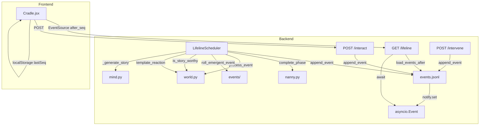

# Design: Lifeline Redesign

## 架构总览

```
┌─ scheduler.run() ──────────────────────────────────────┐
│  _run_phase(phase) → _run_day(day) → _run_event(evt)  │
│                                  │                      │
│                  append_event(baby_id, event)           │
│                       │              │                   │
│                       ├→ events.jsonl (seq=N)           │
│                       └→ _notify[baby_id].set()         │
└────────────────────────────────────────────────────────-┘

┌─ GET /lifeline?after_seq=X ────────────────────────────┐
│  Phase 1 (回放): 读 events.jsonl, seq > X → 50ms/条    │
│  Phase 2 (实时): await _notify → 读最新 → 即时推送      │
│  每 2s 无事件 → sim_tick (时钟心跳)                      │
└────────────────────────────────────────────────────────-┘

┌─ 前端 ─────────────────────────────────────────────────┐
│  EventSource(/lifeline?after_seq=localStorage.seq)     │
│  收到事件 → 渲染 + 更新 localStorage.seq               │
│  断连重连 → 自动带 last_seq，从断点继续                  │
└────────────────────────────────────────────────────────-┘

┌─ interact / intervene API ─────────────────────────────┐
│  处理业务逻辑 → append_event(带 seq) → notify.set()    │
│  scheduler 主循环不受影响                                │
└────────────────────────────────────────────────────────-┘
```

---

## 1. 事件日志与序列号

### 1.1 append_event 重构

**文件**: `cradle/state.py` 函数 `append_event`

当前签名:
```python
def append_event(baby_id: str, event: dict) -> None
```

新签名:
```python
def append_event(baby_id: str, event: dict) -> int
```

改动要点:
- 返回分配的 seq 号
- 使用 per-baby 的 `threading.Lock` 保证 seq 的原子递增
- seq 从文件现有行数 + 1 开始（启动时计算一次，缓存在内存）
- 写入的 JSON 行格式: `{"seq": N, "ts": unix_timestamp, ...event_fields}`

### 1.2 seq 计数器

```python
# cradle/state.py 新增
_seq_counters: dict[str, int] = {}    # baby_id -> 当前最大 seq
_seq_locks: dict[str, threading.Lock] = {}  # baby_id -> 写入锁

def _get_seq_lock(baby_id: str) -> threading.Lock:
    """获取 baby 的写入锁（惰性创建）。"""
    if baby_id not in _seq_locks:
        _seq_locks[baby_id] = threading.Lock()
    return _seq_locks[baby_id]

def _next_seq(baby_id: str) -> int:
    """分配下一个 seq（在锁内调用）。"""
    if baby_id not in _seq_counters:
        # 冷启动: 从文件行数推断
        path = _baby_dir(baby_id) / "events.jsonl"
        _seq_counters[baby_id] = _count_lines(path)
    _seq_counters[baby_id] += 1
    return _seq_counters[baby_id]
```

### 1.3 通知机制

```python
# cradle/state.py 新增
_notify_events: dict[str, asyncio.Event] = {}  # baby_id -> asyncio.Event

def get_notify(baby_id: str) -> asyncio.Event:
    """获取 baby 的通知事件（惰性创建）。"""
    if baby_id not in _notify_events:
        _notify_events[baby_id] = asyncio.Event()
    return _notify_events[baby_id]
```

`append_event` 末尾调用:
```python
notify = get_notify(baby_id)
notify.set()   # 唤醒所有 SSE 读取器
```

### 1.4 load_events_after

```python
def load_events_after(baby_id: str, after_seq: int) -> list[dict]:
    """加载 seq > after_seq 的事件。"""
    # 从文件末尾反向搜索或全量扫描（事件量有限，全量可接受）
```

### 1.5 旧数据迁移

对于没有 `seq` 字段的旧 events.jsonl：
- `load_events_after(after_seq=0)` 时自动为旧事件分配 seq（行号）
- 不修改原文件，在内存中补充

---

## 2. Scheduler 重写

### 2.1 新架构: 阶段驱动而非事件驱动

当前 scheduler 是 DES（离散事件模拟），用 heapq 管理事件队列，逐事件处理。问题：
- 每天 8-10 个事件，2555 天 = 20000+ 事件
- 每个事件都要等 sim_to_real 的等待时间
- 前端影响等待逻辑

新 scheduler 采用**阶段驱动 + 日批量处理**:

```python
class LifelineScheduler:
    """阶段驱动的生命线调度器。"""

    def __init__(self):
        self._agents: dict[str, asyncio.Task] = {}   # baby_id -> running task
        self._llm_semaphore = asyncio.Semaphore(3)
        self._running = False

    async def register(self, baby_id: str) -> None:
        """注册 agent，启动生命线协程。"""
        if baby_id in self._agents:
            self._agents[baby_id].cancel()
        task = asyncio.create_task(self._run_life(baby_id))
        self._agents[baby_id] = task

    async def _run_life(self, baby_id: str) -> None:
        """一个 baby 的完整生命循环。"""
        state = load_state(baby_id)
        for phase_idx in range(state.current_phase, len(PHASES)):
            await self._run_phase(baby_id, state, phase_idx)
            await self._complete_phase(baby_id, state, phase_idx)
        # 所有阶段完成
        append_event(baby_id, {"event": "life_complete"})

    async def _run_phase(self, baby_id, state, phase_idx):
        """运行一个阶段的所有天。"""
        phase = PHASES[phase_idx]
        start_day = phase.age_days[0]
        end_day = phase.age_days[1]
        story_budget = 5   # 每阶段 story LLM 预算
        story_count = 0
        quiet_days_start = None  # 平静日压缩起点

        for day in range(start_day, end_day):
            had_story = await self._run_day(
                baby_id, state, day, phase_idx,
                story_budget - story_count,
            )
            if had_story:
                # 先 flush 之前的平静日
                if quiet_days_start is not None:
                    self._flush_quiet_days(baby_id, state, quiet_days_start, day - 1)
                    quiet_days_start = None
                story_count += 1
            else:
                if quiet_days_start is None:
                    quiet_days_start = day

        # flush 尾部平静日
        if quiet_days_start is not None:
            self._flush_quiet_days(baby_id, state, quiet_days_start, end_day - 1)

    async def _run_day(self, baby_id, state, day, phase_idx, remaining_budget):
        """运行一天的日程 + 涌现事件。返回是否有 story 事件。"""
        # 1. 批量计算 routine 事件
        schedule = generate_daily_schedule(phase_idx, state.life_tags, day * 24)
        for event_name, sim_time in schedule:
            state.sim_time = sim_time
            state.update_age_from_sim_time()
            result = process_event(event_name, state, sim_time % 24)
            # routine 不写逐条日志（累计到 day_summary / quiet_days）

        # 2. 涌现事件掷骰（每天最多 1 次）
        emergent = roll_emergent_event(...)
        if emergent and remaining_budget > 0 and is_story_worthy(emergent, state):
            # LLM 叙事
            append_event(baby_id, {"event": "autonomous_processing", ...})
            async with self._llm_semaphore:
                result = await asyncio.to_thread(self._generate_story, state, emergent)
            append_event(baby_id, {"event": "autonomous_event", ...})
            save_state(state)
            return True
        elif emergent:
            # 模板化反应
            reaction = template_reaction(emergent, state)
            append_event(baby_id, {"event": "autonomous_routine", ...})
            save_state(state)

        # 3. 增量保存（每 N 天 save 一次，避免频繁 IO）
        if day % 10 == 0:
            save_state(state)

        return False
```

### 2.2 平静日压缩

```python
def _flush_quiet_days(self, baby_id, state, from_day, to_day):
    """将一段平静日压缩为一条摘要日志。"""
    append_event(baby_id, {
        "event": "day_summary",
        "from_day": from_day,
        "to_day": to_day,
        "days": to_day - from_day + 1,
        "age_days_start": from_day,
        "age_days_end": to_day,
        "phase_index": state.current_phase,
    })
```

### 2.3 阶段完成

```python
async def _complete_phase(self, baby_id, state, phase_idx):
    """调用 nanny.complete_phase 核心逻辑，生成阶段总结。"""
    append_event(baby_id, {"event": "phase_completing", "phase_index": phase_idx})
    async with self._llm_semaphore:
        summary = await asyncio.to_thread(complete_phase, state)
    append_event(baby_id, {
        "event": "phase_completed",
        "phase_index": phase_idx,
        "phase_name": PHASES[phase_idx].name,
        "summary": summary,
        "next_phase": PHASES[phase_idx + 1].display_name if phase_idx + 1 < len(PHASES) else None,
    })
    save_state(state)
```

### 2.4 与旧 scheduler 的关系

- 旧 `EventScheduler` 类保留但标记为 deprecated
- 新 `LifelineScheduler` 在 `scheduler.py` 中作为主类
- `scheduler` 模块级单例切换为 `LifelineScheduler`
- 旧的 `register()` 中 catchup/heapq 逻辑全部移除

### 2.5 time_scale 的新角色

time_scale 在新架构中**不影响批量处理速度**（批量处理全速运行）。

time_scale 只在以下场景生效：
- 未来如果引入"实时观察模式"（暂不实现），控制事件间等待间隔
- 可以影响 sim_tick 心跳中显示的时间推进速度

---

## 3. Story-Worthy 判断逻辑

### 3.1 判断函数

**文件**: `world.py` 新增函数

```python
def is_story_worthy(event: Event, state: BabyState) -> bool:
    """判断涌现事件是否值得 LLM 叙事。"""

    # 首次经历：memories 中无此事件名
    experienced = {m.event for m in state.memories}
    if event.name not in experienced:
        return True

    # 高强度事件
    if event.intensity >= 0.5:
        return True

    # 身份共鸣：事件感官通道匹配主导感官
    dominant = state.identity.sensory_profile.dominant
    if dominant and dominant in event.sensory_channels:
        return True

    return False
```

### 3.2 模板化反应

**文件**: `world.py` 新增函数

```python
# 预定义模板，按 category + intensity 分档
TEMPLATE_REACTIONS: dict[str, list[str]] = {
    "environment_low": [
        "{display_name}发生了，{baby_name}没有太大反应。",
        "{baby_name}注意到了{display_name}，但很快失去兴趣。",
    ],
    "environment_high": [
        "{display_name}让{baby_name}有些紧张，但很快适应了。",
        "{baby_name}对{display_name}表现出好奇。",
    ],
    "critical_low": [
        "{display_name}平稳度过。",
    ],
}

def template_reaction(event: Event, state: BabyState) -> dict:
    """为非 story_worthy 事件生成模板化反应。"""
    key = f"{event.category}_{'high' if event.intensity >= 0.5 else 'low'}"
    templates = TEMPLATE_REACTIONS.get(key, TEMPLATE_REACTIONS["environment_low"])
    summary = random.choice(templates).format(
        display_name=event.display_name,
        baby_name=state.name or "宝宝",
    )
    # 状态微调（模拟 LLM 的 stress_delta）
    stress_delta = event.intensity * 0.05 * random.uniform(-1, 1)
    if hasattr(state, "stress") and state.stress:
        state.stress.stress_level = max(0.0, min(1.0, state.stress.stress_level + stress_delta))
    return {
        "summary": summary,
        "stress_delta": round(stress_delta, 4),
    }
```

---

## 4. Lifeline SSE 端点

### 4.1 新端点

**文件**: `api/cradle.py`

```
GET /cradle/{baby_id}/lifeline?after_seq=0
```

```python
@router.get("/{baby_id}/lifeline")
async def lifeline(baby_id: str, after_seq: int = 0):
    """
    生命线 SSE -- 日志读取器 + 实时追踪。

    Phase 1 (回放): 读 events.jsonl 中 seq > after_seq 的事件，50ms/条
    Phase 2 (实时): await notify → 读最新事件 → 即时推送
    每 2s 无事件 → sim_tick
    """
    state = load_state(baby_id)
    if state is None:
        raise HTTPException(404, f"Baby '{baby_id}' not found")

    async def event_generator():
        from cradle.state import load_events_after, get_notify

        last_seq = after_seq

        # Phase 1: 回放历史
        events = load_events_after(baby_id, last_seq)
        for evt in events:
            yield _sse(evt)
            last_seq = evt["seq"]
            await asyncio.sleep(0.05)  # 50ms 回放节奏

        # Phase 2: 实时追踪
        notify = get_notify(baby_id)
        while True:
            notify.clear()
            # 检查有无新事件
            new_events = load_events_after(baby_id, last_seq)
            if new_events:
                for evt in new_events:
                    yield _sse(evt)
                    last_seq = evt["seq"]
            else:
                # 等待通知或超时
                try:
                    await asyncio.wait_for(notify.wait(), timeout=2.0)
                except asyncio.TimeoutError:
                    # 推送 sim_tick
                    tick_state = load_state(baby_id)
                    if tick_state:
                        yield _sse({
                            "event": "sim_tick",
                            "sim_day": int(tick_state.sim_time // 24),
                            "sim_hour": round(tick_state.sim_time % 24, 1),
                        })

    return StreamingResponse(
        event_generator(),
        media_type="text/event-stream",
        headers=_SSE_HEADERS,
    )
```

### 4.2 旧端点重定向

```python
@router.get("/{baby_id}/heartbeat/stream")
async def heartbeat_stream_redirect(baby_id: str):
    """向后兼容：重定向到 lifeline。"""
    from fastapi.responses import RedirectResponse
    return RedirectResponse(
        url=f"/cradle/{baby_id}/lifeline?after_seq=0",
        status_code=301,
    )
```

### 4.3 notify 竞态处理

`asyncio.Event` 的 set/clear 存在竞态窗口（clear 后 set 前可能丢通知）。解决方案：

```python
# 实时追踪循环改进
while True:
    # 先读再等，不 clear
    new_events = load_events_after(baby_id, last_seq)
    if new_events:
        for evt in new_events:
            yield _sse(evt)
            last_seq = evt["seq"]
        continue  # 可能还有更多，立即再读

    # 无新事件，等通知
    notify.clear()
    # clear 后再检查一次（防止 clear 和 set 之间丢通知）
    new_events = load_events_after(baby_id, last_seq)
    if new_events:
        for evt in new_events:
            yield _sse(evt)
            last_seq = evt["seq"]
        continue

    try:
        await asyncio.wait_for(notify.wait(), timeout=2.0)
    except asyncio.TimeoutError:
        yield _sse({"event": "sim_tick", ...})
```

---

## 5. interact / intervene 兼容

### 5.1 interact API 改动

**文件**: `api/cradle.py` 函数 `interact`

改动最小：
- 现有的 `append_event(baby_id, {"event": "interaction", ...})` 调用不变
- `append_event` 内部自动分配 seq + 触发 notify
- 无需额外改动

### 5.2 intervene API 改动

同理，现有的 `append_event` 调用自动获得 seq + notify。

### 5.3 scheduler 不感知外部事件

新 scheduler 的 `_run_life` 协程独立运行，不读取 events.jsonl。
外部事件（interact/intervene）只写入日志，不影响 scheduler 的状态计算。

如果需要外部事件影响婴儿状态（如互动改变 stress），
interact 端点已经直接修改 state 并 `save_state`。
scheduler 下一次 `load_state` 时自然读到最新状态。

注意：scheduler 批量处理时 state 在内存中，外部修改可能被覆盖。
解决方案：scheduler 在每次 `_run_day` 前 merge 最新的 state 关键字段（stress, preferences 等）。
或更简单：interact 期间 scheduler 正在快速推进，短暂冲突可接受。

---

## 6. 数据模型变更

### 6.1 events.jsonl 格式

旧格式:
```json
{"ts": 1234567890.0, "event": "autonomous_routine", ...}
```

新格式:
```json
{"seq": 1, "ts": 1234567890.0, "event": "autonomous_routine", ...}
```

### 6.2 新事件类型

| 事件类型 | 说明 |
|---------|------|
| `day_summary` | 平静日压缩摘要（from_day, to_day, days） |
| `phase_completing` | 阶段总结生成中 |
| `life_complete` | 所有 12 阶段完成 |

### 6.3 BabyState 无新增字段

seq 计数器在 `cradle/state.py` 模块级管理，不存入 BabyState。
BabyState 的 `sim_time`, `current_phase`, `age_days` 等现有字段足够。

---

## 7. 前端改动

### 7.1 Cradle.jsx SSE 连接

**文件**: `frontend/src/Cradle.jsx`

```javascript
// 旧代码（约 L708）
const source = new EventSource(`${API}/cradle/${selectedId}/heartbeat/stream`)

// 新代码
const lastSeq = parseInt(localStorage.getItem(`lastSeq_${selectedId}`) || '0', 10)
const source = new EventSource(`${API}/cradle/${selectedId}/lifeline?after_seq=${lastSeq}`)
```

### 7.2 事件处理 + seq 更新

```javascript
source.onmessage = (e) => {
    const data = JSON.parse(e.data)

    // 更新游标
    if (data.seq) {
        localStorage.setItem(`lastSeq_${selectedId}`, String(data.seq))
    }

    // 现有 dispatch 逻辑不变
    if (data.event === 'heartbeat_initiative') dispatch(...)
    // ...
}
```

### 7.3 新事件类型处理

```javascript
// day_summary: 显示为折叠的平静日摘要
if (data.event === 'day_summary') {
    dispatch({ type: 'DAY_SUMMARY', data })
}
// phase_completing: 显示阶段总结中...
if (data.event === 'phase_completing') {
    dispatch({ type: 'PHASE_COMPLETING', data })
}
// life_complete: 显示成长完成
if (data.event === 'life_complete') {
    dispatch({ type: 'LIFE_COMPLETE', data })
}
```

---

## 8. 组件与模块关系图



---

## 9. 关键设计决策

### D-1: 为什么用文件而不是内存队列通知 SSE？

日志即真相。文件是持久化的单一事实源。SSE 读取器是日志的消费者，不是事件的接收者。
崩溃重启后，SSE 读取器通过 after_seq 从日志恢复，无信息丢失。

### D-2: 为什么 scheduler 不写逐条 routine 日志？

2555 天 x 8 事件/天 = 20440 条。绝大多数是 `stress -= 0.02` 这种微调。
写逐条既浪费 IO 又让前端日志流信噪比极低。平静日压缩后日志量降低 10x+。

### D-3: 为什么每 baby 一个协程而不是全局事件队列？

旧架构用全局 heapq，所有 baby 共享一个队列。问题：
- baby A 的 LLM 调用阻塞 baby B
- 队列管理复杂（清除旧事件、插入新日程）
- 难以实现阶段级的批量处理

每 baby 一个协程：简单、隔离、天然支持并发。

### D-4: interact 期间 state 冲突如何处理？

scheduler 批量处理时 state 在内存中。interact API 修改 state 并 save。
两者可能冲突（interact 写入被 scheduler 覆盖）。

当前方案：接受短暂冲突。理由：
1. 批量处理极快（一个阶段几十秒），interact 大概率在阶段间隙发生
2. interact 的核心效果（记录到 interactions.jsonl + events.jsonl）不丢失
3. 如果未来需要更强一致性，可引入 per-baby asyncio.Lock

### D-5: time_scale 在新架构中的角色

time_scale 不影响批量处理速度（全速运行）。
保留字段用于未来"实时观察模式"（用户选择慢速逐事件观看）。
当前 sim_tick 心跳中可以用 time_scale 控制显示的时间推进速率。
