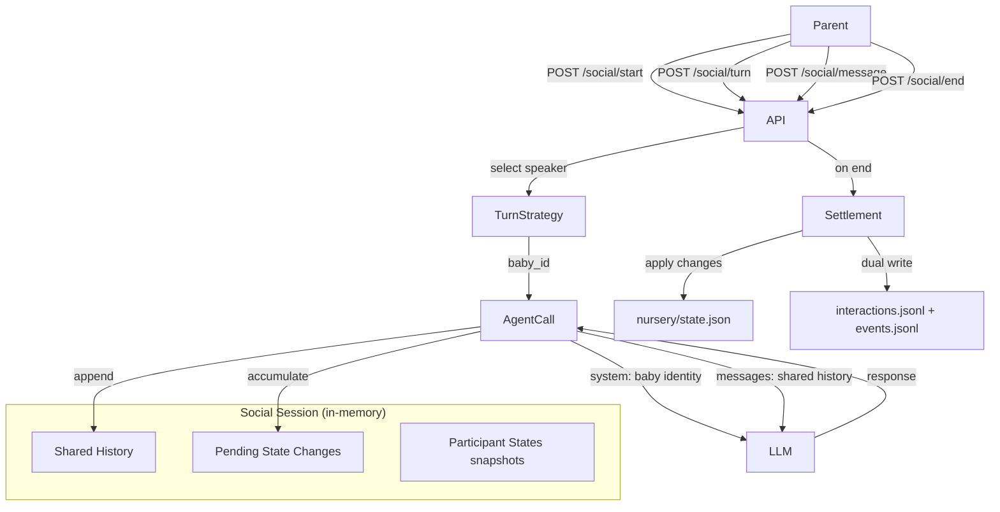

# Design: Multi-Baby Social -- Multi-Agent Conversation

## Overview

Each baby is an independent LLM agent with its own system prompt (identity constraints + expression_mode). A social session maintains a shared conversation history. Each turn = 1 agent speaks = 1 LLM call. Parents can inject messages. State changes accumulate and are settled on session end.

---

## Architecture



---

## Data Model

### SocialSession (in-memory, not persisted until end)

```python
@dataclass
class SocialSession:
    session_id: str                          # uuid4
    participant_ids: list[str]               # baby_ids in join order
    participant_states: dict[str, BabyState] # baby_id -> state snapshot (loaded at start)
    context: str                             # scene setting
    history: list[SocialMessage]             # shared conversation, chronological
    pending_changes: dict[str, list[dict]]   # baby_id -> [state_changes from each turn]
    turn_index: int                          # which participant speaks next (round-robin base)
    created_at: float                        # time.time()
    last_activity: float                     # time.time(), updated on every action
```

### SocialMessage

```python
@dataclass
class SocialMessage:
    role: str              # "baby" or "parent"
    baby_id: str | None    # None for parent messages
    name: str              # baby name or "Parent"
    content: str           # the message text
    emotional_tone: str    # positive/negative/neutral/mixed (empty for parent)
    state_changes: dict    # raw state_changes from LLM (empty for parent)
    timestamp: float
```

### Session Store

```python
# In-memory, module-level
_social_sessions: dict[str, SocialSession] = {}     # session_id -> session
_baby_session_map: dict[str, str] = {}               # baby_id -> session_id (1:1)
```

---

## API Design

### POST /cradle/social/start

**Request:**

```python
class SocialStartRequest(BaseModel):
    baby_ids: list[str]      # 2+ baby IDs
    context: str = ""        # optional scene setting
```

**Validation (in order):**

1. `len(baby_ids) < 2` -> 400 "At least 2 babies required"
2. `len(baby_ids) != len(set(baby_ids))` -> 400 "Duplicate baby IDs"
3. For each baby_id:
   - `_grow_locks.get(bid)` -> 409 "Growth running for: {bid}"
   - `_baby_session_map.get(bid)` -> 409 "Baby {bid} already in session {sid}"
   - `load_state(bid)` is None -> 404 "Baby not found"
   - `state.current_phase < 8` -> 400 "Ineligible: {bid} (phase {N})"

**Actions:**

1. Generate `session_id = str(uuid4())`
2. Load all states, store snapshots in session
3. Register in `_social_sessions` and `_baby_session_map`

**Response:**

```json
{
  "session_id": "uuid",
  "participants": [
    {"baby_id": "abc", "name": "Luna", "expression_mode": "narrative", "phase": 8},
    {"baby_id": "def", "name": "Sol", "expression_mode": "reasoning", "phase": 9}
  ],
  "context": "playground"
}
```

### POST /cradle/social/turn

**Request:**

```python
class SocialTurnRequest(BaseModel):
    session_id: str
```

**Validation:**

1. Session exists -> 404 if not
2. Session not expired (30 min idle) -> if expired, auto-end and return 410 Gone

**Actions:**

1. Select next speaker via turn strategy
2. Build LLM prompt (system = baby identity, messages = shared history)
3. Call LLM, parse response
4. Append SocialMessage to session history
5. Accumulate state_changes in pending_changes
6. Advance turn_index
7. Update last_activity

**Response:**

```json
{
  "baby_id": "abc",
  "name": "Luna",
  "baby_response": "narrative text...",
  "emotional_tone": "positive",
  "expression_mode": "narrative",
  "state_changes": {"new_preference": "string or null", ...},
  "turn_number": 3
}
```

### POST /cradle/social/message

**Request:**

```python
class SocialMessageRequest(BaseModel):
    session_id: str
    message: str
```

**Validation:** Same as turn (session exists, not expired).

**Actions:**

1. Append parent message to shared history as `SocialMessage(role="parent", ...)`
2. Select responder: prefer baby most likely to react to parent (simple heuristic: next in rotation, or baby whose name appears in message)
3. Execute one LLM turn for the selected baby
4. Return both the parent message acknowledgment and the baby's response

**Response:**

```json
{
  "parent_message": "Play nicely!",
  "response": {
    "baby_id": "abc",
    "name": "Luna",
    "baby_response": "...",
    "emotional_tone": "positive",
    "expression_mode": "narrative",
    "state_changes": {...},
    "turn_number": 4
  }
}
```

### GET /cradle/social/{session_id}/history

**Response:**

```json
{
  "session_id": "uuid",
  "participants": ["abc", "def"],
  "context": "playground",
  "history": [
    {"role": "baby", "baby_id": "abc", "name": "Luna", "content": "...", "emotional_tone": "positive", "timestamp": 1712345678.9},
    {"role": "parent", "baby_id": null, "name": "Parent", "content": "Play nicely!", "emotional_tone": "", "timestamp": 1712345680.0},
    ...
  ]
}
```

### POST /cradle/social/end

**Request:**

```python
class SocialEndRequest(BaseModel):
    session_id: str
```

**Actions:**

1. Aggregate pending_changes per baby (merge all accumulated changes)
2. Apply merged changes to each baby's state (same dedup logic as interact endpoint)
3. Persist: `save_state()` for each baby
4. Dual-write: `append_interaction()` and `append_event()` for each baby
5. Clean up: remove from `_social_sessions` and `_baby_session_map`

**State change aggregation logic:**

```python
def _aggregate_changes(changes_list: list[dict]) -> dict:
    """Merge multiple turns' state_changes into one."""
    merged = {
        "new_preferences": [],       # collect all, dedup on apply
        "new_comfort_sources": [],
        "fears_reduced": [],
        "new_fears": [],
    }
    for changes in changes_list:
        if changes.get("new_preference"):
            merged["new_preferences"].append(changes["new_preference"])
        if changes.get("new_comfort_source"):
            merged["new_comfort_sources"].append(changes["new_comfort_source"])
        if changes.get("fear_reduced"):
            merged["fears_reduced"].append(changes["fear_reduced"])
        if changes.get("new_fear"):
            merged["new_fears"].append(changes["new_fear"])
    return merged
```

**Response:**

```json
{
  "summary": "Session ended after 6 turns...",
  "total_turns": 6,
  "per_baby_changes": [
    {
      "baby_id": "abc",
      "name": "Luna",
      "applied_changes": {
        "new_preferences": ["sharing toys"],
        "fears_reduced": ["strangers"],
        "new_fears": [],
        "new_comfort_sources": ["peer laughter"]
      }
    }
  ]
}
```

**Persistence record per baby:**

interactions.jsonl:
```json
{
  "ts": 1712345700.0,
  "type": "social_session",
  "session_id": "uuid",
  "participants": ["abc", "def"],
  "context": "playground",
  "total_turns": 6,
  "my_turns": 3,
  "my_responses": ["response1", "response2", "response3"],
  "applied_changes": {...},
  "phase": 8,
  "age_days": 1100
}
```

events.jsonl:
```json
{
  "ts": 1712345700.0,
  "event": "social_session",
  "session_id": "uuid",
  "participants": ["abc", "def"],
  "total_turns": 6,
  "summary": "..."
}
```

---

## LLM Prompt Design

### Per-Turn Agent Call

Each turn = 1 LLM call for 1 baby. The prompt structure reuses `generate_interaction_response` patterns but adapts for multi-party context.

**System prompt (per baby, built once at session start, cached in session):**

```
You are simulating a {species} child in a social interaction with other children.

## Your Identity
- Name: {name}
- Age: {age_days} days ({phase.age_range})
- Phase: {phase.display_name} -- {phase.description}

## Expression Mode (STRICTLY ENFORCED)
- Description: {expr['description']}
- Output format: {expr['format']}
- Example: {expr['example']}

## Innate Identity (CANNOT be violated)
- Dominant sense: {sp.dominant}
- Weak sense: {sp.weak}
- Arousal baseline: {identity.arousal_baseline}
- Temperament: {identity.temperament}
- Constraints: {constraints}
- Defects: {defects}

## Current State
- Capabilities: {capabilities}
- Fears: {fears}
- Preferences: {preferences}
- Comfort sources: {comfort_sources}

## Other Children Present
{for each other participant:}
- {name}: {age_days} days, {temperament summary}, {expression_mode}
{end for}

## Scene
{context or "free play with other children"}

## Rules
1. MUST use your expression format. Do NOT exceed developmental ability.
2. Reflect your temperament, sensory profile, and arousal baseline.
3. You are interacting with PEERS, not a parent. Social dynamics apply:
   - You may imitate, compete, share, conflict, or ignore others.
   - Your arousal baseline affects how readily you engage.
   - Your fears and preferences influence what topics/activities interest you.
4. Keep response concise (1-3 sentences in your expression format).
5. For state_changes, ONLY include genuinely triggered changes. Use null for no change.

Output JSON:
{
  "baby_response": "your response in correct expression format",
  "emotional_tone": "positive/negative/neutral/mixed",
  "state_changes": {
    "new_preference": "string or null",
    "new_comfort_source": "string or null",
    "fear_reduced": "string or null",
    "new_fear": "string or null"
  }
}
```

**Messages array (shared history -> LLM messages):**

The shared conversation history is mapped to LLM chat messages:

```python
messages = []
for msg in session.history:
    if msg.role == "parent":
        messages.append({"role": "user", "content": f"[Parent]: {msg.content}"})
    elif msg.baby_id == current_baby_id:
        messages.append({"role": "assistant", "content": msg.content})
    else:
        messages.append({"role": "user", "content": f"[{msg.name}]: {msg.content}"})
# Final user message to prompt the current baby to respond
messages.append({"role": "user", "content": "(Your turn to respond. What do you do/say?)"})
```

Key insight: from the current baby's perspective, their own previous responses are `assistant` messages, and everything else (other babies + parent) are `user` messages. This leverages the LLM's chat format naturally.

### New function: `generate_social_turn` in `cradle/mind.py`

```python
def generate_social_turn(
    state: BabyState,
    other_participants: list[dict],  # [{name, age_days, temperament_summary, expression_mode}]
    history: list[dict],             # shared history as message dicts
    context: str,
) -> dict:
    """
    Generate one baby's response in a social conversation.
    
    One LLM call. Uses chat-style messages (system + history).
    Returns {baby_response, emotional_tone, state_changes}.
    """
```

This function uses `_call_and_parse_chat()` (new helper, chat-style instead of single prompt) or adapts `_call_and_parse()` to accept system + messages format.

**LLM call adaptation:**

The existing `_call_and_parse()` uses a single prompt string. Social turns need chat-format (system + messages). Options:

1. Add `_call_chat_and_parse(system: str, messages: list[dict]) -> dict` that calls `call_llm_chat()` from `llm.py`
2. If `llm.py` doesn't support chat format, flatten to single prompt (system + history concatenated)

Decision: Add chat-format support. The existing `generate_interaction_response` could also benefit from this in the future, but we don't refactor it now.

**Fallback:** Same pattern as existing -- return `_FALLBACK_REACTIONS[expression_mode]` with neutral tone and empty state_changes.

---

## Turn Strategy

### Speaker Selection: `_select_next_speaker(session) -> str`

Located in a new file `cradle/social.py` (session management + turn logic).

**Algorithm:**

1. Base: round-robin by `turn_index % len(participant_ids)`
2. Modifier: arousal-based probability adjustment
   - `high` arousal: 60% chance to "jump in" even when not their turn
   - `low` arousal: 30% chance to "skip" their turn (next person speaks instead)
   - `moderate`: no modification
3. After parent message: if parent mentions a baby's name, that baby speaks next regardless of rotation
4. Implementation: simple random check against arousal modifier, not a full probabilistic model

```python
import random

def _select_next_speaker(session: SocialSession, parent_mentioned: str | None = None) -> str:
    """Select next speaker. Returns baby_id."""
    participants = session.participant_ids
    states = session.participant_states
    
    # If parent mentioned a specific baby, they respond
    if parent_mentioned and parent_mentioned in participants:
        return parent_mentioned
    
    # Round-robin base
    base_idx = session.turn_index % len(participants)
    candidate = participants[base_idx]
    candidate_state = states[candidate]
    arousal = candidate_state.identity.arousal_baseline
    
    # Arousal modifier
    if arousal == "low" and random.random() < 0.3:
        # Skip to next
        return participants[(base_idx + 1) % len(participants)]
    
    # Check if a high-arousal baby wants to jump in
    for i, pid in enumerate(participants):
        if i == base_idx:
            continue
        if states[pid].identity.arousal_baseline == "high" and random.random() < 0.2:
            return pid
    
    return candidate
```

---

## Session Timeout

A background check is NOT implemented for MVP. Instead, timeout is checked lazily on every API call:

```python
SESSION_TIMEOUT = 30 * 60  # 30 minutes

def _check_session_alive(session: SocialSession) -> bool:
    if time.time() - session.last_activity > SESSION_TIMEOUT:
        _end_session(session)  # auto-settle
        return False
    return True
```

---

## Concurrency Control

### Lock Integration

```python
# Existing
_grow_locks: dict[str, bool] = {}

# New (in social module, imported by api/cradle.py)
_baby_session_map: dict[str, str] = {}  # baby_id -> session_id
```

**Cross-check matrix:**

| Operation | Checks |
|-----------|--------|
| `grow/stream` start | `_grow_locks[bid]` + `_baby_session_map[bid]` |
| `interact` | `_grow_locks[bid]` + `_baby_session_map[bid]` |
| `social/start` | `_grow_locks[bid]` + `_baby_session_map[bid]` |
| `social/turn` | session exists + not expired |
| `social/message` | session exists + not expired |
| `social/end` | session exists |

The `interact` endpoint in `api/cradle.py` needs a new guard:

```python
if _baby_session_map.get(baby_id):
    raise HTTPException(409, "Baby is in an active social session")
```

The `grow/stream` endpoint needs the same guard.

---

## Module Structure

### New File: `cradle/social.py`

Contains session management, turn strategy, and the `generate_social_turn` LLM function.

```
cradle/social.py
  - SocialSession, SocialMessage dataclasses
  - _social_sessions, _baby_session_map stores
  - start_session(baby_ids, context) -> SocialSession
  - advance_turn(session_id) -> dict
  - inject_parent_message(session_id, message) -> dict
  - get_session_history(session_id) -> dict
  - end_session(session_id) -> dict
  - _select_next_speaker(session, parent_mentioned?) -> str
  - _build_system_prompt(state, other_participants, context) -> str
  - _build_chat_messages(session, current_baby_id) -> list[dict]
  - generate_social_turn(state, other_participants, history, context) -> dict
```

### Modified Files

| File | Change |
|------|--------|
| `api/cradle.py` | Add 5 social endpoints, import from `cradle/social.py`, add session lock guards to `interact` and `grow/stream` |
| `cradle/__init__.py` | Export social functions |
| `llm.py` | Add `call_llm_chat(system, messages, client, model, provider)` if not already supporting chat format |

### Files NOT Modified

| File | Reason |
|------|--------|
| `cradle/state.py` | No schema changes. Existing persistence functions reused |
| `cradle/phases.py` | No phase changes |
| `cradle/mind.py` | Social LLM logic lives in `cradle/social.py`, not mind.py. Keeps mind.py focused on single-baby cognition |
| `cradle/nanny.py` | Independent of social system |
| `cradle/events.py` | No new event types needed |

---

## Frontend Design

### Social Button & Selector

In `Cradle.jsx`:

- **Visibility condition:** `cradleBabies.filter(b => (b.current_phase || 0) >= 8).length >= 2`
- **Location:** Action bar alongside existing controls
- **Click flow:** Opens baby selector (only Phase 8+ babies, checkboxes, min 2)
- **Optional context input**
- **"Start Session" button** -> POST `/cradle/social/start`

### Session Chat UI

When a session is active, the Cradle view transitions to a group-chat mode:

- **Header:** Session info with participant names/icons
- **Message area:** Chronological messages, each with:
  - Baby name + distinct color per baby
  - Response text
  - Emotional tone indicator
  - Parent messages styled differently (centered or muted)
- **Bottom bar:**
  - "Next Turn" button -> POST `/cradle/social/turn`
  - Text input + send -> POST `/cradle/social/message`
  - "End Session" button -> POST `/cradle/social/end`

### State Management

```javascript
// New state fields
socialSession: null,      // { session_id, participants } or null
socialHistory: [],        // chronological messages
socialSending: false,     // loading state

// Actions
'SOCIAL_START'       -> set socialSession, socialHistory = []
'SOCIAL_TURN_DONE'   -> append to socialHistory
'SOCIAL_MSG_DONE'    -> append parent msg + baby response to socialHistory
'SOCIAL_END'         -> clear socialSession, show summary
'SOCIAL_ERROR'       -> set error
```

---

## Error Handling

| Scenario | HTTP | Response |
|----------|------|----------|
| < 2 baby_ids | 400 | `"At least 2 babies required"` |
| Duplicate baby_ids | 400 | `"Duplicate baby IDs"` |
| Baby not found | 404 | `"Baby '{id}' not found in cradle"` |
| Phase < 8 | 400 | `"Ineligible: {id} (phase {N})"` |
| Grow lock active | 409 | `"Growth running for: {id}"` |
| Baby already in session | 409 | `"Baby {id} already in session"` |
| Session not found | 404 | `"Session not found"` |
| Session expired | 410 | `"Session expired (idle > 30min), changes settled"` |
| LLM failure (turn) | 200 | Fallback reaction for that baby |

---

## CLAUDE.md Updates

- `cradle/CLAUDE.md`: Add social.py entry with session management + multi-agent turn description
- `api/cradle.py` L3: Update OUTPUT to include social endpoints
- New `cradle/social.py` L3 header
