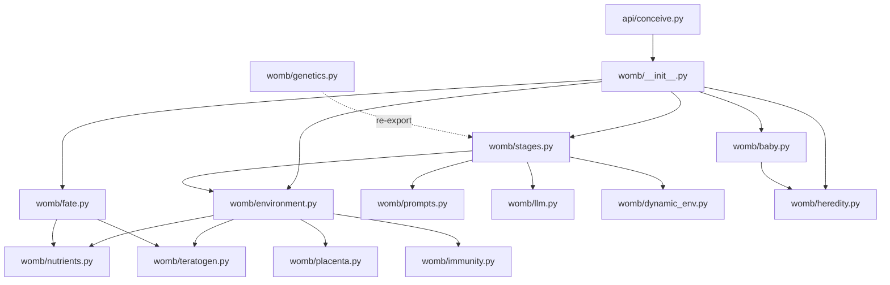

# Design: Womb Upgrade

## 概述

本文档是 womb-upgrade 的完整技术蓝图。设计遵循三个原则：
1. **向后兼容** -- 所有现有接口保持不变，新功能通过扩展（非修改）引入
2. **关注点分离** -- 每个子系统独立文件，通过 env 字典传递状态
3. **genetics.py 拆分** -- 当前 961 行的巨型文件拆分为 prompts.py + stages.py + llm.py

---

## 1. 数据模型

### 1.1 env 字典结构（升级后）

```python
env = {
    # --- 原有字段（保持不变）---
    "nutrition": "adequate",            # str, 从 nutrients 加权计算，向后兼容
    "stress": "mild",                   # str, 等级值
    "toxin_exposure": "moderate",       # str, 等级值
    "maternal_age_factor": "optimal",   # str, 等级值
    "modifiers": {
        "budget_multiplier": 0.912,
        "defect_risk_multiplier": 1.3,
        "miscarriage_risk_multiplier": 1.0,
    },

    # --- US-03: 营养细分（新增）---
    "nutrients": {
        "folate": 0.72,     # 0.0~1.0
        "iodine": 0.65,
        "iron": 0.58,
        "dha": 0.70,
        "calcium": 0.80,
    },

    # --- US-04: 致畸窗口（新增）---
    "toxin_types": ["alcohol"],         # list[str], toxin_exposure != "none" 时随机选取
    "teratogen_context": {              # 每阶段动态计算，不存入 env
        # 运行时注入到 gestation_log
    },

    # --- US-01: 动态环境（新增）---
    "env_history": [                    # 每阶段追加
        {
            "stage": "zygote",
            "event": None,             # 或 "stress_increase" 等
            "snapshot": { ... },       # 该阶段生效的 env 快照（不含 env_history 自身）
        },
    ],

    # --- US-07: 胎盘（P3，新增）---
    "placenta": {
        "efficiency": 0.3,             # 当前效率
        "complications": [],           # list[str]
    },

    # --- US-08: 免疫（P3，新增）---
    "immunity": {
        "maternal_blood_type": {"abo": "A", "rh": "+"},
        "fetal_blood_type": {"abo": "O", "rh": "+"},
        "rh_incompatible": False,
        "torch_infections": [],        # list[str]
    },
}
```

### 1.2 Baby dataclass（升级后）

```python
@dataclass
class Baby:
    id: str
    species: str
    sex: str
    phenotype: dict
    born_at: str
    genes: dict
    first_cry: str
    gestation_log: list[dict]
    environment: dict
    complications: list[dict] = field(default_factory=list)  # US-05: dict 格式
    preterm: dict = field(default_factory=dict)
    alive: bool = True
    parent_genomes: dict = field(default_factory=dict)       # US-06: 父母基因快照

    @property
    def complication_names(self) -> list[str]:
        """向后兼容：返回缺陷名称列表（旧格式）"""
        return [c["defect"] if isinstance(c, dict) else c for c in self.complications]
```

### 1.3 ParentGenome（US-06, 新文件 womb/heredity.py）

```python
@dataclass
class ParentGenome:
    """单个亲本的基因组。每个性状由一对等位基因表示。"""
    traits: dict[str, tuple[str, str]]
    # 示例: {"eye_color": ("brown", "blue"), "hair_type": ("curly", "straight"), ...}

HUMAN_TRAITS = {
    "eye_color":        {"alleles": ["brown", "blue", "green"], "dominance": {"brown": 2, "green": 1, "blue": 0}},
    "hair_type":        {"alleles": ["curly", "wavy", "straight"], "dominance": {"curly": 2, "wavy": 1, "straight": 0}},
    "hair_color":       {"alleles": ["black", "brown", "red", "blonde"], "dominance": {"black": 3, "brown": 2, "red": 1, "blonde": 0}},
    "skin_tone":        {"alleles": ["dark", "medium", "light"], "dominance": {"dark": 2, "medium": 1, "light": 0}},
    "height_tendency":  {"alleles": ["tall", "average", "short"], "dominance": {"tall": 1, "average": 1, "short": 1}},  # 不完全显性
    "metabolism_type":  {"alleles": ["fast", "moderate", "slow"], "dominance": {"fast": 1, "moderate": 1, "slow": 1}},
    "blood_type_abo":   {"alleles": ["A", "B", "O"], "dominance": {"A": 1, "B": 1, "O": 0}},  # 共显性 AB
    "earwax_type":      {"alleles": ["wet", "dry"], "dominance": {"wet": 1, "dry": 0}},
    "dimples":          {"alleles": ["present", "absent"], "dominance": {"present": 1, "absent": 0}},
    "freckles":         {"alleles": ["present", "absent"], "dominance": {"present": 1, "absent": 0}},
}
```

### 1.4 Complication 结构（US-05）

```python
# 掷骰命中后生成
complication = {
    "defect": "congenital_heart_defect",
    "severity": 0.45,                    # 0.0~1.0 连续谱
    "syndrome_origin": "down_syndrome",  # 因综合征共现而触发，None 表示独立
}
```

---

## 2. 文件变更清单

### 2.1 新增文件

| 文件 | 职责 | 预估行数 | 优先级 |
|------|------|----------|--------|
| `womb/nutrients.py` | 营养素生成、加权计算、阶段敏感性配置 | ~150 | P0 |
| `womb/teratogen.py` | 毒素类型定义、阶段-风险矩阵、窗口查询 | ~120 | P0 |
| `womb/dynamic_env.py` | 环境变化事件触发、env 状态更新 | ~130 | P0 |
| `womb/placenta.py` | 胎盘曲线、并发症、效率计算 | ~120 | P3 |
| `womb/immunity.py` | 血型、Rh、TORCH 感染 | ~150 | P3 |
| `womb/heredity.py` | ParentGenome、孟德尔遗传、子代基因型 | ~200 | P2 |
| `womb/prompts.py` | 从 genetics.py 拆出的 prompt 模板 | ~250 | P0 |
| `womb/llm.py` | 从 genetics.py 拆出的 LLM 客户端和 JSON 解析 | ~130 | P0 |
| `womb/stages.py` | 从 genetics.py 拆出的阶段编排逻辑（express/express_stream）| ~250 | P0 |

### 2.2 修改文件

| 文件 | 变更内容 | 优先级 |
|------|----------|--------|
| `womb/environment.py` | 集成 nutrients.py、dynamic_env.py；generate_environment() 增加 nutrients 参数 | P0 |
| `womb/fate.py` | roll_congenital_defects() 支持营养素风险调整和综合征共现；扩展缺陷列表 | P0+P2 |
| `womb/baby.py` | Baby.complications 类型变更 + complication_names 兼容属性 + parent_genomes 字段 | P2 |
| `womb/genetics.py` | 拆分后保留为薄包装层（re-export），最终 < 50 行 | P0 |
| `womb/__init__.py` | conceive() 集成动态环境、母体反馈数值化、营养素、致畸窗口 | P0 |
| `api/conceive.py` | API 参数扩展（nutrients、parent_genomes） | P0+P2 |
| `womb/species/human.yaml` | 新增缺陷概率、毒素窗口数据、TORCH 概率 | P0+P2+P3 |

---

## 3. 接口变更

### 3.1 API: POST /conceive

无变更（同步接口保持现状）。

### 3.2 API: GET /conceive/stream -- 新增参数

```
新增 query 参数（全部可选）:
  folate: float        # 0.0~1.0
  iodine: float
  iron: float
  dha: float
  calcium: float
  father_genome: str   # JSON 编码的 ParentGenome.traits（P2）
  mother_genome: str   # JSON 编码的 ParentGenome.traits（P2）
```

### 3.3 API: SSE 事件扩展

```json
// 新增 SSE 事件
{"event": "env_change", "stage": "early_organogenesis", "change": "stress_increase", "old": "mild", "new": "moderate"}
{"event": "nutrient_status", "stage": "early_neural", "nutrients": {"folate": 0.72, ...}, "sensitive_nutrients": ["iodine"]}
{"event": "maternal_feedback_applied", "stage": "late_organogenesis", "direction": "worse", "delta": -0.03, "new_budget_multiplier": 0.882}
{"event": "placenta_status", "stage": "fetal_movement", "efficiency": 0.95, "complications": []}
```

### 3.4 内部接口

#### generate_environment() 签名变更

```python
def generate_environment(
    nutrition: str | None = None,       # 保留，优先级低于 nutrients
    stress: str | None = None,
    toxin_exposure: str | None = None,
    maternal_age_factor: str | None = None,
    # 新增
    nutrients: dict | None = None,      # {"folate": 0.8, ...} 覆盖
) -> dict:
```

#### conceive() 签名变更

```python
def conceive(
    species: str,
    model: str | None = None,
    # 新增
    father_genome: dict | None = None,  # P2
    mother_genome: dict | None = None,  # P2
) -> ConceptionResult:
```

---

## 4. 核心逻辑设计

### 4.1 动态环境引擎（US-01, womb/dynamic_env.py）

```
                    ┌──────────────┐
                    │ 初始 env     │
                    └──────┬───────┘
                           │
          ┌────────────────▼────────────────┐
          │  Stage Loop (7 stages)          │
          │  ┌───────────────────────────┐  │
          │  │ roll_env_change(env, p)   │  │
          │  │ p = 0.15~0.25 per stage  │  │
          │  │                           │  │
          │  │ if triggered:             │  │
          │  │   pick event type         │  │
          │  │   shift level ±1 step     │  │
          │  │   recompute modifiers     │  │
          │  │   record in env_history   │  │
          │  └───────────────────────────┘  │
          │  ┌───────────────────────────┐  │
          │  │ stage development (LLM)   │  │
          │  └───────────────────────────┘  │
          │  ┌───────────────────────────┐  │
          │  │ maternal feedback (LLM)   │  │
          │  │ → apply_feedback(env)     │  │
          │  │   budget ±0.01~0.05       │  │
          │  │   clamp [0.50, 1.20]      │  │
          │  └───────────────────────────┘  │
          └─────────────────────────────────┘
```

等级移位规则：
- stress: minimal ↔ mild ↔ moderate ↔ severe（单步移动）
- nutrition: 通过调整 nutrients 值 ±0.10~0.15 再重新计算
- toxin: none → mild → moderate → severe（onset 上移）/ severe → moderate → mild → none（end 下移）

### 4.2 营养素系统（US-03, womb/nutrients.py）

```
NUTRIENT_STAGE_SENSITIVITY = {
    "folate": {
        "sensitive_stages": ["zygote", "early_organogenesis"],
        "target_system": "neural_tube",
        "deficiency_threshold": 0.35,
        "risk_effect": {"neural_tube_defect": 3.0},  # 低于阈值时风险倍数
        "budget_penalty": 0.05,  # 低于阈值时 budget 额外惩罚
    },
    "iodine": {
        "sensitive_stages": ["early_neural", "late_neural"],
        "target_system": "thyroid_neural",
        "deficiency_threshold": 0.30,
        "risk_effect": {"microcephaly": 2.0},
        "budget_penalty": 0.04,
    },
    "iron": {
        "sensitive_stages": ["late_organogenesis", "early_neural", "late_neural", "fetal_movement", "birth"],
        "target_system": "hematopoietic",
        "deficiency_threshold": 0.30,
        "risk_effect": {},
        "budget_penalty": 0.06,
    },
    "dha": {
        "sensitive_stages": ["late_neural", "fetal_movement"],
        "target_system": "brain_development",
        "deficiency_threshold": 0.30,
        "risk_effect": {},
        "budget_penalty": 0.04,
    },
    "calcium": {
        "sensitive_stages": ["late_organogenesis", "fetal_movement"],
        "target_system": "skeletal",
        "deficiency_threshold": 0.30,
        "risk_effect": {},
        "budget_penalty": 0.03,
    },
}

NUTRITION_WEIGHTS = {"folate": 0.25, "iodine": 0.20, "iron": 0.20, "dha": 0.20, "calcium": 0.15}

NUTRITION_THRESHOLDS = [
    (0.80, "excellent"),
    (0.55, "adequate"),
    (0.35, "moderate_deficiency"),
    (0.00, "severe_deficiency"),
]
```

计算流程：
1. 生成 5 个营养素值（正态分布 N(0.65, 0.15), clamp [0.1, 1.0]）
2. 加权求和 → nutrition_score
3. 映射到四档字符串 → 写入 env["nutrition"]
4. 每个阶段开始时，检查当前阶段的敏感营养素是否低于阈值 → 叠加风险/budget 惩罚

### 4.3 致畸窗口（US-04, womb/teratogen.py）

```
TERATOGEN_STAGE_RISK = {
    "alcohol": {
        "zygote": 2.0,
        "early_organogenesis": 4.0,  # 峰值：器官形成期
        "late_organogenesis": 3.0,
        "early_neural": 2.5,
        "late_neural": 2.0,
        "fetal_movement": 1.5,
        "birth": 1.0,
    },
    "tobacco": {
        "zygote": 1.2,
        "early_organogenesis": 1.5,
        "late_organogenesis": 1.5,
        "early_neural": 1.3,
        "late_neural": 1.3,
        "fetal_movement": 1.8,  # 影响生长
        "birth": 1.5,
    },
    "heavy_metals": { ... },
    "medication": { ... },
    "radiation": { ... },
    "infection": { ... },
}
```

每阶段的有效 defect_risk = base_defect_risk * env_modifier * max(teratogen_stage_risks)

### 4.4 母体反馈数值化（US-02）

在 `womb/stages.py` 的 express/express_stream 循环中，收到母体反馈后：

```python
def apply_maternal_feedback(env: dict, maternal_response: dict) -> dict:
    """解析 LLM 母体反馈，数值化修改 budget_multiplier。"""
    text = str(maternal_response.get("updated_environment_modifier", "")).lower()
    current = env["modifiers"]["budget_multiplier"]

    if any(kw in text for kw in ("better", "improved", "favorable", "enhanced")):
        delta = random.uniform(0.01, 0.03)
    elif any(kw in text for kw in ("worse", "deteriorated", "declined", "stressed", "reduced")):
        delta = -random.uniform(0.01, 0.05)
    else:
        return env  # neutral

    new_val = max(0.50, min(1.20, current + delta))
    env["modifiers"]["budget_multiplier"] = round(new_val, 3)
    return env
```

### 4.5 genetics.py 拆分方案

```
genetics.py (961行)
    ├── womb/prompts.py      (~250行)  # STAGE_*_PROMPT 模板 + MATERNAL_RESPONSE_PROMPT
    ├── womb/llm.py          (~130行)  # PROVIDERS, _create_client, _call_llm, _parse_json, _is_inside_object
    ├── womb/stages.py       (~250行)  # express(), express_stream(), build_stage_prompts(),
    │                                  # _enforce_budget, _build_env_constraint, blueprint loading
    └── womb/genetics.py     (~30行)   # 薄包装：re-export express, express_stream 保持向后兼容
```

### 4.6 并发症扩展（US-05, fate.py 修改）

新增缺陷及概率（人类）:

| 缺陷 | 基础概率 | 来源 |
|------|----------|------|
| clubfoot | 0.001 | WHO |
| gastroschisis | 0.0005 | CDC |
| diaphragmatic_hernia | 0.0003 | EUROCAT |
| limb_reduction | 0.0006 | CDC |
| microcephaly | 0.0002 | WHO |
| hydrocephalus | 0.001 | WHO |

综合征共现矩阵:

```python
SYNDROME_CO_OCCURRENCE = {
    "down_syndrome": {
        "congenital_heart_defect": 5.0,  # 50% of Down syndrome → CHD
        "hydrocephalus": 2.0,
    },
    "neural_tube_defect": {
        "hydrocephalus": 8.0,            # Arnold-Chiari 畸形
        "clubfoot": 3.0,
    },
}
```

掷骰流程:
1. 遍历所有缺陷，独立掷骰
2. 对已命中的缺陷，查找共现矩阵，将依赖缺陷的概率乘以共现倍数后再掷骰
3. 每个命中的缺陷生成 severity = random.betavariate(2, 5)（偏向轻度）

### 4.7 遗传模型（US-06, womb/heredity.py）

```
┌──────────────┐    ┌──────────────┐
│ Father Genome│    │ Mother Genome│
│ (请求参数)   │    │ (请求参数)   │
└──────┬───────┘    └──────┬───────┘
       │                   │
       └─────────┬─────────┘
                 │
        ┌────────▼────────┐
        │ Mendelian Cross  │
        │ 每个性状:       │
        │  father[trait]   │
        │    pick 1 allele │
        │  mother[trait]   │
        │    pick 1 allele │
        │  → child allele  │
        │  → phenotype     │
        └────────┬────────┘
                 │
        ┌────────▼────────┐
        │ Child Genotype   │
        │ → Baby.phenotype │
        │ → Baby.genes     │
        │ → parent_genomes │
        └─────────────────┘
```

表现型判定规则：
- 简单显隐性：显性等位基因优先
- 不完全显性（height, metabolism）：两个不同等位基因时取中间值
- 共显性（blood_type）：A+B → AB

### 4.8 胎盘建模（US-07, womb/placenta.py）

```python
PLACENTA_EFFICIENCY_CURVE = {
    "zygote": 0.30,
    "early_organogenesis": 0.50,
    "late_organogenesis": 0.70,
    "early_neural": 0.85,
    "late_neural": 0.95,
    "fetal_movement": 1.00,
    "birth": 0.95,
}

PLACENTA_COMPLICATIONS = {
    "placenta_previa": {"probability": 0.005, "efficiency_reduction": 0.15, "onset_stages": ["late_organogenesis", "early_neural"]},
    "placental_abruption": {"probability": 0.01, "efficiency_reduction": 0.30, "onset_stages": ["fetal_movement", "birth"]},
    "placental_insufficiency": {"probability": 0.03, "efficiency_reduction": 0.25, "onset_stages": ["early_neural", "late_neural", "fetal_movement"]},
}
```

胎盘效率作为 budget_multiplier 的额外乘数:
`effective_budget = base * env_modifier * fetus_factor * placenta_efficiency`

### 4.9 免疫交互（US-08, womb/immunity.py）

```python
TORCH_INFECTIONS = {
    "toxoplasma": {"probability": 0.005, "stage_risk": {"early_organogenesis": 2.0, "late_organogenesis": 1.5}, "defect_boost": 1.5, "miscarriage_boost": 1.3},
    "rubella": {"probability": 0.001, "stage_risk": {"zygote": 3.0, "early_organogenesis": 4.0}, "defect_boost": 3.0, "miscarriage_boost": 2.0},
    "cmv": {"probability": 0.01, "stage_risk": {"early_neural": 2.0, "late_neural": 1.5}, "defect_boost": 1.8, "miscarriage_boost": 1.2},
    "hsv": {"probability": 0.003, "stage_risk": {"birth": 2.5}, "defect_boost": 1.3, "miscarriage_boost": 1.1},
}
```

---

## 5. 模块依赖关系



---

## 6. LLM Prompt 注入策略

新增信息通过以下方式注入到 stage prompts 中（不改变 prompt 整体结构）:

1. **营养素状态**：在 `## Maternal Environment` 段落后追加 `## Nutrient Status` 子段
2. **致畸窗口**：在 `{defects_section}` 中追加当前阶段的毒素风险说明
3. **动态环境事件**：在 `{env_constraint}` 中追加环境变化描述
4. **胎盘状态**：在环境描述中追加胎盘效率信息
5. **遗传倾向**：在 `## Innate Attributes` 中追加遗传基因型信息

每段追加的 token 预算：< 100 tokens，总计 < 500 tokens/prompt。

---

## 7. 向后兼容策略

| 变更点 | 兼容方案 |
|--------|----------|
| `env["nutrition"]` | 保留字符串值，从 nutrients 加权计算 |
| `Baby.complications` | 新格式 `list[dict]`，提供 `complication_names` 属性返回 `list[str]` |
| `genetics.py` | 保留为薄包装层，re-export `express` 和 `express_stream` |
| `generate_environment()` | 新增参数全部可选，默认值保持原行为 |
| `conceive()` | 新增参数全部可选，默认值保持原行为 |
| API 响应 | 新增字段追加，不删除/修改现有字段 |
