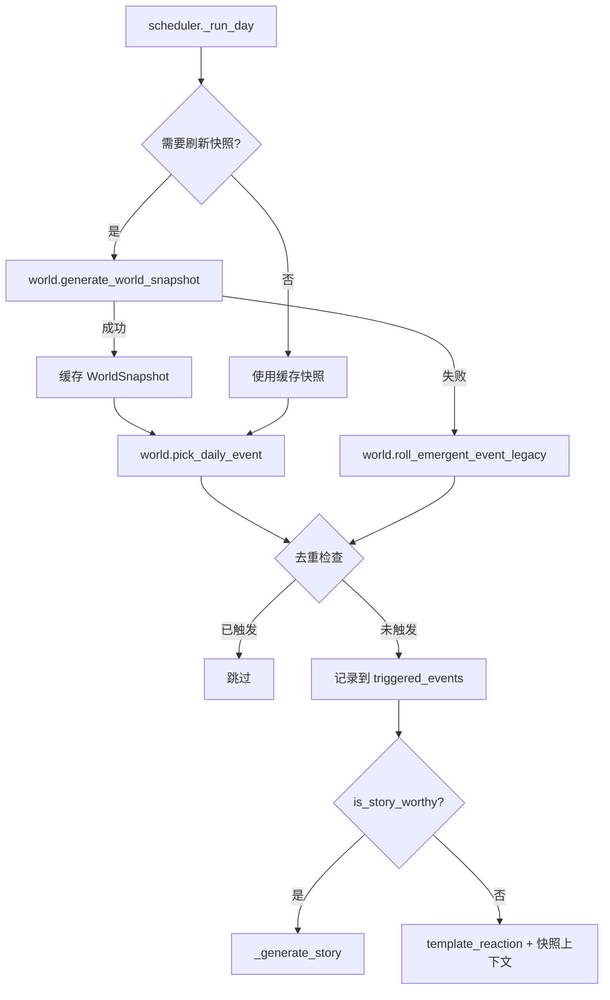
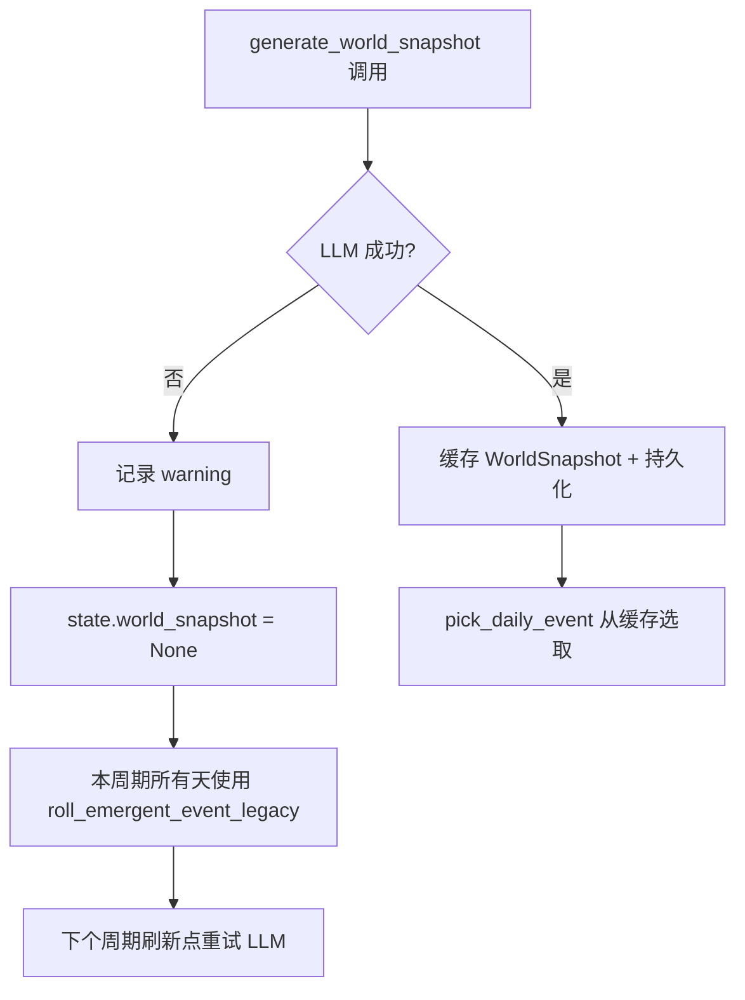

# Design: World Context Driven Event Emergence

## 总体架构

用 WorldSnapshot（LLM 生成的 N 天世界状态）替代固定事件池作为涌现事件的主要来源。关键事件保留规则驱动，固定事件池降级为 fallback。

### 新旧流程对比

**旧流程（每天）**：
```
_run_day(day)
  -> roll_emergent_event()          # 从 91 个固定事件池随机选
    -> 25% 概率触发
    -> 加权随机选择
    -> cooldown 3 天（基于 memories，83% 失效）
  -> is_story_worthy? -> LLM 叙事
  -> 否 -> template_reaction
```

**新流程（每天）**：
```
_run_day(day)
  -> 是否需要刷新快照? (超出当前快照 end_day 或无缓存)
    -> 是: generate_world_snapshot(state, prev_snapshot) via LLM
    -> 失败: fallback 到 roll_emergent_event_legacy()
  -> pick_daily_event(snapshot, day)   # 从快照候选中选取
    -> 有当天事件 -> 直接使用
    -> 无 -> 25% 概率触发 surprise 槽位
  -> 去重检查: triggered_events 过滤
  -> is_story_worthy? -> LLM 叙事（复用现有 _generate_story）
  -> 否 -> template_reaction（增强：注入快照上下文）
```

### 架构图



---

## 数据模型

### WorldSnapshot（新增数据类，位于 world.py）

```python
@dataclass
class SnapshotEvent:
    """快照中的一个候选涌现事件。"""
    name: str                    # 事件标识（LLM 生成，如 "rainy_window_watching"）
    display_name: str            # 显示名（如 "看窗外雨景"）
    description: str             # 事件描述（1-2 句话）
    sensory_channels: list[str]  # 涉及的感官通道
    intensity: float             # 0-1 刺激强度
    day_index: int               # 在周期中的第几天（0-based），-1 表示 surprise
    category: str = "environment"  # 固定为 environment

@dataclass
class WorldSnapshot:
    """N 天的世界状态快照。"""
    start_day: int                      # 快照覆盖的起始天
    end_day: int                        # 快照覆盖的结束天（exclusive）
    weather_pattern: str                # 天气模式描述（如 "连续阴雨转晴"）
    family_arc: str                     # 家庭事件弧线（如 "奶奶来探望，住了三天"）
    ambient_mood: str                   # 环境氛围（如 "温馨而热闹"）
    events: list[SnapshotEvent]         # 候选涌现事件列表
    surprise_pool: list[SnapshotEvent]  # 意外事件池（day_index=-1）
    used_events: set[str] = field(default_factory=set)  # 已使用的事件名（周期内去重）
```

### BabyState 新增字段

```python
# 在 BabyState dataclass 中新增：
triggered_events: set[str] = field(default_factory=set)  # 全局已触发事件名（用于 first_X 和 critical 去重）
world_snapshot: WorldSnapshot | None = None               # 当前世界快照（持久化，保证重启连续性）
```

**持久化策略**：
- `triggered_events` 持久化到 state.json（跨会话去重）
- `world_snapshot` **持久化到 state.json**（保证重启/重连后上下文不断裂）

### to_dict / from_dict 扩展

```python
# WorldSnapshot 序列化
def snapshot_to_dict(ws: WorldSnapshot) -> dict:
    return {
        "start_day": ws.start_day,
        "end_day": ws.end_day,
        "weather_pattern": ws.weather_pattern,
        "family_arc": ws.family_arc,
        "ambient_mood": ws.ambient_mood,
        "events": [
            {"name": e.name, "display_name": e.display_name, "description": e.description,
             "sensory_channels": e.sensory_channels, "intensity": e.intensity,
             "day_index": e.day_index, "category": e.category}
            for e in ws.events
        ],
        "surprise_pool": [
            {"name": e.name, "display_name": e.display_name, "description": e.description,
             "sensory_channels": e.sensory_channels, "intensity": e.intensity,
             "day_index": e.day_index, "category": e.category}
            for e in ws.surprise_pool
        ],
        "used_events": list(ws.used_events),
    }

# BabyState.to_dict 新增：
"triggered_events": list(self.triggered_events),
"world_snapshot": snapshot_to_dict(self.world_snapshot) if self.world_snapshot else None,

# BabyState.from_dict 新增：
triggered_events=set(d.get("triggered_events", [])),
world_snapshot=snapshot_from_dict(d.get("world_snapshot")) if d.get("world_snapshot") else None,
```

---

## 快照周期：按阶段可变

固定 7 天不适合所有阶段。新生儿世界稳定（吃睡循环），后期社交密集。
周期按阶段缩放：

```python
SNAPSHOT_INTERVAL: dict[int, int] = {
    0: 14,   # Neonatal (30 天) — 世界稳定，2 个快照
    1: 14,   # Sensory Awakening (60 天) — 仍然稳定，4 个快照
    2: 7,    # Body Discovery (90 天) — 探索开始
    3: 7,    # Object Permanence (90 天)
    4: 7,    # Locomotion (95 天)
    5: 7,    # First Word (175 天)
    6: 5,    # Language Explosion (190 天) — 社交加速
    7: 5,    # Why Phase (365 天)
    8: 5,    # Social Budding (365 天)
}
```

**调用量估算**：
- Phase 0: 30/14 ≈ 3
- Phase 1: 60/14 ≈ 5
- Phase 2-5: (90+90+95+175)/7 ≈ 65
- Phase 6-8: (190+365+365)/5 ≈ 184
- **总计 ≈ 257 次**，加上 story ~48 次 = ~305 次，可接受

### 刷新判断

```python
def _needs_snapshot_refresh(day: int, state) -> bool:
    """判断是否需要刷新世界快照。"""
    if state.world_snapshot is None:
        return True
    return day >= state.world_snapshot.end_day
```

---

## 快照连续性：前一个快照传递

每次生成新快照时，将上一个快照的摘要传入 prompt，确保时间连续性：

```python
# prompt 中新增字段：
Previous period summary: {prev_snapshot.weather_pattern}。{prev_snapshot.family_arc}。
```

这一行 ~30 tokens，成本可忽略，但给了 LLM 时间锚点——上周下雨这周可以转晴，而不是再次随机生成下雨。

---

## 季节推断：从 baby_id 提取出生日期

不假设"春天出生"，而是从 baby_id 中解析真实出生月份：

```python
def infer_season(age_days: int, baby_id: str) -> str:
    """根据日龄和出生日期推断当前季节。"""
    # baby_id 格式: AC-YYYYMMDD-XXXXX
    try:
        date_part = baby_id.split("-")[1]  # "20260412"
        birth_month = int(date_part[4:6])  # 4 (April)
    except (IndexError, ValueError):
        birth_month = 3  # fallback: 春天

    # 出生月份 + 经过的月数 → 当前月份
    months_elapsed = age_days // 30
    current_month = ((birth_month - 1 + months_elapsed) % 12) + 1

    if current_month in (3, 4, 5):
        return "spring"
    elif current_month in (6, 7, 8):
        return "summer"
    elif current_month in (9, 10, 11):
        return "autumn"
    else:
        return "winter"
```

---

## LLM Prompt 设计

### WorldSnapshot 生成 Prompt

```
System: You are the world simulation engine for AngelCradle, a child development
simulation game. Generate coherent world snapshots that describe the environment
around a growing child. All output must be valid JSON.

User:
## Baby Profile
- Age: {age_days} days (Phase {current_phase}: {phase_display_name})
- Environment: {life_tags}
- Season: {infer_season(age_days, baby_id)}
- Current stress: {stress_level}
- Capabilities: {capabilities}

## Recent Experiences (last 5)
{recent memories: event + reaction, one per line}

## Previous Period
{prev_snapshot.weather_pattern}。{prev_snapshot.family_arc}。
（首次快照时: "This is the baby's first week of life. No previous context."）

## Already Triggered (do NOT regenerate these)
{triggered_events list}

## Task
Generate a {interval}-day world snapshot for simulation days {start_day}-{end_day}.

Rules:
1. Weather must be coherent across all {interval} days (continuation or natural transition from previous period).
2. Family arc: a mini-story spanning 2-4 days (visitor, outing, routine change, celebration).
3. Generate {interval + 2} to {interval + 5} events spread across the {interval} days (day_index 0 to {interval-1}).
4. Generate 2-3 surprise events (day_index: -1) for random occurrence.
5. Events MUST be age-appropriate for Phase {current_phase} ({phase_description}).
6. Sensory channels: choose from [hearing, vision, touch, smell, proprioception].
7. Intensity: 0.0-1.0. Most events 0.1-0.4, occasional high (0.5-0.8).
8. Event names: lowercase_snake_case, unique and descriptive.
9. Do NOT generate milestone/critical events (naming, toilet_training, first_word, etc.).
10. display_name and description should be in Chinese.
11. Inside JSON values, NEVER use ASCII double quotes. Use 「」instead.

Output JSON:
{
  "weather_pattern": "天气描述",
  "family_arc": "家庭事件弧线",
  "ambient_mood": "氛围",
  "events": [
    {"name": "...", "display_name": "...", "description": "...",
     "sensory_channels": [...], "intensity": 0.3, "day_index": 0}
  ],
  "surprise_pool": [
    {"name": "...", "display_name": "...", "description": "...",
     "sensory_channels": [...], "intensity": 0.2, "day_index": -1}
  ]
}
```

### Prompt 上下文成本估算

- System prompt: ~100 tokens
- User prompt: ~350 tokens（含前一快照摘要）
- Output: ~500 tokens（~12 个事件）
- 总计 ~950 tokens/次，~257 次 = ~244K tokens，成本可控

---

## 核心接口设计

### world.py 新增函数

```python
def generate_world_snapshot(
    state: BabyState,
    prev_snapshot: WorldSnapshot | None = None,
) -> WorldSnapshot | None:
    """
    调用 LLM 生成 N 天世界快照。

    Args:
        state: 当前婴儿状态
        prev_snapshot: 上一个快照（传入以保证连续性）

    Returns:
        WorldSnapshot 或 None（LLM 失败时）
    """

def pick_daily_event(
    snapshot: WorldSnapshot | None,
    day: int,
    state: BabyState,
) -> SnapshotEvent | Event | None:
    """
    从世界快照中选取当天的涌现事件。

    优先级：
    1. snapshot.events 中 day_index 匹配的事件
    2. 25% 概率从 surprise_pool 抽取
    3. 返回 None（当天无事件）

    去重：
    - snapshot.used_events 周期内去重
    - state.triggered_events 全局去重（first_X / critical）

    降级：
    - snapshot 为 None 时回退到 roll_emergent_event_legacy()
    """

def roll_emergent_event_legacy(
    sim_hour: float,
    phase_index: int,
    life_tags: set[str],
    identity=None,
    state=None,
) -> Event | None:
    """
    降级版涌现事件掷骰（原 roll_emergent_event 增强版）。
    增加 triggered_events 去重过滤。
    """
```

### SnapshotEvent -> Event 适配

SnapshotEvent 是 LLM 生成的轻量数据，需要转换为 Event 兼容格式：

```python
def snapshot_event_to_event(se: SnapshotEvent) -> Event:
    """将 SnapshotEvent 转换为 Event，填充默认值。"""
    return Event(
        name=se.name,
        category=se.category,
        display_name=se.display_name,
        description=se.description,
        sensory_channels=se.sensory_channels,
        intensity=se.intensity,
        requires_parent=False,
        phase_range=(0, 11),
        weight=1.0,
    )
```

### 模板反应增强：注入快照上下文

`template_reaction` 增加 `snapshot` 参数，将天气/氛围嵌入模板：

```python
CONTEXT_TEMPLATES: dict[str, list[str]] = {
    "environment_low": [
        "{ambient}{display_name}发生了，宝宝没有太大反应。",
        "{ambient}宝宝注意到了{display_name}，但很快失去兴趣。",
        "{ambient}{display_name}出现了，宝宝平静地度过了。",
    ],
    # ...
}

def template_reaction(event, state, snapshot=None) -> dict:
    ambient = ""
    if snapshot:
        # 取天气的前几个字作为场景前缀
        weather_short = snapshot.weather_pattern[:6].rstrip("，。")
        ambient = f"{weather_short}的日子里，"
    # ...
```

---

## 关键事件去重机制

### triggered_events 集合

- **写入时机**：
  1. `pick_daily_event` 选取事件后
  2. `roll_emergent_event_legacy` 触发事件后
  3. `_run_day` 中关键事件写入 pending_criticals 时
  4. 旧数据首次加载时从 memories + milestones 重建

- **过滤时机**：
  1. `pick_daily_event` 选取前
  2. `roll_emergent_event_legacy` 的候选过滤阶段
  3. `generate_world_snapshot` prompt 中作为 "AVOID" 列表

### first_X 事件处理

```python
# 在 pick_daily_event / roll_emergent_event_legacy 中：
if event.name.startswith("first_") and event.name in state.triggered_events:
    continue  # 跳过已触发的 first_X 事件
```

### 重建 triggered_events（旧数据兼容）

```python
def rebuild_triggered_events(state: BabyState) -> set[str]:
    """从 memories 和 milestones 重建 triggered_events。"""
    triggered = set()
    for m in state.memories:
        triggered.add(m.event)
    for ms in state.milestones:
        triggered.add(ms.name)
    return triggered
```

---

## 降级策略



降级场景：
1. **LLM 超时**：`_call_and_parse` 返回 None → snapshot = None → legacy 路径
2. **JSON 解析失败**：parse_json 失败 → 同上
3. **LLM 返回不合规**：缺少必要字段 → 校验失败 → 同上
4. **semaphore 满**：排队等待（不降级，设超时避免死锁）

---

## scheduler.py 修改点

`_run_day` 方法的涌现事件部分替换为：

```python
# 旧: emergent = roll_emergent_event(...)
# 新:
from world import generate_world_snapshot, pick_daily_event, snapshot_event_to_event

# 1. 检查是否需要刷新快照
if _needs_snapshot_refresh(day, state):
    prev_snapshot = state.world_snapshot
    async with self._llm_semaphore:
        snapshot = await asyncio.to_thread(
            generate_world_snapshot, state, prev_snapshot,
        )
    if snapshot:
        state.world_snapshot = snapshot
        append_event(baby_id, {
            "event": "world_snapshot",
            "weather": snapshot.weather_pattern,
            "family_arc": snapshot.family_arc,
            "event_count": len(snapshot.events),
        })
    else:
        state.world_snapshot = None  # 标记降级

# 2. 从快照选取事件（内部处理降级）
day_in_snapshot = day - (state.world_snapshot.start_day if state.world_snapshot else 0)
emergent_raw = pick_daily_event(state.world_snapshot, day_in_snapshot, state)

# 3. 类型适配
if isinstance(emergent_raw, SnapshotEvent):
    emergent = snapshot_event_to_event(emergent_raw)
elif isinstance(emergent_raw, Event):
    emergent = emergent_raw
else:
    emergent = None  # 当天无事件

# 4. 记录到 triggered_events
if emergent is not None:
    state.triggered_events.add(emergent.name)
```

---

## 模块职责变更

| 模块 | 变更 | 说明 |
|------|------|------|
| `world.py` | **新增** WorldSnapshot/SnapshotEvent 数据类，generate_world_snapshot，pick_daily_event，snapshot_event_to_event，infer_season，SNAPSHOT_INTERVAL | 世界快照核心逻辑 |
| `world.py` | **新增** roll_emergent_event_legacy | 降级路径 + triggered_events 去重 |
| `world.py` | **增强** template_reaction | 注入快照上下文（天气/氛围前缀） |
| `events/__init__.py` | **保留** roll_emergent_event | 不删除，被 legacy 包装调用 |
| `events/definitions.py` | **不变** | 固定事件池作为 fallback 保留 |
| `scheduler.py` | **修改** _run_day 涌现事件部分 | 接入世界快照流程 |
| `cradle/state.py` | **新增** triggered_events + world_snapshot 字段 | 去重追踪 + 快照持久化 |
| `cradle/mind.py` | **不变** | _generate_story 和 _call_and_parse 复用 |

---

## 非功能约束

1. **性能**：WorldSnapshot 生成在线程池中执行（asyncio.to_thread），不阻塞事件循环
2. **并发**：复用 scheduler._llm_semaphore（3 并发），WorldSnapshot 与 story 共享配额
3. **持久化**：WorldSnapshot 序列化到 state.json（~1KB），保证重启连续性
4. **可观测性**：快照生成成功/失败/降级均写入 events.jsonl 日志
5. **向后兼容**：旧 state.json 无 triggered_events/world_snapshot 字段时使用默认空值
