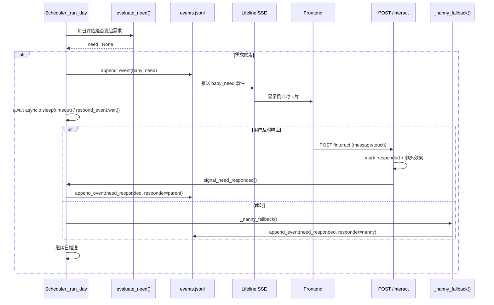

# Design: Initiative Parenting (主动需求 + 限时响应)

## 概述

在 scheduler `_run_day` 流程中嵌入"需求评估 → 等待响应 → 降级处理"循环。
最大程度复用 heartbeat.py 的 InitiativeState 和 heartbeat_provider.py 的 CRADLE_BEHAVIORS。
不引入新 API 端点，不调用 LLM（保姆降级为纯模板）。

---

## 1. 需求类型与紧急度

### 1.1 需求分类

复用 BehaviorSpace 中已有的行为类别，按语义归类为三级紧急度：

```python
# initiative_needs.py 新文件

from enum import Enum

class NeedUrgency(str, Enum):
    PHYSIOLOGICAL = "physiological"   # 生理：2 min
    EMOTIONAL = "emotional"           # 情感：3 min
    SOCIAL = "social"                 # 社交：5 min

URGENCY_TIMEOUT: dict[NeedUrgency, int] = {
    NeedUrgency.PHYSIOLOGICAL: 120,
    NeedUrgency.EMOTIONAL: 180,
    NeedUrgency.SOCIAL: 300,
}

# trigger -> urgency 映射
TRIGGER_URGENCY: dict[str, NeedUrgency] = {
    "hunger":   NeedUrgency.PHYSIOLOGICAL,
    "pain":     NeedUrgency.PHYSIOLOGICAL,
    "sleepy":   NeedUrgency.PHYSIOLOGICAL,
    "fear":     NeedUrgency.EMOTIONAL,
    "lonely":   NeedUrgency.EMOTIONAL,
    "curious":  NeedUrgency.SOCIAL,
    "bored":    NeedUrgency.SOCIAL,
    "play":     NeedUrgency.SOCIAL,
    "share":    NeedUrgency.SOCIAL,
}
```

### 1.2 阶段适配的 trigger 权重

不同阶段 trigger 的出现权重不同，新生儿以生理为主，大孩子以社交为主：

```python
# 每阶段 trigger 权重池（权重越高越容易被选中）
PHASE_TRIGGER_WEIGHTS: dict[int, dict[str, float]] = {
    0: {"hunger": 4, "pain": 3, "sleepy": 3},                           # 新生儿
    1: {"hunger": 3, "pain": 2, "sleepy": 3, "fear": 1},               # 感官觉醒
    2: {"hunger": 3, "pain": 2, "sleepy": 2, "fear": 2, "curious": 1}, # 身体探索
    3: {"hunger": 2, "pain": 1, "sleepy": 2, "fear": 3, "curious": 2}, # 客体永恒
    4: {"hunger": 2, "sleepy": 2, "fear": 2, "curious": 3, "play": 1}, # 运动爆发
    5: {"hunger": 1, "sleepy": 1, "fear": 2, "curious": 3, "play": 2, "share": 1},
    6: {"hunger": 1, "sleepy": 1, "fear": 1, "curious": 2, "play": 3, "share": 2, "bored": 1},
    7: {"hunger": 1, "fear": 1, "curious": 2, "play": 3, "share": 2, "bored": 2},
    8: {"curious": 2, "play": 3, "share": 3, "bored": 2, "fear": 1},
    # Phase 9-11 延续 Phase 8 的分布
}
```

---

## 2. 需求评估逻辑（LLM 驱动）

### 2.1 设计原则

需求不是机械掷骰，而是从宝宝内心状态涌现。已有的 heartbeat.py 提供了完整的基础设施：
- `CradleMonologueProvider.build_inner_monologue()` 构造内心独白（生理信号 + 情绪 + 经历 + 互动间隔）
- `evaluate_heartbeat()` 将内心独白传给 LLM 判断是否发起行为
- `BehaviorSpace` 定义每阶段可用的行为空间

**规则层只做频率门卫**（冷却期、pending 检测），不做需求判断。
**LLM 决定要不要发起、发起什么需求、用什么表达方式**。

### 2.2 频率门卫（规则层）

在调用 LLM 之前，先过门卫：

```
1. 当前有 pending 需求 → 跳过
2. 距上次需求 < MIN_NEED_INTERVAL_DAYS(2 sim days) → 跳过
3. heartbeat.frequency_gate(ini) 返回 False → 跳过（2min 绝对间隔 + 60s 互动后冷却）
```

门卫通过后才调 LLM。

### 2.3 LLM 评估（核心）

复用 `evaluate_heartbeat()` 流程：

```python
async def evaluate_need(state, lock) -> dict | None:
    """让 LLM 作为宝宝的潜意识，判断此刻是否有需求。"""
    from heartbeat import evaluate_heartbeat, frequency_gate
    from cradle.heartbeat_provider import CradleMonologueProvider
    from cradle.mind import generate_heartbeat_evaluation, generate_ignored_reaction

    ini = state.initiative
    
    # 1. 频率门卫
    if ini.pending_initiative_id:
        return None
    if not frequency_gate(ini):
        return None

    # 2. 冷却期检测（sim days 维度）
    # ... MIN_NEED_INTERVAL_DAYS 检查

    # 3. 调用 heartbeat 引擎（内部调 LLM）
    provider = CradleMonologueProvider()
    result = await asyncio.to_thread(
        evaluate_heartbeat,
        state, provider, ini,
        generate_heartbeat_evaluation,
        generate_ignored_reaction,
    )

    # 4. 如果 LLM 判定有主动行为，转换为需求格式
    if result.get("initiative"):
        init = result["initiative"]
        trigger = init.get("trigger", "curious")
        urgency = TRIGGER_URGENCY.get(trigger, NeedUrgency.SOCIAL)
        return {
            "trigger": trigger,
            "urgency": urgency,
            "timeout_sec": URGENCY_TIMEOUT[urgency],
            "expression": init.get("expression", ""),
            "behavior_type": init.get("behavior_type", "verbal"),
            "intent_id": init.get("intent_id", ""),
        }
    return None
```

### 2.4 LLM 输出格式

`generate_heartbeat_evaluation` 已有（cradle/mind.py），其 prompt 让 LLM 输出：

```json
{
  "initiative": true,
  "trigger": "hunger",
  "behavior_type": "verbal",
  "expression": "哇……哇……（小脸涨红，嘴巴一张一合寻找奶头）",
  "type": "urgent"
}
```

LLM 基于内心独白（stress 高、sleep 差、久未互动等）自主决定：
- 是否发起（initiative: true/false）
- 发起什么（trigger: hunger/fear/play/share...）
- 用什么表达（expression: 符合当前 expression_mode 的反应）
- 紧急程度（type: urgent/exploratory）

### 2.5 保姆降级表达（纯模板）

LLM 只用于**需求判断和用户交互**。保姆降级处理仍然用模板，因为保姆的行为不需要个性化：

```python
NANNY_RESPONSES: dict[str, list[dict]] = {
    "hunger": [
        {"text": "保姆喂了奶，宝宝安静下来了。", "role": "nanny"},
        {"text": "奶奶热了奶瓶，喂宝宝吃了。", "role": "grandparent"},
    ],
    # ... 其他 trigger
}
```

选择模板时优先匹配 caregivers 中实际存在的角色。

---

## 3. Scheduler 集成方案

### 3.1 _run_day 修改

在现有 `_run_day` 的涌现事件处理（步骤 3）之前插入需求评估：

```
async def _run_day(self, baby_id, state, day, phase_idx, remaining_budget, lock):
    # 1. 批量 routine 事件（不变）
    # 2. 世界快照刷新（不变）

    # === 新增: 需求评估 + 等待 ===
    # 2.5 需求评估
    need = evaluate_need(state, day)
    if need:
        await self._handle_need(baby_id, state, need, lock)

    # 3. 涌现事件选取（不变）
    # 4. story_worthy / template_reaction（不变）
```

### 3.2 _handle_need 方法

```python
async def _handle_need(
    self, baby_id: str, state, need: dict, lock: asyncio.Lock,
) -> None:
    """处理一次宝宝需求：写事件 → 等待响应 → 降级处理。"""

    # 1. 生成需求 ID
    need_id = uuid.uuid4().hex[:12]

    # 2. 记录到 initiative state
    state.initiative.pending_initiative_id = need_id
    state.initiative.pending_initiative_ts = time.time()
    state.initiative.pending_initiative_type = need["urgency"].value
    state.initiative.total_initiatives += 1

    # 3. 写入 events.jsonl（前端可见）
    append_event(baby_id, {
        "event": "baby_need",
        "need_id": need_id,
        "trigger": need["trigger"],
        "urgency": need["urgency"].value,
        "timeout_sec": need["timeout_sec"],
        "expression": need["expression"],
        "age_days": state.age_days,
        "sim_day": int(state.sim_time // 24),
    })

    # 4. 保存状态（让 interact 端点能看到 pending）
    async with lock:
        save_state(state)

    # 5. 等待用户响应或超时
    respond_event = _get_or_create_respond_event(baby_id)
    respond_event.clear()

    try:
        await asyncio.wait_for(
            respond_event.wait(),
            timeout=need["timeout_sec"],
        )
        # 用户已响应 — interact 端点已处理状态变更
        # 只需写一条确认事件
        append_event(baby_id, {
            "event": "need_responded",
            "need_id": need_id,
            "responder": "parent",
            "trigger": need["trigger"],
        })
    except asyncio.TimeoutError:
        # 超时 — 保姆降级处理
        await self._nanny_fallback(baby_id, state, need, need_id, lock)
```

### 3.3 响应信号机制

```python
# scheduler.py 模块级

_respond_events: dict[str, asyncio.Event] = {}

def _get_or_create_respond_event(baby_id: str) -> asyncio.Event:
    if baby_id not in _respond_events:
        _respond_events[baby_id] = asyncio.Event()
    return _respond_events[baby_id]

def signal_need_responded(baby_id: str) -> None:
    """被 api/cradle.py 的 interact 端点调用。"""
    evt = _respond_events.get(baby_id)
    if evt:
        evt.set()
```

### 3.4 interact 端点修改

在现有 `POST /{baby_id}/interact` 的 `mark_responded` 之后，增加：

```python
# 检测是否有 pending need，如有则发信号唤醒 scheduler
if state.initiative.pending_initiative_id:
    from scheduler import signal_need_responded
    signal_need_responded(baby_id)
```

---

## 4. 保姆降级处理

### 4.1 降级模板

```python
NANNY_RESPONSES: dict[str, list[dict]] = {
    "hunger": [
        {"text": "保姆喂了奶，宝宝安静下来了。", "role": "nanny"},
        {"text": "奶奶热了奶瓶，喂宝宝吃了。", "role": "grandparent"},
    ],
    "pain": [
        {"text": "保姆轻轻拍着宝宝，哼着歌安抚。", "role": "nanny"},
        {"text": "奶奶抱起宝宝，检查了一下，没有大碍。", "role": "grandparent"},
    ],
    "sleepy": [
        {"text": "保姆把宝宝放到小床上，轻拍入睡。", "role": "nanny"},
    ],
    "fear": [
        {"text": "保姆抱起宝宝，拍拍后背安慰。", "role": "nanny"},
    ],
    "play": [
        {"text": "保姆拿出玩具陪宝宝玩了一会儿。", "role": "nanny"},
    ],
    "share": [
        {"text": "保姆听宝宝说了一会儿话。", "role": "nanny"},
    ],
    "curious": [
        {"text": "保姆带宝宝看了看窗外。", "role": "nanny"},
    ],
    "bored": [
        {"text": "保姆给宝宝放了一首歌。", "role": "nanny"},
    ],
}
```

### 4.2 降级效果逻辑

```python
async def _nanny_fallback(
    self, baby_id, state, need, need_id, lock,
) -> None:
    """保姆降级处理：纯规则，不调 LLM。"""

    # 选择模板
    templates = NANNY_RESPONSES.get(need["trigger"], NANNY_RESPONSES["hunger"])
    template = random.choice(templates)

    # 效果应用
    state.stress.stress_level = max(0.0, state.stress.stress_level - 0.05)

    # 更新 initiative state
    state.initiative.consecutive_ignores += 1
    state.initiative.total_ignored += 1
    state.initiative.pending_initiative_id = ""
    state.initiative.pending_initiative_type = ""
    state.initiative.pending_behavior_type = ""

    # 连续忽略 >= 3 次：依恋向 avoidant 偏移
    if state.initiative.consecutive_ignores >= 3:
        from cradle.heartbeat_provider import shift_attachment_toward_avoidant
        shift_attachment_toward_avoidant(state)

    # 写事件
    append_event(baby_id, {
        "event": "need_responded",
        "need_id": need_id,
        "responder": "nanny",
        "trigger": need["trigger"],
        "nanny_text": template["text"],
        "nanny_role": template["role"],
        "stress_delta": -0.05,
        "attachment_change": "none",
    })

    # 保存
    async with lock:
        save_state(state)
```

### 4.3 用户响应效果（在 interact 端点中已有，需增强）

在 interact 端点的 `mark_responded` 附近，增加需求响应的额外效果：

```python
# 如果当前有 pending need，应用需求响应加成
if state.initiative.pending_initiative_id:
    # stress 降低（在 LLM 生成的 stress_delta 基础上额外 -0.1）
    state.stress.stress_level = max(0.0, state.stress.stress_level - 0.1)

    # 依恋向 secure 偏移
    _TOWARD_SECURE = {
        "forming": "secure",
        "anxious": "forming",
        "avoidant": "anxious",
    }
    state.attachment_style = _TOWARD_SECURE.get(
        state.attachment_style, state.attachment_style,
    )

    # 社交需求有概率形成偏好
    trigger = state.initiative.pending_initiative_type
    # (trigger type 判断在 signal 之前，此处省略具体实现)
```

---

## 5. 事件格式定义

### 5.1 需求发起事件

```json
{
    "seq": 142,
    "ts": 1712956800.0,
    "event": "baby_need",
    "need_id": "a1b2c3d4e5f6",
    "trigger": "hunger",
    "urgency": "physiological",
    "timeout_sec": 120,
    "expression": "哇……哇……（小脸涨红，不停扭动）",
    "age_days": 15,
    "sim_day": 15
}
```

### 5.2 需求响应事件（用户）

```json
{
    "seq": 143,
    "ts": 1712956860.0,
    "event": "need_responded",
    "need_id": "a1b2c3d4e5f6",
    "responder": "parent",
    "trigger": "hunger"
}
```

### 5.3 需求响应事件（保姆降级）

```json
{
    "seq": 143,
    "ts": 1712956920.0,
    "event": "need_responded",
    "need_id": "a1b2c3d4e5f6",
    "responder": "nanny",
    "trigger": "hunger",
    "nanny_text": "保姆喂了奶，宝宝安静下来了。",
    "nanny_role": "nanny",
    "stress_delta": -0.05,
    "attachment_change": "none"
}
```

---

## 6. 数据流 Mermaid 图



---

## 7. 关键设计约束

1. **不调 LLM**: 需求评估、表达生成、保姆降级全部为纯规则/模板，零 LLM 开销。
2. **不引入新端点**: 用户通过现有 `POST /interact` 响应，scheduler 通过 asyncio.Event 信号感知。
3. **不修改全局 time_scale**: 暂停仅影响当前 `_run_day` 的 await，不改 state.time_scale。
4. **向后兼容**: InitiativeState 已有的字段全部复用，新增字段有默认值。events.jsonl 新增事件类型不影响旧事件解析。
5. **最大复用**: BehaviorSpace triggers 分类、InitiativeState 追踪、mark_responded 信号、shift_attachment_toward_avoidant 依恋偏移 -- 全部复用现有基础设施。
